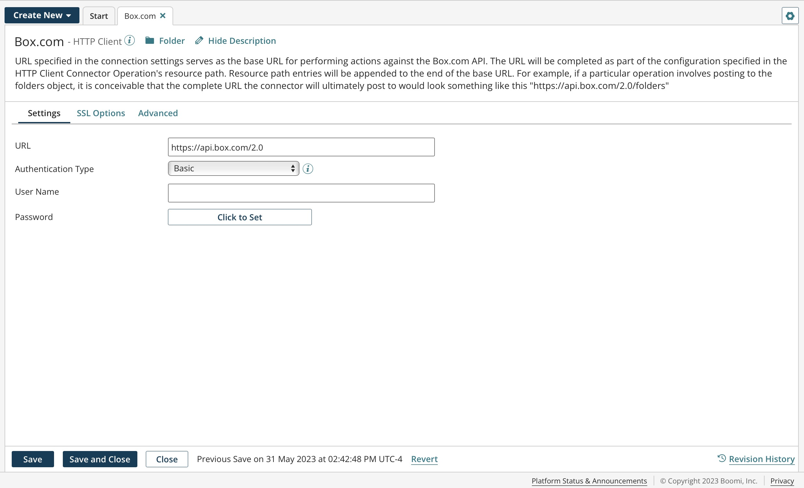
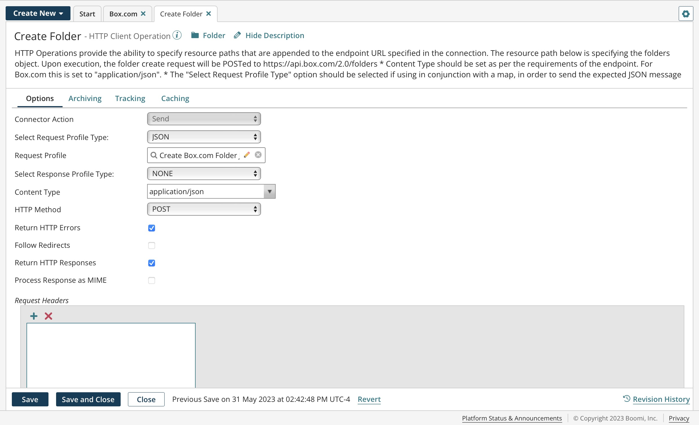

# Technology connectors 

<head>
  <meta name="guidename" content="Integration"/>
  <meta name="context" content="GUID-2c48c3e3-1a3d-4f5b-ae06-00c35d0439fb"/>
</head>

Technology connectors provide connectivity to and from web applications, on-premise applications, and common data repositories using various protocols \(including HTTP, FTP, JMS, etc.\) using a standard data transport method or generic data driver.

The data format or profile for technology connectors is independent from the connector’s operation. You can, for example, send any type of data to an FTP directory or HTTP URL. Boomi recommends using an application connector, if possible, before using a technology connector.

The following image is an example of a configured HTTP connection.

The following image is an example of a configured HTTP operation.

## Connector licenses and classes 

Connection licenses are categorized and provisioned by connector classes:

-   Small Business — For example, QuickBooks and Sage 50/Peachtree.
-   Standard — For example, NetSuite, Salesforce, SFTP, Disk, etc. Most connectors are Standard class connectors.
-   Enterprise — For example, SAP and Oracle E-Business.
-   Trading Partner — For example, your trading partner profiles, such as X12, HL7, EDIFACT, etc.

In general, your account is provisioned with a number of connection licenses based on your subscription. This means you can deploy up to that many connections across your various integration processes. Connection licenses are consumed as you deploy processes containing unique connections.

For more information about connection usage, licensing, how connections are counted, and other helpful information, review the following resource in the Boomi Community:

-   [How Connector Licensing Works](https://community.boomi.com/s/article/connection-licensing)

**AS2 Client connector** - 
Use the AS2 Client connector to send data in real-time using the AS2 protocol. 

**AS2 Server connector - legacy** - 
Use the AS2 Server connector to receive data in real-time using the AS2 protocol. 

**AS2 Shared Server connector** - 
Use the AS2 Shared Server connector (listen-only connector) to accept AS2 requests in real-time and initiate Integration processes.  

**Database connector** - 
Use the Database connector to select, insert, update and delete records in a database. 

**Database V2 connector** - 
The Database V2 connector allows you to process or retrieve data in any JDBC supported database using Database drivers. It enables you to Insert, Get, Update, Upsert, Delete and Execute Stored procedures on the data available in the database. 

**Disk connector** - 
Use the Disk connector to read and write from the underlying file system of the host machine where the Atom is running. 

**Disk v2 connector** - 
Use the Disk v2 connector to read and write from the underlying file system of the host machine where the Atom is running.  

**FTP connector** - 
Use the File Transfer Protocol (FTP) connector to download files from or upload files to an FTP-enabled server.  

**FTP V2 connector** - 
The FTP V2 connector opens a data connection session (either passive or active) with an external FTP server so your Integration process can create, update, download, delete a file, etc.  

**HTTP Client connector** - 
Use the HTTP Client connector to exchange data with HTTP-enabled servers using the Hyper Text Transfer Protocol (HTTP) and Hyper Text Transfer Protocol Secure (HTTPS) protocols.  

**HTTP PATCH Client connector** - 
Use the HTTP PATCH Client connector to send HTTP requests supporting the PATCH method to update and make partial changes to an existing resource without replacing the original version of the resource. For example, when you only need to update the email address for an existing employee.  

**LDAP connector** - 
Using the LDAP connector, you can move data into and out of common LDAP servers (Microsoft Active Directory, OpenLDAP, etc.), manage, search for, and update the data in the data directory. 

**LDAP (Legacy) connector** - 
Use the LDAP (Legacy) connector to move data into and out of common LDAP servers, integrate any on-premise applications and legacy systems, and integrate LDAP (Legacy) with other on-demand or SaaS-based applications such as Intacct, Salesforce, NetSuite, etc. 

**Mail connector** - Use the Mail connector to read email from a POP email server and send email to an SMTP email server. 

**Mail (IMAP) connector** - Use the Mail (IMAP) connector to send email messages and attachments to an email server that supports SMTP. You can also retrieve email messages and attachments from any mail server that supports the IMAP protocol. 

**Microsoft Azure Cosmos DB connector** - Microsoft Azure Cosmos DB connector allows you to transfer data from/to Microsoft Azure Cosmos DB server, using Boomi Integrations and REST APIs. These REST APIs provide access to Microsoft Azure Cosmos DB resources to Get, Update, Delete, Create, Upsert and Query documents from Collections and Databases.  

**MLLP Client connector** - Use the MLLP Client connector to send data in real-time through the MLLP (Minimal Lower Layer Protocol) protocol. MLLP is commonly used for HL7 message transmission in EDI and business-to-business (B2B) integrations. As a result, this connector is typically used with a Trading Partner step.  

**MLLP Server connector** - Use the MLLP Server connector to accept MLLP (Minimal Lower Layer Protocol) requests in real-time and initiate Integration processes. MLLP is commonly used for HL7 message transmission in EDI and business-to-business (B2B) integrations. As a result, this connector is typically used with the Start step with the Trading Partner option. 

**MQTT connector** - Use the MQTT connector to integrate data to and from MQTT brokers, which manage data from devices and sensors with data from other sources accessible through the Boomi connectors. 

**OData Client connector** - Use the OData Client connector to connect Integration with any OData service. This connector acts as generic OData protocol connector and is not application-specific. 

**OFTP2 Client connector** - Use the OFTP2 Client connector to send or receive data in real time through the OFTP2 protocol. OFTP2 is commonly used for ODETTE message transmission in EDI and business-to-business (B2B) integrations. As a result, this connector might be used with a Trading Partner step.  

**OFTP2 Server connector** - Use the OFTP2 Server connector to accept OFTP2 requests in real time and initiate Integration processes. OFTP2 is commonly used for ODETTE message transmission in EDI and business-to-business (B2B) integrations. As a result, this connector might be used with the Start step with the Trading Partner option. 

**OpenAPI connector** - Boomi's OpenAPI connector enables you to connect to REST APIs over HTTP adhering to the OpenAPI specification version 3.0 and greater, previously known as Swagger. The OpenAPI connector reads the API definitions to understand the metadata and available operations. 

**REST Client connector** - Use the REST Client connector to connect to any service utilizing a REST API. With this connector, you can extract and exchange data with HTTP-enabled servers using the Hyper Text Transfer Protocol (HTTP) and Hyper Text Transfer Protocol Secure (HTTPS) protocols, and use the data in your process.  

**SFTP connector** - Use the Secure File Transfer Protocol (SFTP) connector to download files from or upload files to an SFTP-enabled server using SSH. 

**SFTP V2 connector** - The SFTP V2 connector allows you to download files from or upload files to the SFTP-enabled server.  

**Web Services Server connector** - Use the Web Services Server connector to listen for and accept REST, SOAP, and simple HTTP requests in real time and initiate Integration processes. 

**Web Services SOAP Client connector** - Use the Web Services SOAP Client connector (a generic connector) to integrate with any web-based or on-premise application that exposes a SOAP web services interface. 