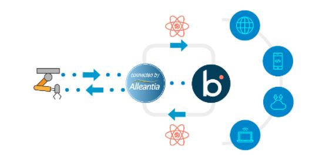

import PartnerSupport from './_PartnerSupport.md'

# Alleantia IoT - Partner connector

<head>
  <meta name="guidename" content="Integration"/>
  <meta name="context" content="GUID-a4844537-9d9e-4263-9bfb-976fd8786575"/>
</head>

<PartnerSupport />

The Alleantia IoT - Partner Connector is a component that bridges the Alleantia ISC IoT Gateway and the Boomi Enterprise Platform, ensuring a fast and easy connection between machines and applications, to enable complete monitoring and control features for industrial devices, machines, plants and sensors.

## Alleantia ISC

Alleantia ISC is an off-the-shelf Industrial IoT (IIoT) integration software platform that can integrate in seconds any industrial machine and device with any application and cloud platform, transforming machine data (‘IoT Data’) into secure, ready-to-use valuable information to monitor, manage and control production and operational processes in real time, enabling digital transformation for industrial end-users and machine makers. Is a no-code IoT integration software, Enterprise ready, tested in thousands of deployments, hardware and OS agnostic, widely used in several industries including automotive, aerospace, energy, transportation. Alleantia ISC integration with Boomi provides a comprehensive integration solution for any industrial environment – manufacturing, energy, transportation, oil & gas — to seamlessly leverage Industrial IIoT information across the Enterprise.

## Alleantia IoT - Partner connector

The Alleantia IoT - Partner connector is a component that bridges the Alleantia ISC IoT Gateway and the Boomi Enterprise Platform, ensuring a fast and easy connection between machines and applications, to enable complete monitoring and control features for industrial devices, machines, plants and sensors.

Leveraging the interoperability of the two software stacks, the customer can easily configure integration processes that bring raw data directly from the field, through Alleantia ISC software, to any business application, through Boomi Enterprise Platform and ISC software capabilities.

Boomi developers can customize everything needed, select any available machine variable, custom alarms (they notify you, as soon as alert conditions are met, so you can act immediately) and events (when a condition occurs, or the value of a variable has changed). This solution exploits the compute power of the IoT gateway, also reduces local network traffic, making it extremely simple to build, deploy and govern complex integration patterns for industrial machinery.

The Alleantia IoT - Partner connector leverages the Alleantia ISC Rest API set and the Boomi Atom features. The architecture provides that one Atom Alleantia IoT — Partner connector is set up per each Alleantia ISC gateway, while ISC can connect multiple industrial devices on the same instance.

Alleantia ISC implements a local data repository, configurable, that Boomi users can query against. Data types and sets available include:

-   System information
-   List of all devices connected to a specific ISC instance \(aka device supplier, model, version…\)
-   List of all variables configured for a specific device \(aka ids, names, dataTypes, measurement units…\)
-   List of all configured variables values \(near real time read from devices\)
-   List of current active alarms
-   List of alarm history
-   List of raised events
-   Write values on writable variables on devices

## Benefits

-   Fast integration of Industrial IoT devices information, bidirectional, with Platform.
-   Leverage of thousands of ready to use machine drivers for fast connection.
-   Wide flexibility in installation environments for Alleantia ISC – physical or virtual architectures, centralized and distributed, on hardware and OS of many kinds.
-   Enterprise-grade IIoT solution with thousands of deployments and supporting management platform.

:::note

The documentation for this connector is provided by a partner.

:::

## Connector configuration

To configure the connector to communicate with Alleantia software, set up the following components:

-   Alleantia connection
-   Alleantia operation

This design provides reusable components, which contain connection settings such as host, port, etc. After building your connection and operation, set up your connector within a process. When you have properly configured your connector within your process, Boomi Integration can send rest API requests using the Alleantia connector to get or send data from/to Alleantia Software.

## Prerequisites

Alleantia IoT — Partner connector requires the following:

-   Alleantia ISC up and running on target installation, with licensed REST API module.
-   Alleantia ISC Rest API plugin active on target installation.
-   The locally deployed Atom shall reach the Alleantia ISC through customer network or may be installed in the same system where Alleantia ISC runs.

## Supported editions

Alleantia IotScada software: minimum version supported: 4.4.0 and later.