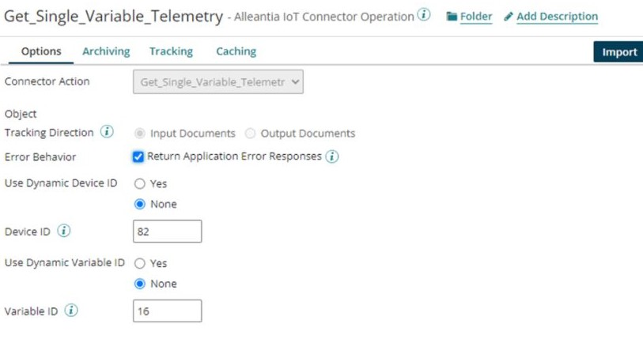

import OperationEnd from './_operationEnd.md'

# Alleantia IoT — Partner operation

<head>
  <meta name="guidename" content="Integration"/>
  <meta name="context" content="GUID-95163fd4-ffc9-4068-9283-79bacd583f58"/>
</head>


The Alleantia IoT — Partner connector's operation defines how to interact with the gateway selected in the connection.

To use the connector, you need to define the Action and Operation, along with the connection.

-   Alleantia IoT Action : the object information about your devices you are querying for.
-   Alleantia IoT Operation : the request and response profiles and any parameters used in the request.

## Actions

The Alleantia IoT — Partner connector Operation only supports actions which sends and receives data to and/or from Alleantia ISC Software. Certain operations require you to specify certain fields in the request necessary to complete the action. The Alleantia IoT — Partner connector supports the following actions:

-   **Alleantia\_System\_Information** — Use this action to return Alleantia system information.
-   **All\_Devices\_Information** — Use this action to return a data list to retrieve information on all devices configured in the ISC Software.
-   **Single\_Device\_Information** — Use this action to return the configuration information for a device configured in the system.
-   **All\_Custom\_Variables\_Information** — Use this action to return a list with the information on variables configuration of the plant configured in the IoT.
-   **All\_Variables\_ Information** — Use this action to return a list with the information on variables configuration of devices configured in the ISC Software.
-   **Single\_Variable\_Information** — Use this action to return the information on a variable configuration for a device configured on the ISC Software.
-   **All\_Alarms\_Information** — Use this action to return the information on all alarms configured on the ISC Software.
-   **Single\_Alarm\_Information** — Use this action to return the information on an alarm configured on the ISC Software.
-   **All\_Events\_Information** — Use this action to return information relative to events that can be generated by the system.
-   **Single\_Event\_Information** — Return information relative to the single event that can be generated by the system.
-   **Get\_Full\_Telemetry** — Use this action to return data lists to retrieve information on all devices configured in the ISC Software.
-   **Get\_Single\_Device\_Telemetry** — Use this action to return a list of actual values for the variables of a device configured in the ISC Software.
-   **Get\_Single\_Variable\_Telemetry** — Use this action to return the actual variable value for a device configured in the ISC Software.
-   **Get\_Single\_Custom\_Variable\_Telemetry** — Use this action to return the actual variable value for the plant configured in the ISC Software.
-   **Get\_Custom\_Variable\_Historical\_Telemetry\_Data** — Use this action to return the historical values of a plant variable configured in the system for a specified time interval.
-   **Get\_Variable\_Historical\_Telemetry\_Data** — Use this action to return the historical values of a variable of a device configured in the ISC Software for a specified time interval.
-   **Get\_Full\_Active\_Alarms** — Use this action to return a list of active alarms in the ISC Software.
-   **Get\_Alarms\_History** — Use this action to return the historical list of the alarms in the ISC Software sorted by ascending time.
-   **Get\_Full\_Active\_Events** — Use this action to return a list of active events in the ISC Software.
-   **Get\_Events\_History** — Use this action to return the historical events in the ISC Software for a specified time interval.
-   **Get\_Single\_Event\_History** — Use this action to return a single historical event in the ISC Software for a specified time interval.
-   **Set \_Variable\_Value** — Use this action to set the value of a writable variable for a device configured in the ISC Software.

## Options tab

Click **Import Operation**, then use the Import wizard to select the object to integrate. When you configure an action, the following fields appear on the **Options** tab.


**Request Profile** - 
The Request Profile selects the profile definition that represents the data structure that is being sent by the connector in the request.

**Response Profile** - 
The Response Profile selects the profile definition that represents the data structure that is being received by the connector. You use this profile when mapping the connector response to another format or whenever you need to reference a specific field in a process step configuration.
 
**Use Dynamic Device ID** - 
Yes or None. Specify Yes, if passing the parameters into the connector using the Alleantia Command String Document Property, otherwise specify None.

**Device ID** - 
If Dynamic Device ID is set to None, specify the ID of the device to take the action against here.

## Specifying Request Parameters

Actions may or may not require Parameters to operate. They can be static or dynamic. You can use the field within the Operation tab to define them in a static way, or you can define the parameters in a dynamic way, using a Document Property. ‘Global’ Actions that retrieve massive data sets from industrial devices connected to Alleantia ISC application do not require parameters. Those are:

-   Alleantia\_System\_Information
-   All\_Devices\_Information
-   All\_Custom\_Variables\_Information
-   All\_Variables\_ Information
-   All\_Alarms\_Information
-   All\_Events\_Information
-   Get\_Full\_Telemetry
-   Get\_Full\_Active\_Alarms
-   Get\_Alarms\_History
-   Get\_Full\_Active\_Events
-   Get\_Events\_History

‘Selected’ Actions that get / set data on specific devices and variables require Parameters to operate. Those are:

-   Single\_Device\_Information
-   Single\_Variable\_Information
-   Single\_Alarm\_Information
-   Single\_Event\_Information
-   Get\_Single\_Device\_Telemetry
-   Get\_Single\_Variable\_Telemetry
-   Get\_Single\_Custom\_Variable\_Telemetry
-   Get\_Custom\_Variable\_Historical\_Telemetry\_Data
-   Get\_Variable\_Historical\_Telemetry\_Data
-   Get\_Single\_Event\_History
-   Set \_Variable\_Value

The parameters to use are dependent on ISC Application configuration and will refer to industrial devices Identification \(Dev\_Id\) and variables identification \(Var\_Id\) within a connected industrial device, and eventually time ranges. For example, these are the parameters required for

**Get\_Single\_Variable\_Telemetry** - 



Where,

-   Device ID is a unique identifier only within a specific ISS system and is only valid for the system that has returned it. If the user subsequently modifies the IoT Server configuration, by disabling or removing the device, further calls to this API will no longer provide the device ID.
-   Plant Variable ID is unique only within the specific IoT Server that has returned it. If the user subsequently modifies the IoT Server configuration, by disabling the device variable, further calls to this API will no longer provide the id.

## Document Properties

This connector has the following document property that can be set or referenced in various step parameters.

**Command String** -  A JSON string containing an array of values with their device identifier and variable identifier.

**Structure** - 

``` {#codeblock_eqb_g1s_lpb}
{
  {
      "devid":5, 
      "varid":1,
      "value":"7"
    },
   {
     "devid":5,
     "varid":2,
     "value":"4"
  }…
]
```
:::note

This new property will now show up in the list of standard connector document properties, you can choose from the [Set Properties step](../Process%20building/r-atm-Set_Properties_shape_d99aaa70-ed9a-4792-b641-b94aea1254b9.md) \> Document Properties \> Connectors \> Alleantia IoT — Partner connector.

:::

<OperationEnd />