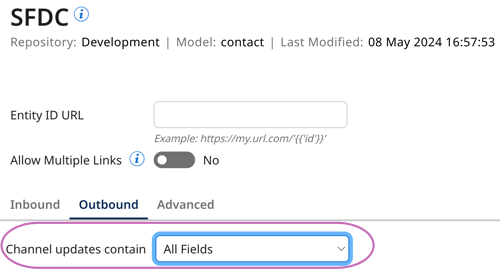
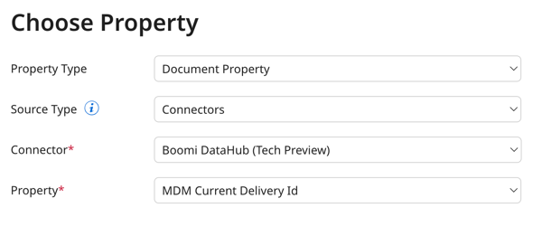

# Fetch Channel Updates operation 

<head>
  <meta name="guidename" content="Integration"/>
  <meta name="context" content="GUID-e5a897db-95a4-4138-8a7f-aa8ca3dea74d"/>
</head>


The Fetch Channel Updates operation retrieves batches of requests to create, update, or delete records in a specified channel for a deployed model. Each batch contains entities up to the repository's 200 entity outbound limit. With automatic acknowledgement set, the operation retrieves batches until there are no pending requests in the channel. The update requests are returned in XML format.

You can use this operation to send golden record data from Boomi DataHub to an accepting source for data synchronization. The operation aligns with the [Fetch Channel Updates operation](/docs/Atomsphere/Master%20Data%20Hub/REST%20APIs/r-mdm-Fetch_Channel_Updates_403852dd-1ebe-4cca-861f-8d423f6415a9.md) in the Repository API. In the legacy connector this operation was titled Query.

For example, you can create an integration that sends contacts from the Boomi DataHub connector, routes the record based on its op attribute (DELETE, CREATE, UPDATE, etc) to the correct Salesforce operation, and maps the contact record to the contact record in Salesforce. Salesforce receives a batch of contact record updates.

<!-- Add diagram to show integration example -->

## Operation behavior

When you set channel updates to include all fields, the fetched updates show the latest version of the records. Even if many updates happen between fetches, you'll receive the latest version of updates.



When you set channels to only include changed fields in record updates, you'll receive field updates since the last batch of delivered updates. 

## Automatic and manual acknowledgement

By default, the connector automatically acknowledges that you've received a previous batch of updates after it delivers the next batch in the same channel. Boomi DataHub can also automatically confirm the batch as received if you manually delete the updates. Boomi DataHub does not resend batches that it automatically acknowledged as received.

You can set your integration to manually acknowledge that you received a batch of updates. Read [MDM Current Delivery Id property](#mdm-current-delivery-id-property) for more information on manual acknowledgement.

<!-- Add diagram that explains automatic acknowledgement -->

## Prerequisites

You must have the following:

- A Hub repository 
- A deployed model in the repository
- Active golden records in the deployed model
- Pending update requests in the channel for a source that accepts channel updates
- Open source channel in the deployed model's Source tab (green dot)
- A deployed Boomi Atom to run connector operations (Integration > Manage > Atom Management)

## Setting up the Fetch Channel Updates operation

1. In the connector, select **Fetch Channel Updates** in the **Action** drop-down.
2. Click the plus icon in the **Operation** field to create a new operation.
3. Click **Import Operation**.
4. Select the Atom you want to use to run your integration. The Atom must be online.
5. Ensure [the connection you created](/docs/Atomsphere/Integration/Connectors/int-Boomi_Data_Hub_connection.md) to the repository is selected in the Connection field.
6. **Optional**: In **Source**, enter the source ID, which acts as a filter to help you select the deployed model name. You can find the source ID on the Sources page in Hub.
7. **Optional**: In **Filter**, enter a regex as a filter to help you select the deployed model name.
8. Click **Next**.
9. Select the deployed model name.
10. Click **Next**. 
11. Click **Finish**. The import operation creates a response profile. You can use this response profile to map data in a [Map step within your integration](/docs/Atomsphere/Integration/Process%20building/c-atm-Map_components_87f669d6-4999-445f-9f29-ed24e79c92dd.md). 
12. In **Source**, enter the source ID for the source receiving the batch of updates. 
13. **Optional**: Select **Manually Acknowledge** if you want Boomi DataHub to confirm the delivery of the previous batch before fetching the next update request batch. You can use this setting with the connector's Dynamic Operation Properties tab to automatically enter the latest MDM Current Delivery ID. Document properties are an option if the Boomi DataHub connector is not a start step. Read step 17 to learn more about Dynamic Operation Properties.
    - **Optional: Fetch Single Update Request** - Retrieves a single update request when using manual acknowledgement. This setting ensures that only one update request is delivered for each fetch request instead of the outbound limit. 
14. **Optional:** In **Max Updates** enter a number to limit the amount of update requests retrieved and acknowledged. This setting is only relevant with automatic acknowledgement set. When this field is left blank, the operation continues to fetch updates until there are no pending update requests. 
15. **Optional:** The **MDM Current Delivery Id** field is used to manually acknowledge a batch as received. You can leave this field blank and populate this field using the **Dynamic Operation Properties tab** in the connector. Your integration checks if this property is populated and if there is a value here, it acknowledges the batch as received. It then proceeds with the next batch. If this property is empty and **Manually Acknowledge** is set, only the first batch is returned.
16. Click **Save and Close**.
17. **Optional**: The **Dynamic Operation Properties** tab lets you set the tracked property **MDM Current Delivery Id** with the delivery ID from the previous fetch. This setting is relevant when using manual acknowledgement. Read [MDM Current Delivery Id property](#mdm-current-delivery-id-property) to learn more. 
18. **Optional**: Select **Return Application Error Responses** if you want the operation to continue when there is an application error. Processing continues and passes the error to the next component processed as the connection output. When the checkbox is clear, the process stops and reports the error in Process Reporting.
19. Click **OK**.
20. Click **Save**.

## Fetch Response example

```xml
<batch id="2" fmt="FULL" src-"SF">
  <contact op="UPDATE" grid="61bf3e7e-fa64-4bf9-12gh-12abcd245ef6" ts="05-17-2024T16:40:48.000+0000">
  <id>SF-1</id>
  <name>Quinn</name>
  <city>Miami</city>
  <country>USA</country>
  </contact>
<batch>
```

:::info 

The connector uses administrator privileges to authenticate. Therefore, masked field values are unmasked in responses.

:::

|**Element**|**Definition**|
------  | -------  |
id      | batch ID. Also known as the MDM Current Delivery ID. The ID can be used to acknowledge a batch as delivered. |
fmt     | channel type that specifies the amount of data sent. FULL indicates that the channel is set to send all fields in an update request, including unchanged values. DIFF indicates the channel is set to send only changed field values. |
src     | source ID of the destination source. |
grid    | grid ID. |
ts      | timestamp for the associated golden record update. |
op      | the operation performed in Hub on the record. Available values: <ul><li>CREATE - created record.</li><li>UPDATE - updated record.</li><li>DELETE - end-dated record.</li><li>RESTORE - restored an end-dated record.</li><li>REJECT DUPLICATE - the incoming entity was prevented from being added to the golden record data because it's a duplicate.</li></ul>|
id     | source entity Id. This is an entity's child element. |

## MDM Current Delivery Id property

The **MDM Current Delivery Id** is a tracked property that is returned in the documents with each successful fetch. 

When you select **Manually Acknowledge**, you can use one of the following options in your process:

- Use the delivery ID returned from a previous fetch to populate the **MDM Current Delivery Id** field in the next fetch.
- Set the **Dynamic Operation Property** tab in the connector to **MDM Current Delivery Id** to receive the delivery ID from the previous fetch. This is only available when the connector is not a start step. 
  You can select **Add Dynamic Operation Property** > **Document Property** and set the Document Property to the Boomi DataHub connector and the **MDM Current Delivery Id** property.

  
  
- Use the [Acknowledge Previously Fetched Channel Updates](/docs/Atomsphere/Master%20Data%20Hub/REST%20APIs/r-mdm-Acknowledge_Previously_Fetched_Channel_Updates_896ca6ee-56b4-4ff7-afe1-8849feec1d3b.md) API. You can make a request using the HTTP connector and the delivery ID in your process.

When the operation is set to automatically acknowledge, this property is empty. 