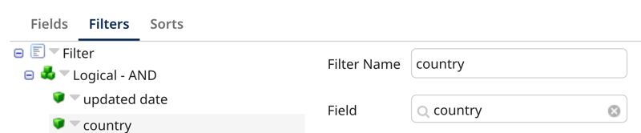

# Query Golden Records operation 

<head>
  <meta name="guidename" content="Integration"/>
  <meta name="context" content="GUID-81630969-17ee-4b5b-aaa3-53772d7dce74"/>
</head>


The Query Golden Records operation retrieves active golden records from the authenticated repository.  You can set query filter parameters to control which records are returned. You can also set a sorting parameter to control the order in which golden records are returned. This operation aligns with the [Query Golden Records](/docs/Atomsphere/Master%20Data%20Hub/REST%20APIs/r-mdm-Query_Golden_Records_dad5ed08-37ae-47e7-b431-7394cf591aa1.md) operation in the Repository API.

:::note

You can activate Accelerated Query when you have 100,000 or more golden records in a deployed model (universe). This feature improves query performance. Read [Activating Accelerated Query](/docs/Atomsphere/Master%20Data%20Hub/Stewardship/hub-accelerated_query.md) to learn more.

:::

## Prerequisites

- A Hub repository 
- A deployed model in the repository
- Active golden records in the repository
- A deployed Boomi Atom to run connector operations (Integration > Manage > Atom Management)

## Setting up the Query Golden Records operation

1. In the connector, select **Query Golden Records** in the **Action** drop-down.
2. Click the plus icon in the **Operation** field to create a new operation.
3. Click **Import Operation**.
4. Select the Atom you want to use to run your integration. The Atom must be online.
5. Ensure [the connection you created](/docs/Atomsphere/Integration/Connectors/int-Boomi_Data_Hub_connection.md) to the repository is selected in the Connection field.
6. **Optional**: In **Filter**, enter a regex as a filter to help you select the deployed model name.
7. Click **Next**.
8. Select the deployed model name. 
9. Click **Next**. 
10. Click **Finish**. The import operation creates a response profile. You can use this response profile to map data in a [Map step within your integration](/docs/Atomsphere/Integration/Process%20building/c-atm-Map_components_87f669d6-4999-445f-9f29-ed24e79c92dd.md).
11. **Optional**: Select **Include Source Links** to include golden record metadata in the response. The returned metadata includes the entity ID, name, and established date of each source linked to the record.
12. **Optional**: Enter a number in **Max Records** to limit the amount of records returned by the operation. By default, all records matching the filter criteria are returned.
13. **Optional**: Select **Return Application Error Responses** if you want the operation to continue when there is an application error. Processing continues and passes the error to the next component processed as the connection output. When the checkbox is clear, the process stops and reports the error in Process Reporting.
14. In **Fields**, select the fields to include in the query response. 
15. Add a filter. Click the **Filters** tab and select **Add Expression**. The default main operator is AND. You can join multiple filters together with AND or OR by selecting **Add Logical Sub-Group**. For example, `value AND value AND value`. Complex expressions such as `value AND (value OR value)` are not supported. 
    1. Enter a filter name. 
    2. In **Field**, select a model field or attribute to set the filter. Refer to [Query Golden Records operation filters](#query-golden-records-operation-filters) to learn more about the available filters for the Query operation.
    
    3. Select an operator.
16. **Optional**: Click the **Sorts** tab to specify the order records are returned.
    1. Select the **Sort Field**.
    2. Select the **Sort Order**.
17. Click **Save and Close**.
18. Select the **Parameters** tab to import your filter parameters. Click the link to import all.

    :::note

    Is Not Null, Is Null, and Is Invalid operators do not accept a parameter.

    :::
19. Select the parameter in the list.
20. Click the edit icon. 
21. Set the parameter value. For example, you can add a static value. For guidance on value formatting, refer to [Query Golden Records operation filters](#query-golden-records-operation-filters). Read [Parameter values](/docs/Atomsphere/Integration/Process%20building/c-atm-Parameter_Values_23a1eb13-d83b-423e-adf1-d78db4a1fbbd.md) to learn more about setting values.
22. Click **OK**.
23. Click **Save**.

## <a name="Query Golden Records operation filters">Query Golden Records operation filters</a>

You can filter your query using the following filters, including field name values. Set the filter operator in the Operation. Then, in the connector's Parameters tab, set the value for the filter.

**Filter name**|**Field**
-----|-----
createdDate|Sets a filter by the date and time of golden record creation. Set the dates as a static value since the format is a comma separated string. The format is 'From,To' where 'From' and 'To' is `yyyy-MM-dd'T'HH:mm:ss'Z'`, and 'T' separates the date and time — for example, `2013-03-01T15:32:00Z,2022-03-01T15:32:00Z`. 'From' is any record after the From date specified. 'To' is any record up to the date specified. You can set the 'To' or 'From' date to an empty string. For example, `2013-03-01T15:32:00Z,`. 
updatedDate|Sets a filter by the date and time of last golden record update. Set the dates as a static value since the format is a comma separated string. The format is 'From,To' where 'From' and 'To' is `yyyy-MM-dd'T'HH:mm:ss'Z'`, and 'T' separates the date and time — for example, `2013-03-01T15:32:00Z,2022-03-01T15:32:00Z`. 'From' is any record after the From date specified. 'To' is any record up to the date specified. You can set the 'To' or 'From' date to an empty string. For example, `2013-03-01T15:32:00Z,`.
recordIds|Sets a filter by 1–100 golden record IDs. You can set record IDs as a comma separated string. For example, `acb123,def456`. If you set this filter, the connector operation disregards other filters.
tags|Sets a filter by one or more tags specified by the tag name. A golden record with any specified tags will meet the tag criteria. You can set the tags as a comma separated string. For example, `tag1,tag2`.
creatingSourceId | sets a filter by a creating source specified by the source ID.
sourceLink | Sets a filter by the presence or absence of links to a source. The Source ID specifies the source by its ID. The Link Type can be either Linked, to filter by the presence of links, or Not Linked, to filter by the absence of links.
unresolvedReference | Sets a filter by the presence of unresolved reference field data. The field ID specifies a reference field by its ID. You set the source ID to a specific source to filter by unresolved source contributions or set it to all. The value must be set as a comma separated string in the form `field_id,source_id` or `field_id,@all`. You can also set the value to `field_id` so the source Id is empty and it is considered @all. 
field name | Sets the filter by the field value you specify in your parameter settings. Several operators are available and display in the drop-down depending on the field type.

### Field name operators

The default of the main logical sub-group operator is AND. You can join multiple filters together with AND or OR For example, `value AND value AND value`. Complex expressions such as `value AND (value OR value)` are not supported.

**Field name operator** | **Definition**
--------------------|------------
Equal To    | This operator is valid for all field types.
Not Equal To | This operator is valid for all types except Reference fields and collection (repeatable) or collection item fields.
Is Not Null| This operator is valid for all types except Reference fields and collection (repeatable) or collection item fields. No parameter is needed for this operator. 
Is Null | This operator is valid for all types except Reference fields and collection (repeatable) or collection item fields. No parameter is needed for this operator. 
Contains | This operator is valid only for Text and Long Text fields.
Ends With | This operator is valid only for Text and Long Text fields.
Starts With | This operator is valid only for Text and Long Text fields.
Greater Than | This operator is valid only for Integer and Float fields.
Greater Than Equal | This operator is valid only for Integer and Float fields.
Less Than | This operator is valid only for Integer and Float fields.
Less Than Equal | This operator are valid only for Integer and Float fields.
Between | This operator is valid only for createdDate, updatedDate, Date, Date and Time, and Time fields.
Is Invalid | This operator is valid only for Enumeration fields. Filters by records that contain an enumeration field with an invalid value. No parameter is needed for this operator. 
Linked | This operator is valid for the sourceLink filter only. Filters by records with linked sources.
Not Linked | This operator is valid for the sourceLink filter only. Filters by record with unlinked sources.


## Response example

A separate document is returned for each record that the meets the filter criteria.

:::info 

The connector uses administrator privileges to authenticate. Therefore, masked field values are unmasked in responses.

:::

```xml
<Record recordId="c86394d3-3z17-4bc2-9b1b-022033f53990" createdDate="2024-04-26T19:48:20Z" updatedDate="2024-05-10T20:26:26Z" recordTitle="Quinn USA">
  <Fields>
    <contact>
      <name>Quinn</name>
      <city>Philadelphia</city>
      <state>PA</state>
      <zipcode>19093</zipcode>
      <country>USA</country>
    </contact>
  </Fields>
  <links>
    <link source="SF" entityId="904" establishedDate="2024-04-11T14:45:33Z"/>
    <link source="NS" entityId="366" establishedDate="2024-04-17T21:13:03Z"/>
  </links>
</Record>
```

| Element | Definition |
| ----    | ----       |
| recordId |  Golden record ID.|
| createdDate | Time stamp of the creation of the golden record.|
| updatedDate | Time stamp of the last update of the golden record.|
| recordTitle  | Record title based on the title rules set by the model. If record title is not set, recordTitle does not appear in the response.|
| link |A golden record's established link to a source.<ul><li>source - source's user-specified unique ID.</li><li>entityID - source entity ID</li><li>establishedDate - time stamp of the establishment of the link.</li></ul> |

The tracked property **Query Total Count** displays the number of records in the response that meet the filter criteria.


