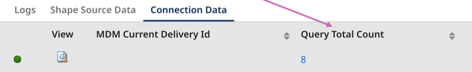

# Query Quarantine Entries operation 

<head>
  <meta name="guidename" content="Integration"/>
  <meta name="context" content="GUID-c521cab0-4ad1-4907-bc6c-a57d08b6a10e"/>
</head>


The Query Quarantine Entries operation retrieves quarantine entries from the authenticated repository.  You can set query filters to control which records are returned. This operation aligns with the [Query Quarantine Entries](/docs/Atomsphere/Master%20Data%20Hub/REST%20APIs/r-mdm-Query_Quarantine_Entries_1ba99cc5-8cd1-4d9c-ac3c-ae95db3aa4cd.md) operation in the Repository API. 

## Prerequisites

- A Hub repository 
- A deployed model in the repository
- Quarantine entries in the repository
- A deployed Boomi Atom to run connector operations (Integration > Manage > Atom Management)

## Setting up the Query Quarantine Entries operation

1. In the connector, select **Query Quarantine Entries** in the **Action** drop-down.
2. Click the plus icon in the **Operation** field to create a new operation.
3. Click **Import Operation**.
4. Select the Atom you want to use to run your integration. The Atom must be online.
5. Ensure [the connection you created](/docs/Atomsphere/Integration/Connectors/int-Boomi_Data_Hub_connection.md) to the repository is selected in the **Connection** field.
6. **Optional**: In **Filter**, enter a regex as a filter to help you select the deployed model name.
7. Click **Next**.
8. Select the deployed model name. 
9. Click **Next**. 
10. Click **Finish**. The import operation creates a response profile. You can use this response profile to map data in a [Map step within your integration](/docs/Atomsphere/Integration/Process%20building/c-atm-Map_components_87f669d6-4999-445f-9f29-ed24e79c92dd.md). 
11. **Optional**: Select **Return Application Error Responses** if you want the operation to continue when there is an application error. Processing continues and passes the error to the next component processed as the connection output. When the checkbox is clear, the process stops and reports the error in Process Reporting.
12. **Optional**: Select **Include Data** to include entity data in addition to quarantine entry metadata.
13. In **Type**, select the status of the quarantine entries to return. You can return Active, Resolved or both types.
14. **Optional**: Enter a number in **Max Records** to limit the amount of records returned by the operation. By default, all records matching the filter criteria are returned.
15. Add a filter. In the **Filters** tab, select **Add Expression**. The default main operator is AND. You can join multiple filters together with AND or OR by selecting **Add Logical Sub-Group**. For example, `value AND value AND value`. Complex expressions such as `value AND (value OR value)` are not supported.  
    1. Enter a filter name. 
    2. In **Field**, select a model field or attribute to set the filter. You can select a filter name or a model field. Refer to [Quarantine query filters](#quarantine-query-filters) to learn more about the available filters for the operation. 
    3. Select an operator.
16. Click **Save and Close**.
17. Select the **Parameters** tab to import your filter parameters. Click the link to import all.

    :::note

    Is Not Null, Is Null, and Is Invalid operators do not accept a parameter.

    :::
18. Select the parameter in the list.
19. Click the edit icon. 
20. Set the parameter value. For example, you can add a static value. For guidance on value formatting, refer to [Quarantine Query Filters](#quarantine-query-filters). Read [Parameter values](/docs/Atomsphere/Integration/Process%20building/c-atm-Parameter_Values_23a1eb13-d83b-423e-adf1-d78db4a1fbbd.md) to learn more about setting values.
21. Click **OK**.
22. Click **Save**.

## <a name="Quarantine query filters">Quarantine query filters</a>

You can filter your query using the following filters, including field name values. Set the filter operator in the Operation. Then, in the connector's Parameters tab, set the value for the filter. 

**Filter Name**|**Field**
-----|-----
createdDate|Sets a filter by the date and time of quarantine entry creation. Set the dates as a static value since the format is a comma separated string. The format is 'From, To' where 'From' and 'To' is `yyyy-MM-dd'T'HH:mm:ss'Z'`, and 'T' separates the date and time — for example, `2013-03-01T15:32:00Z,2022-03-01T15:32:00Z`. 'From' is any record after the From date specified. 'To' is any record up to the date specified. You can set the 'To' or 'From' date to an empty string. For example, `2013-03-01T15:32:00Z,`.
endDate|Sets a filter by the date and time of quarantine entry resolution. Set the dates as a static value since the format is a comma separated string. The format is 'From, To' where 'From' and 'To' is `yyyy-MM-dd'T'HH:mm:ss'Z'`, and 'T' separates the date and time — for example, `2013-03-01T15:32:00Z,2022-03-01T15:32:00Z`. 'From' is any record after the From date specified. 'To' is any record up to the date specified. You can set the 'To' or 'From' date to an empty string. For example, `2013-03-01T15:32:00Z,`.
sourceID | Sets a filter by source. Specify the source by its unique ID.
sourceEntityId | Sets a filter by source entity ID for the source of the quarantined entity.
field name | Sets a filter by field value. Select a field name from the drop-down. The value matches on the beginning of the field value. For example, 4617 Main St matches the following values: 4, 4617 Main. Refer to [Field operators](#field-operators) for more information. 
cause | Sets a filter by the reason for quarantining. Refer to [Quarantine cause filters](#quarantine-cause-filters) for available filters and format. 
resolution | Sets a filter by the resolution of a quarantine entry. You can apply multiple values as a comma separate string in the Parameters tab. For example, `resolution_value1,resolution_value2`. Refer to [Quarantine resolution filters](#quarantine-resolution-filters) for available filters and format.

### <a name="Quarantine cause filters">Quarantine cause filters</a>

Set the cause parameter value exactly as it is listed below. For example, in the Parameters tab, to filter by entries that require approval, enter `REQUIRES_APPROVAL` as the static value. You can enter multiple values as a comma separated string. For example, `REQUIRES_APPROVAL,DUPLICATE_KEY`.

Cause | Definition
----- | ------
AMBIGUOUS_MATCH |Entities matching 10 or more golden records, regardless of links to source records (1,000 or more in the case of an exact matching expression grouped with a fuzzy matching expression).
DUPLICATE_KEY | Entities containing multiple collection items with the same key field values. This cause corresponds to Duplicate Collection Key in the UI.
ENRICH_ERROR | Entities failing data quality steps. This cause corresponds to Data Quality Error in the UI.
FIELD_FORMAT_ERROR | Entities containing data not in conformance with their field type or validation options for that field type specified in the domain’s model or with the system 255-character limit for text and Enumeration field values. 
INCORPORATE_ERROR | Entities causing errors other than unresolvable references during incorporation. This cause corresponds to Other Incorporation Error in the UI.
MATCH_REFERENCE_UNKNOWN | Entities having a value in a reference field specified for matching in a match rule that does not resolve to a golden record. This cause corresponds to Reference Matching Error in the UI.
MULTIPLE_MATCHES | Entities matching multiple golden records not linked to a record in the contributing source. 
PARSE_FAILURE | Entities not specifying a source entity ID. This cause corresponds to Data Integration Error in the UI.
POSSIBLE_DUPLICATE | Entities matching golden records linked to a record in the contributing source.
RECORD_ALREADY_ENDDATED | Entities to which a link exists from an end-dated golden record. 
REFERENCE_UNKNOWN | Entities having unresolvable references, either collection items or fields for which referential integrity for entity contributions is enforced. This cause corresponds to Unknown Reference Value in the UI.
REQUIRED_FIELD | Entities omitting fields specified as required in the domain’s model. This cause corresponds to Required Field Omitted in the UI.
REQUIRES_APPROVAL | Entities satisfying conditions configured for their source requiring the manual approval of new entity contributions. This cause corresponds to Create Approval Required in the UI.
REQUIRES_END_DATE_APPROVAL | Entities from a source configured to require manual approval of contributed Entities that end-date matching golden records. This cause corresponds to End-date Approval Required in the UI.
REQUIRES_UPDATE_APPROVAL | Entities satisfying conditions configured for their source requiring the manual approval of contributed Entities that would update matching golden records. This cause corresponds to Update Approval Required in the UI.
REQUIRES_UPDATE_WITH_BASE_VALUE_APPROVAL | Entities for which there is a pending link from the matching golden record to the contributing source, and in which a field has a base value (the value of the field in the golden record’s base version for the source when you created the pending link).

## <a name="Quarantine resolution filters">Quarantine resolution filters</a>

You can filter resolved quarantine entries by the resolution type. Set the resolution parameter value exactly as it is listed below. For example, in the Parameters tab enter `RESTORED` as the static value. You can enter multiple values as a comma separated string. For example, `RESTORED,INCORPORATE_SUCCESS`.

Resolution | Definition
----- | ------
GRID_DELETED | Entries for which a user manually deleted the golden record associated with the quarantined entity. This cause corresponds to the resolution Golden Record Deleted in the UI.
INCORPORATE_SUCCESS | Entries automatically resolved as a result of the successful incorporation in the target domain of a replacement for the quarantined entity. This cause corresponds to the resolution Newer Version Incorporated in the UI.
RESTORED | Entries resolved by restoring an end-dated golden record from which there was a link to the quarantined entity. This cause corresponds to the resolution Golden Record Restored in the UI.
SUPERSEDED | Entries for which a newer version of the quarantined entity was contributed in a batch, thereby making this quarantine entry obsolete. This cause corresponds to the resolution Newer Version Contributed in the UI.
USER_APPROVED | Entries for which a user approved the quarantined entity. This cause corresponds to the resolution Approved for Incorporation in the UI.
USER_IGNORE  | Entries for which a user requested deletion. This cause corresponds to the resolution Entity Deleted in the UI.
USER_IGNORED_ENRICHMENT | Entries for which a user resubmitted the quarantined entity, applying only data quality steps subsequent to the failed step. This cause corresponds to the resolution Resubmitted Ignoring Enrichment in the UI.
USER_MATCHED | Entries for which a user resolved the matching issue associated with the quarantined entity. This cause corresponds to the resolution Matching Issue Resolved in the UI.
USER_REJECTED | Entries for which a user rejected the quarantined entity. This cause corresponds to the resolution Entity Rejected in the UI.
USER_REPLAY | Entries for which a user resubmitted the quarantined entity without editing. This cause corresponds to the resolution Resubmitted Without Editing in the UI.
USER_REPLAY_WITH_EDITS | Entries for which a user edited and resubmitted the quarantined entity using the Edit and Resubmit Entity wizard. This cause corresponds to the resolution Resubmitted With Edits in the UI.
USER_RETRIED_ENRICHMENT |Entries for which a user resubmitted the quarantined entity, reapplying the failed data quality step and all subsequent steps. This cause corresponds to the resolution Resubmitted Retrying Enrichment in the UI.
USER_SELECTIVE_MERGED | Entries for which a user merged fields from the quarantined entity into a selected matching golden record and also rejected the quarantined entity. This cause corresponds to the resolution Fields Selectively Merged in the UI.

### <a name="Field operators">Field operators</a>

**Field operator** | **Definition**
--------------------|------------
Equal To    | This operator is valid for all field types.
Not Equal To | This operator is valid for all types except Reference fields and collection (repeatable) or collection item fields.
Is Not Null| This operator is valid for all types except Reference fields and collection (repeatable) or collection item fields. No parameter is needed for this operator.
Is Null | This operator is valid for all types except Reference fields and collection (repeatable) or collection item fields. No parameter is needed for this operator.
Contains | This operator is valid only for Text and Long Text fields.
Ends With | This operator is valid only for Text and Long Text fields.
Starts With | This operator is valid only for Text and Long Text fields.
Greater Than | This operator is valid only for Integer and Float fields.
Greater Than Equal | This operator is valid only for Integer and Float fields.
Less Than | This operator is valid only for Integer and Float fields.
Less Than Equal | This operator are valid only for Integer and Float fields.
Between | This operator is valid only for createdDate, endDate, Date, Date and Time, and Time fields.
Is Invalid | This operator is valid only for Enumeration fields. No parameter is needed for this operator.

## Response example

A separate document is returned for each record that the meets the filter criteria.

:::info 

The connector uses administrator privileges to authenticate. Therefore, masked field values are unmasked in responses.

:::

```xml
<QuarantineEntry createdDate="2024-05-08T20:59:53Z" endDate="2024-05-10T19:50:48Z" sourceId="SFDC" sourceEntityId="SF2" transactionId="f228af44-a1bc-4379-ad5e-dbdaed9f1234">
  <cause>REQUIRES_UPDATE_APPROVAL</cause>
  <reason>The source which submitted this entity requires approval to update the following fields: {street}</reason>
  <resolution>USER_APPROVED</resolution>
  <fields>STREET</fields>
</QuarantineEntry>
```

| Element | Definition |
| ----    | ----       |
| createdDate | Time stamp of the quarantining of this entity.|
| endDate | Time stamp of the resolution of this quarantine entry. Resolved quarantine entries only.|
| sourceId | ID of the source of the quarantined entity.| 
| sourceEntityId |  Source entity ID of the quarantined entity.|
| transactionId | Internal ID associated with this entity upon its initial receipt for processing.|
| cause |   Category of the reason for quarantining.|
| reason | Reason for quarantining.|
| fields |  Fields in the entity requiring approval or containing invalid data. This element is omitted for an entity quarantined due to a parsing failure, an enrichment error or a matching issue.|
|matchRule |Match rule in the domain model whose application resulted in a matching error and the quarantining of the entity. This element is present only for an entity quarantined due to a matching error.|
| resolution |  Reason for resolution. This element is present only for a resolved quarantine entry.|

The tracked property **Query Total Count** displays the number of records in the response that meet the filter criteria.




