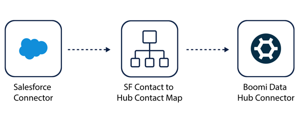
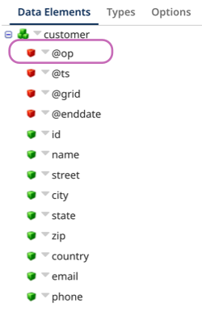

# Update Golden Records operation 

<head>
  <meta name="guidename" content="Integration"/>
  <meta name="context" content="GUID-6ce8d433-0f20-40cd-bc82-8c1dd729ead6"/>
</head>

The Update Golden Records operation submits a batch of entities from a contributing source to a deployed model in the authenticated repository. You can enter a staging ID to stage a batch of entities. In a batch submission, the operation can do one or more of the following:

- Create a new golden record
- Update an existing golden record
- End-date a golden record
- Quarantine the source entity
- Link the source entity to a golden record

This operation aligns with the [Update Golden Records](/docs/Atomsphere/Master%20Data%20Hub/REST%20APIs/r-mdm-Update_Golden_Records_fdad4dc4-f3db-48ab-8ba7-d027ecc10791.md) operation in the Repository API.

For example, you can create an integration that sends contacts from Salesforce and maps the contact fields to the deployed model fields. The Update operation submits a batch of contact data to the Contact repository. Boomi DataHub uses the Salesforce contact data to create new golden records and update any existing records.

## Prerequisites

You must have the following:

- A Hub repository 
- A deployed model in the repository
- A contributing source attached to the deployed model
- Source channel is open in the deployed model > Sources tab. Refer to [Loading data from a source](/docs/Atomsphere/Master%20Data%20Hub/Deployment/t-mdm-Loading_data_from_a_source_8c5915de-5144-45a0-8d21-b798879e174a.md).
- A deployed Boomi Atom to run connector operations (Integration > Manage > Atom Management)

## Setting up the Update Golden Records operation

1. In the connector, select **Update Golden Records** in the **Action** drop-down.
2. Click the plus icon in the **Operation** field to create a new operation.
3. Enter a name for the operation. 
4. Click **Import Operation**. 
5. Select the Atom you want to use to run your integration. The Atom must be online. 
6. Ensure you selected [the connection you created](/docs/Atomsphere/Integration/Connectors/int-Boomi_Data_Hub_connection.md) to the repository in the Connection field. 
7. **Optional**: Enter the source ID in **Source** for the source contributing data to the repository. The source ID here acts as a filter to help you select the deployed model name. You can find the source ID on the Sources page in Hub. 
8. **Optional**: In **Staging Area ID**, enter a staging ID as a filter to help you select the deployed model name. 
9. **Optional**: In **Filter**, enter a regex as a filter to help you select the deployed model name.
10. Click **Next**. 
11. In the **Object Type** drop-down, select the deployed model you want to use when creating and updating new golden records or staged entities. 
12. Click **Next**. 
13. Click **Finish**. The import operation creates a request profile. You can use this request profile to map data in a [Map step within your integration](/docs/Atomsphere/Integration/Process%20building/c-atm-Map_components_87f669d6-4999-445f-9f29-ed24e79c92dd.md)
14. Enter the source ID in **Source** for the source contributing data to the repository. The source ID indicates which source is sending data to Hub. You can find the source ID on the Sources page in Hub.
15. **Optional**: Enter a Staging Area ID to stage a batch of entities to see the potential effects on golden record data. Staging IDs are listed in the deployed model's Sources tab. Read [Adding a staging area for a source](/docs/Atomsphere/Master%20Data%20Hub/Stewardship/t-mdm-Adding_a_staging_area_for_a_source_a4e18da6-9b8d-4257-a28e-dc1725b587ae.md) to learn more. 
16. **Optional**: Select **Return Application Error Responses** if you want the operation to continue when there is an application error. Processing continues and passes the error to the next component processed as the connection output. When the checkbox is clear, the process stops and reports the error in Process Reporting.
17. Click **Save & Close**.

## Op attribute values

The Op attribute in a record tells Hub what action to take on the record. 

By default, all records from a contributing source have an empty @op attribute value. The default behavior is an UPSERT action that directs Hub to update or create a record based on match rules. You can set up your process to apply an @op value to source entities to change the default behavior. 

You can set an entity to have one of the following op attributes: 

- **CREATE** - Creates a new record even if the record creates a duplicate.
- **DELETE** - End-dates a golden record.

For example, you can map the Is Deleted field in a Salesforce contact and use a function to set a rule that applies the DELETE op value to the record in Hub. Read [Update Golden Records](/docs/Atomsphere/Master%20Data%20Hub/REST%20APIs/r-mdm-Update_Golden_Records_fdad4dc4-f3db-48ab-8ba7-d027ecc10791.md) API documentation to learn more about op attributes.