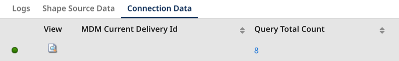

# Boomi DataHub connector

<head>
  <meta name="guidename" content="Integration"/>
  <meta name="context" content="GUID-33bc7d00-fefd-4914-877d-0e7dc6d83aba"/>
</head>

The Boomi DataHub connector integrates seamlessly with your Boomi DataHub repositories. It helps build integrations for data synchronization and management faster and easier.  

It uses an HTTPS connection to make web service calls to your authenticated repository via XML request and response profiles. The low-code/ no-code user interface simplifies the complexities of connecting to Boomi DataHub and setting up request headers, error handling, and HTTPS connections.

## Prerequisites 

You must have the following before using the connector: 

- Boomi DataHub enabled on your account. Contact your account representative for more information. 
- A Hub repository 
- A deployed model in the repository
- A deployed Boomi Atom to run connector operations

## Licensing

Deploying the Boomi DataHub connector does not affect your license count. You can deploy this connector unlimited times across different Atoms and environments.

## Getting started 

To use the connector in your integration:

**Step 1: Set up the connection.** Link your Hub repository to the connector by providing your username, authentication token, and the Hub cloud that hosts your repository. 

**Step 2: Select the Action.** The connector can perform several inbound and outbound operations on your Hub repository.

**Step 3: Set up the operation.** Click the plus icon to import a new operation and create the XML profile.

## Connector operations

The connector’s operations align with the [Boomi DataHub Repository API](/docs/Atomsphere/Master%20Data%20Hub/REST%20APIs/r-mdm-Repository_API_659e32f2-99ce-444e-8201-8a9ae1d92c9b.md) operations. Compared to the [legacy connector](/docs/Atomsphere/Integration/Connectors/r-atm-MDM_connector_ff690a6f-288d-44b3-96fb-e81afb046703.md), some operation titles have changed. The connector supports the following operations: 

- [Get Golden Record](/docs/Atomsphere/Integration/Connectors/int-BDH_Get_Golden_Record.md) - retrieves a specified golden record.
- [Get Quarantine Entry](/docs/Atomsphere/Integration/Connectors/int-BDH_Get_Quarantine_Entry.md) - retrieves a specified quarantine entry.
- [Update Golden Records](/docs/Atomsphere/Integration/Connectors/int-BDH_Update_Golden_Records.md) - (previously called [Upsert](/docs/Atomsphere/Integration/Connectors/r-atm-MDM_operation_outbound_actions_ea6b4a33-f225-4cfc-bf71-5372db17b3a6.md#upsert) in the legacy version) creates, updates, and/or end-dates golden records. The operation can quarantine source entities. It also allows you to send your new or updated records to staging.  
- [Query Golden Records](/docs/Atomsphere/Integration/Connectors/int-BDH_Query_Golden_Records.md)  - retrieves active golden records. 
- [Query Quarantine Entries](/docs/Atomsphere/Integration/Connectors/int-BDH_Query_Quarantine_Entries.md) - retrieves quarantine records. 
- [Fetch Channel Updates](/docs/Atomsphere/Integration/Connectors/int-BDH_Fetch_Channel_Updates.md) - (previously called [Query](/docs/Atomsphere/Integration/Connectors/r-atm-MDM_operation_inbound_actions_02ee8905-a7de-4aaa-85e4-84a1a041c28e.md#query) in the legacy version) fetches batches of source record update requests.
- [Match Entities](/docs/Atomsphere/Integration/Connectors/int-BDH_Match_Entities.md) - Lists match results for a batch of entities from a contributing source.

## Tracked properties

This connector has two tracked properties.

  - **Mdm Current Delivery Id** - This property is available with the Fetch Channel Updates operation when using manual acknowledgment. Read [Fetch Channel Updates](/docs/Atomsphere/Integration/Connectors/int-BDH_Fetch_Channel_Updates.md) for more information on manual acknowledgement.
 - **Query Total Count** - This property is available with the Query Golden Records and Query Quarantine Entries operations.

The other Boomi DataHub operations contain these two properties but provide an empty value. Refer to the topic [Adding tracked fields to a connector operation](../Process%20building/t-atm-Adding_tracked_fields_to_a_connector_operation_f71821dd-95ee-4ebd-bfc9-3333262f56f6.md) to learn how to add a custom tracked field.

