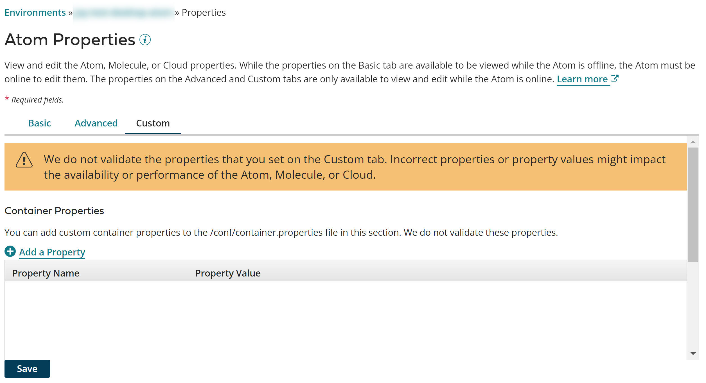

# Enabling Singleton Listen operations 

<head>
  <meta name="guidename" content="Integration"/>
  <meta name="context" content="GUID-d3cd3681-282f-4b05-ad11-aec72d861216"/>
</head>

You can extend the `ListenOperation` class and determine if the listener should operate in singleton mode. This is useful when one object is needed to coordinate actions across the system.

You must have the Atom Management privilege to set container properties. If you have the Atom Management Read Access privilege, you can view existing settings, but you cannot change them.

1.  Go to **Manage** \> **Atom Management**.

2.  Do one of the following:

    -   If you are the owner of a local Atom, Molecule, or private Atom Cloud, select your Atom, Molecule, or Cloud from the list on the left.

    -   If you are an account owner, select your Atom from the list on the left.

3.  Do one of the following:

    -   Open the **Properties** panel.

    -   Open the **Account Properties** panel.

    
    :::note

    The properties that you see are those that were in effect when the Atom, Molecule, or private Atom Cloud started. Properties are displayed regardless of how they were set — through the UI or manually by editing the `<installation_directory>/conf/container.properties` file or the `<installation_directory>/bin/atom.vmoptions` file.

    :::

4.  Click the **Custom** tab.

    Only owners of local Atoms, Molecules, and private Atom Clouds have access to this tab. If you own an Atom set up in a private Cloud, you cannot see the **Custom** tab.

    Some errors can be detected immediately. A red box appears around the property if there are errors. The error messages appear below the box.

    Properties initially appear in the order in which you added them. After you click Save, the properties are alphabetized by property name.

    

5.  To set the singleton listen container property on the **Custom** tab:

    1.  Click ** Add a Property** in the **Container Properties** section.

    2.  If you want to use the singleton listen operation, skip to the next step, since it is enabled by default. If you do not want to enable the singleton listen operation, type com.boomi.container.bounded.listenv2.enabled in the **Property Name** field and set the value to `false`. This setting value helps ensure that listeners successfully start in all containers. When set to `false`, the `SingletonListenOperation` interface is ignored and the Atom functionality does not change for listeners, even if the connector you build implements the `SingletonListenOperation` interface.

        Due to an issue with the existing singleton implementation where multiple instances of the same component version with different values are processed, and duplicate messages are sent, the `com.boomi.container.bounded.listen.enabled` container property is deprecated and will soon be retired from the . We highly recommend that you transition to use the functionality provided by the `com.boomi.container.bounded.listenv2.enabled` container property, allowing you to avoid duplicate messages. This container property and implementation mode is preferred, and takes precedence over the existing implementation. If both properties are set, the existing `com.boomi.container.bounded.listen.enabled` implementation is ignored, in favor of `com.boomi.container.bounded.listenv2.enabled`. When used, an enhanced locking mechanism helps prevent two nodes from locking the same file and avoids duplicate messages from being sent. To learn more, see the topic [Implementing Singleton Listen operations](https://developer.boomi.com/docs/Connectors/DevelopConnectors/Singleton_listen_operations).

    3.  **Attention:** Several container properties are available for you to determine how singleton locking works. Before deciding which property to enable, read the topic [Implementing Singleton Listen operations](https://developer.boomi.com/docs/Connectors/DevelopConnectors/Singleton_listen_operations) which explains the difference.

        Type com.boomi.container.bounds.lock.version in the **Property Name** field.

        -   Choose this property to use enhanced locking functionality. When acquiring the lock, the bounded service manager records the name of the node to lock, rather than relying on file locking. This behavior provides additional validation to ensure the node name exists and the lock is held. To ensure the lock is held, renewal and refresh functonality work in combination to continually check to acquire the lock and make sure it is current.

            -   Verify that the value in the **Property Value** field next to the property name is set to `2` \(the default value\). If the property value is set to 1, please change value to `2` to utilize the enhanced token-based locking. A value of 1 indicates file-based locking, where the node holds onto the network file system lock. Any other nodes that try to access this file will fail since it is being used be another node in the shared network. A value of 2 indicates token-based locking, where the node that locks onto the listener process will write its instance id and the timeout of this lock before it refreshes.

                CAUTION:

                Do not set this property to a value other than `2` or `1`. Doing so results in an error in the container log, and no locks are acquired.

                After enabling this property, set up the locking renewal interval by enabling the `com.boomi.container.bounds.renew.interval` property.

    4.  Type com.boomi.container.bounds.renew.interval in the **Property Name** field.

        After ensuring the `com.boomi.container.bounds.lock.version` property is set to `2`, use this property to schedule a renewal interval that the bounded service manager uses to renew locks. Locks are renewed on a scheduled interval to ensure the node name exists and the lock is held.

        -   Enter the renewal interval \(any value, in milliseconds\) in the **Property Value** field next to the property name.

            -   If left blank, the default value \(half the refresh interval\) is used.
            -   If you enter a value less than or equal to zero \(0\), the renewal interval is turned off.
            CAUTION:

            Locks expire when a value two times the renewal interval is met, or never expire when the renewal interval is less than or equal to zero \(0\).

    5.  Type com.boomi.container.bounds.refresh.interval in the **Property Name** field.

        After setting the `com.boomi.container.bounds.renew.interval` property, use this property to set a refresh interval that the bounded service manager uses to refresh locks. The renew and refresh properties work in combination to ensure locks are held.

        -   Enter the refresh interval \(any value, in milliseconds\) in the **Property Value** field next to the property name.
            -   If left blank, the default value \(1800000 milliseconds\) is used, which is 30 minutes.
6.  Click **Save**.

    Because changes to many of these properties do not take effect until the Atom, Molecule, or private Atom Cloud is restarted, you are prompted to restart. You have the option to restart now or restart later.

    Only Atom, Molecule, and Cloud owners can restart them. Accounts that have an Atom in a Cloud cannot restart the Cloud.

    If errors are still detected, a warning message appears containing the names of the tab\(s\) on which there are errors. You must correct the errors before the properties can be saved.