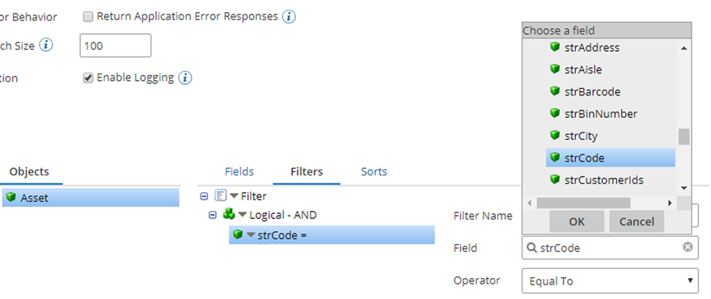
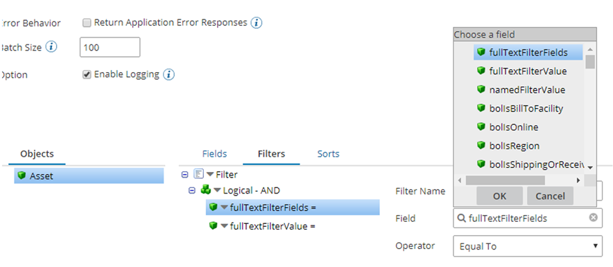
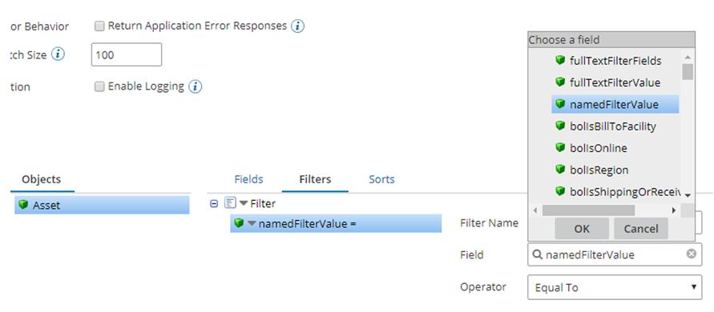

# Fiix — Partner operation

<head>
  <meta name="guidename" content="Integration"/>
  <meta name="context" content="GUID-202cf725-7f5b-45a2-a404-3af9ff12cd07"/>
</head>

The Fiix — Partner operation defines how to interact with your Fiix CMMS. The operation represents a specific action \(Query, Create, Update, or Delete\) to be performed against a specific Fiix CMMS object.

Create a separate operation component for each action/object combination that your integration requires.

The Fiix — Partner operations use JSON format and support the following actions:

-   Inbound: Query

-   Outbound: Create, Update, Delete, Execute

## Query

Query is an inbound action to search/retrieve records of specific CMMS object. The result returned depends on the fields selected in the **Fields** tab of the Query operation. The connector supports 3 types of search filters, which are listed in the sections below.

QL Filter \(default\)

This is the default search method. When using this filter, select the field you want to filter on and the corresponding operation \(as seen below\). Then, use the parameters tab in the connector step to specify the values.

FullText Filter

Use this search method when you specify “fullTextFilterFields” and “fullTextFilterValue” as parameters in Query operation **Filters** tab.

Named Filter

Use this search method when you specify “namedFilterValue” as a parameter in Query operation **Filters** tab.

Sorting

The query operation also supports sorting.

The following operation properties are available:

**Batch Size**
:   Limits the number of items returned in a page. You could use this to optimize the search request when there are a lot of records \(max 100\).

**Enable Logging**
:   Select to enable additional logging \(for troubleshooting purposes only\).

**Profile Format**
:   JSON

## Create

Create is an outbound action to create records of specific object.

If the Create operation is successful, the record is created in Fiix CMMS and the connector returns a JSON document with information about the record. The record information includes all fields in the request, the record id, and other system information.

The following operation properties are available:

**Batch Request**
:   Select to enable the batch request method \(enabled by default\).

**Batch Size**
:   The maximum number of records to be included in a single batch request \(max 100\).

**Enable Logging**
:   Select to enable additional logging \(for troubleshooting purposes only\).

**Profile Format**
:   JSON

## Delete

Delete is an outbound action to delete the record for a specific object from Fiix CMMS. When successful, the operation takes the record ID and returns a JSON document with deletion status.

The following operation properties are available:

**Batch Request**
:   Select to enable the batch request method \(enabled by default\).

**Batch Size**
:   The maximum number of records to be included in a single batch request \(max 100\).

**Enable Logging**
:   Select to enable additional logging \(for troubleshooting purposes only\).

**Profile Format \(Request only\)**
:   XML

## Update

Update is an outbound action to update records of specific object. The record id is required and used to identify the record to be updated.

If the Update operation is successful, the record is updated in Fiix CMMS and the connector returns a JSON document with information about the record. The record information includes all fields in the request, the record id, and other system information.

The following operation properties are available:

**Batch Request**
:   Select to enable the batch request method \(enabled by default\).

**Batch Size**
:   The maximum number of records to be included in a single batch request \(max 100\).

**Enable Logging**
:   Select to enable additional logging \(for troubleshooting purposes only\).

**Profile Format**
:   JSON

## Execute

Execute is an outbound action to perform a specific RPC method. Only the following RPC methods require request parameters:

-   **Calendar** – Get Days of Month

-   **Calendar** – Get Events

-   **Stocks Received** – Receive

-   **Stocks Received** – Receive Stocks

If the Execute operation is successful, the connector returns a JSON document with information about the RPC result.

The following operation properties are available:

**Enable Logging**
:   Select to enable additional logging \(for troubleshooting purposes only\).

**Profile Format**
:   JSON