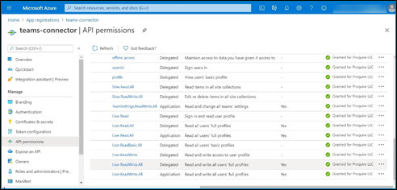

# Microsoft Teams connection 

<head>
  <meta name="guidename" content="Integration"/>
  <meta name="context" content="GUID-3e21fe3f-be48-4889-ae74-a7dd39132576"/>
</head>

The Microsoft Teams connector allows you to connect to your Microsoft Teams server and perform required data transfer from/to, using Microsoft Graph REST APIs.

## Connection tab

The Microsoft Teams connection represents a single account including login credentials. If you have multiple systems, you need a separate connection for each.

API Service Endpoint - Enter the authentication URL for the Microsoft Graph REST API service endpoint. The URL sets the base host API and tenant account. You can find it in the Microsoft Graph API documentation. URL to be provided: `https://login.microsoftonline.com/:tenant_id/oauth2/v2.0/token`

Tenant ID - Provide your client app tenant ID. You can find it in the Microsoft Azure Portal - App Registration - `<Your registered client app>` - Overview - Directory \(tenant\) ID.

API Service Endpoint - Enter the authentication URL for the Microsoft Graph REST API service endpoint. The URL sets the base host API and tenant account. You can find it in the Microsoft Graph API documentation. URL to be provided: `https://login.microsoftonline.com/:tenant_id/oauth2/v2.0/token`

Tenant ID - Provide your client app tenant ID. You can find it in the Microsoft Azure Portal - App Registration - `<Your registered client app>` - Overview - Directory \(tenant\) ID.

Client ID - Provide the unique application ID of your client app. You can find it in the Microsoft Azure Portal - App Registration - `<Your registered client app>` - Overview - Application \(client\) ID.

Client Secret - Type the password or a public/private key pair that you generated for your app during the app registration in the Azure portal.

Scopes - Provide the URL of the Microsoft Graph suffixed with .default. This value informs the Microsoft Azure about the permissions you have configured for your app, it should issue a token for the ones associated with the resource you want to use. URL to be provided: `https://graph.microsoft.com/.default`

Delegated Access - Select this check box to enable user delegated authorization. Mandatory to call specific Microsoft Graph APIs used for Get and Execute operation.

User Name - Enter the username for Microsoft Teams user account. Mandatory for specific Get & Execute operation.

Password - Enter the password for the user account.

## Test Connection

To perform Test Connection action, make sure your registered client app has the following API permissions configured in the Microsoft Azure Portal.

**Application**: User.Read.All, User.ReadWrite.All, Directory.Read.All, Directory.ReadWrite.All

**Delegated** \(Required only if you desire to use delegated user access\): User.Read, User.ReadWrite, User.ReadBasic.All, User.Read.All, User.ReadWrite.All, Directory.Read.All, Directory.ReadWrite.All, Directory.AccessAsUser.All

The following image illustrates the registered client app with required API permissions configured in the Azure portal.

