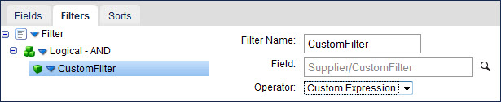

import OperationEnd from './_operationEnd.md'
import RequestProfile from './_RequestProfile.md'
import ResponseProfile from './_ResponseProfile.md'
import TrackingDirection from './_TrackingDirection.md'
import ReturnErrRes from './_ReturnResponse.md'
import ReqRes from './_ReqRes.md'
import TrackingDir from './_TrackObject.md'

# OData Client operation \(V 2.0\) 

<head>
  <meta name="guidename" content="Integration"/>
  <meta name="context" content="GUID-3852dbe5-b80e-4bd1-8cbd-8ac7798c1a19"/>
</head>


The OData Client operation defines how to interact with the OData service's URL endpoint defined in the connection component and represents a specific action \(Create, Delete, etc.\) to be performed against a specific OData entity or link object.

Not all actions are available for every object. You must create a separate operation component for each action/entity object or action/link object combination required for your integration.

The OData Client operation supports these actions:

-   Inbound: Get and Query, which are supported in all versions of OData. Unique parameters are required at run-time to request data. Review the topic about parameter values to understand how to statically or dynamically define these values in a process for run-time. The Get action is available only for entity objects. The Query action is available for entity objects and link objects.

-   Outbound: Create, Delete, Update. These actions are available for all entity objects and link objects for OData V1.0 and V2.0 and are now supported in V4.0. For all outbound operations, send request XML data to the connector that corresponds with the defined XML profile. Typically, request documents are the destination output of a map. You can also set parameters on the outbound connector's Parameters tab within the process to supply static or dynamic request values.


You can use wild cards to browse objects in OData V2.

In OData, objects are *entities* or *entity types*. A collection of objects is an *entity set*. Relationships between two entities or between an entity and a set of entities are called *links*. There are two types of OData objects:

-   *Entity objects* that have simple names that correspond to the entity set.

-   *Link objects* that can be identified by the “–\>” symbol between the two entities and the word “Link” at the end. For example: Product –\> Category Link.


Profiles for entity objects and link objects are distinctly different. Some entities may have concurrency protection in place.

## Concurrency 

When concurrency is enabled, the server provides an `@entityTag` or `etag` for the entity in Get, Delete, and Update actions. You can use ETags in the header of documents to provide web cache validation that compares ETag values in the cached version of an object to the server version. The server ensures that no one else has modified the entity since the last time the you provided an ETag. To use concurrency, put a Set Properties step after the connector step in your process and add an ETag property.

## Get 

You can use the Get action with entity objects but not with link objects. For the Get action, you must supply the entity key as the objectId using either a value or a property value mapping. For example, you can specify a key consisting of a single ID as **9** or **ID=9**. If the key is made up of multiple values, delimit them with commas.

## Query 

You can use the Query action with entity objects and link objects. The Query action allows Integration to look up object records based on specific search criteria. The Query action returns zero-to-many documents from a single Query request based on zero or more filters. After you select the Query connector action and use the Import Wizard, you can select fields, add query filters, and sort the results by field. The bottom half of the Operation component page contains tabs on which you configure these options.

The OData Query action supports the following filter operators: Equal To \(eq\), Not Equal To \(ne\), Greater Than \(gt\), Greater Than or Equal To \(ge\), Less Than \(lt\), and Less Than or Equal To \(le\).

The OData Client connector automatically formats duration, binary, enum, and string values used in filters correctly based on the construction rules in the OData 4.0 specification. You do not need to surround the values with quotes, or provide a prefix. For more information, see the linked topic.

OData supports a complex query language, and you can use a Custom Expression operator with filtering for more advanced operators such as arithmetic. To query an entity object and use the Custom Expression operator in a filter, navigate to and select “CustomFilter” in the **Field** field. The **Operator** is set to “Custom Expression”.



With the custom filter and expression selected, you can use OData's filter language to create, for example, a free-form filter in a parameter value. The values must be formatted based on the OData field data type using the construction rules in the OData 2.0 specification. For more information, see the linked topic. The contents of the parameter value input is substituted into the filter expression according to the custom filter's placement in the configured filter expression. For example, this filter: **AND\(LogicalFilter\(‘price', ‘equals', 5\), CustomFilter\(‘NOT\(name eq ‘Smith'\)'\)\)** results in the expression filter: **price eq 5 and NOT\(name eq ‘Smith'\)**.

When querying a link object, additional `SourceEntityKey/<KeyFields>` are available. Make the SourceEntityKey either a single top-level expression or nest it in a top-level AND expression to specify which entity's links to query.


In OData 2.0 customFilter is a selectable filter, which has a Custom Expression operator. Use this to configure a value that is appended as a filter to the URI.


:::note

As the OData's precedence operator "\(\)" is supported only in custom filters, use the OData's “NOT\(\)” unary query filter operator as a custom filter.

:::


:::note

When you select fields to query, the field names are appended to the URL. As a result, the browser's URL length limit can be exceeded, which generates a 502 server error. If this happens, unselect all fields.

:::

## Create 

Use the Create action with entity objects and link objects.

When you use the Create action with entity profiles, use the `EntitySet/EntityType/Properties` element to specify values for properties of the entity being created. Use the `EntitySet/LinkEntityIds` element to create links to other entities. The `EdmNavigationProperty` and `TargetEntityKey` are required to create links from an element. When you create an element, you can make links only to existing entities by using the `LinkEntityIds` element.

When you use the Create action with entity profiles, you also can establish an association to a collection of elements. For example, to create a supplier with a list of products that the supplier offers, use the `EntitySet/InlineEntityLinks` element to enumerate the collection of elements.

When you use the Create action with link profiles, supply the `EntitySet/SourceEntityKey` and `EntitySet/EdmNavigationProperty/TargetEntityKey`.

## Delete 

Use the Delete action with entity objects and link objects.

When you use the Delete action with entity profiles, you must supply the entity key as input. The `@entityTag` attribute is used on the `EntitySet/EntityType` element in Delete actions. If the entity object is concurrency enabled, the `@entityTag` must be put within brackets \(“\[ \]”\) at the end of the entity key. For example: **9\[W/0000020203X\]**.

When you use the Delete action with link profiles, you must supply the source and target entity keys, separated by a pipe character \(“\|”\). For example: **ID=0\|ID=8**. Or you could use: **0\|8**. If the key is made up of multiple values, they must be delimited by a comma \(“,”\). For example: **ID=9\|ID=3,AD=4,AL=7**. Or you could use: **9\|3,4,7**. Supplying the key property name in the key is optional, as shown in the previous examples.

## Update 

Use the Update action with entity objects and link objects.

When updating, you have the choice of replacing or merging data. Set the Merge check box on the Operation component as needed.

-   When replacing, you must provide a full copy of the entity, with all of its properties and links. It replaces the existing data.

-   When merging, only the data to be updated should be provided. It replaces the existing data. Attributes that are not provided are not modified.


When you use the Update action with entity profiles, you can use the `LinkEntityIds` element to create links. To update existing links on the object, put them in the `Links` element of the source `EntityType`. The `@entityTag` attribute is used on the `EntitySet/EntityType` element in Update actions.

When you use the Update action with link profiles, supply the `SourceEntityKey` and `TargetEntityKey` for the link. To remove the association between a source and a target entity, supply the `OldTargetEntityKey`.


:::note

When employing the Update operation, it is required to populate the @odata.editLink field in the operation's request profile. Exclusion of the editLink value from the Update request profile results in an error. Alternatively, this value is automatically returned in Query and Get operations, and is populated in the response profile for both operations by default.

:::

## Options tab 


:::note

Fields in operations are unselected by default — you need to select the fields that you want returned in a response.

:::

Click **Import Operation**, then use the Import wizard to select the object with which you want to integrate. The available objects vary based on the OData service to which you are connecting.

This table describes the default field definitions for each action type:

**Object** - 
An object defines what you want to integrate or the action to run, which you select in the **Import Operation** wizard.

<TrackingDir />

<RequestProfile />

<ResponseProfile />

<ReturnErrRes />


**$skip** - 
\(Query only\) Starts the query N entries into the set and returns only the remaining entries. Like all filters, $skip reduces processing time by limiting the number of returned records. For example, when querying a set of 10,000 records when $skip = 5000, only entries 5001–10,000 are returned. The default value of -1 turns off this option.

**$top** - 
\(Query only\) Selects only the first N items of the set. Like all filters, $top reduces processing time by limiting the number of returned records. For example, when querying a set of 10,000 records when $top = 200, only entries 1–200 are returned. Combining the $skip = 5000 and $top = 200 examples, the query skips the first 5000 records then returns only the next 200 records \(5001-5200\). The default value of -1 turns off this option.

**Merge** - 
\(Update only\) If selected, performs a Merge operation on an entity.

If cleared, performs a Put \(Replace\) operation.

**Filter** - 
You may need to filter items in the Import Wizard when the generic browse operation exceeds the limit of 500 object types. The filter is case-sensitive. Use a ? to replace any single character; use an \* to replace zero or more characters. The filter applies to object names – not link names. To search for links, filter on the originating object.

**Include ID in Path \(OData 4.0 only\)** - 
\(Get and Delete only\) This setting selects the syntax for the resource path to accommodate different requirements for various OData 4.0 services needed for the Get and Delete operations, and determines if the object ID is included in the path of the URL. Providing the incorrect syntax may cause the operation to fail with a syntax error. If you do not know the correct syntax, see your service's documentation.

-   When selected, the object ID is included in the path of the URL and a slash delimiter is added before the ID to designate a lower path level. For example:

        ```
        host/service/object/id
        ```

	Enable trace logging to see the generated URL in the logs. For more information about enabling trace logging, see the linked topic.

-   When not selected \(default\), the object ID is included in the path of the URL within parenthesis. For example:

        ```
        host/service/object(id)
        ```


When you select this check box, you must manually format the object ID based on the construction rules in the OData 4.0 specification. For more information, see the linked topic. Otherwise, the connector automatically formats the object ID correctly. When formatting the object ID:

-   Surround String types with quotes.
-   Do not surround Numerical types with quotes.
-   Provide a qualified name as a prefix for Enum types.

**Concurrency Mode** - 
\(V4 only\) \(Get, Update, Delete\) This setting controls when the OData server updates concurrent objects:

-   If match — \(On by default.\) Update only if the current ETag matches my version.
-   If none match — Update even if the ETag does not match my copy.


**Patch** - 
\(V4\) \(Update only\) If selected, perform a PATCH operation \(called MERGE in V2\) on an entity instead of a PUT operation.


<OperationEnd />

## Entity object profiles 

The profiles for an entity object have the following format:

```
<[EntitySet] xmlns=”http://www.boomi.com”>
	<[EntityType]entityTag=”[etag]”>
		<Properties xmlns=”[type_namespace]”>
			...properties for the entity...
		</Properties>
		<Links xmlns=”[type_namespace]”>
			...links for the entity...
		</Links>
	</[EntityType]>
	<LinkEntityIds>
		<[EdmNavigationProperty]>
			[TargetEntityKey]
		</[EdmNavgationProperty]>
	</LinkEntityIds>
	<InlineEntityLinks>
		<[TargetEntityType]>
			<Properties xmlns=”[type_namespace]”>
				...target entity properties...
			</Properties>
			<Links xmlns=”[type_namespace]”>
				...target entity links...
			</Links>
		</[TargetEntityType]>
	</InlineEntityLinks>
</[EntitySet]>
```

The OData entity profile contains information needed for various types of operations. The entity set name is at the root of the profile. The first nested element is the definition of the entity type. An entity uses the Properties element to list the information describing various attributes of the entity. The entity uses the Links element to list the links for the entity. See the OData Client Operation's Outbound Actions topic for more information.

## Link object profiles 

The profiles for a link object have the following format:

```
<[SourceEntitySet] xmlns=”http://www.boomi.com”>
	<SourceEntityKey>
		<[KeyField1]>value</[KeyField1]>
			...
	</SourceEntityKey>
	<[EdmNavigationProperty]>
		<TargetEntityKey>
			<[KeyField1]>value</[KeyField1]>
				...
		</TargetEntityKey>
		<OldTargetEntityKey>
			<[KeyField1]>value</[KeyField1]>
				...
		</OldTargetEntityKey>
	</[EdmNavigationProperty]>
</[SourceEntitySet]>
```

In an OData link profile, the SourceEntityKey is the key of the entity that plays the “From” role in the link relationship. The EdmNavigationProperty indicates the relationship from the source entity to which the operation pertains. The TargetEntityKey indicates the entity in the target entity set that is referenced.

## Custom fields 

OData supports “dynamic properties” \(custom fields\), which are properties included on an object but not declared in the metadata. OData4J treats these properties as simple types. Because the dynamic properties are not declared, they cannot be included in the profile upon import. They are provided in the output XML if they are returned by the server. To process the dynamic properties, add profile elements to the profiles manually.