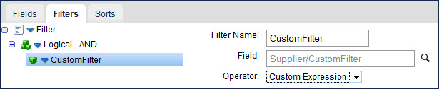
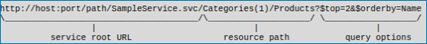

import OperationEnd from './_operationEnd.md'
import RequestProfile from './_RequestProfile.md'
import ResponseProfile from './_ResponseProfile.md'
import TrackingDirection from './_TrackingDirection.md'
import ReturnErrRes from './_ReturnResponse.md'
import ReqRes from './_ReqRes.md'
import TrackingDir from './_TrackObject.md'

# OData Client operation \(V 4.0\) 

<head>
  <meta name="guidename" content="Integration"/>
  <meta name="context" content="GUID-36577562-5b1c-43c6-a1a5-9b0b0ff50d29"/>
</head>


The OData Client operation defines how to interact with the OData service’s URL endpoint defined in the connection component and represents a specific action \(Create, Delete, etc.\) performed against a specific OData entity.

Not all actions are available for every object. You must create a separate operation component for each action/entity object combination required for your integration.

The OData Client operation supports these actions:

-   Inbound: Get and Query, which are supported in all versions of OData. Unique parameters are required at run-time to request data. Review the topic about parameter values to understand how to statically or dynamically define these values in a process for run-time. The Get action is available only for entity objects. The Query action is available for entity objects.

-   Outbound: Create, Delete, Update. These actions are available for all entity objects for OData V1.0 and V2.0 and are now supported in V4.0. For all outbound operations, send request JSON data to the connector that corresponds with the defined JSON profile. Typically, request documents are the destination output of a map. You can also set parameters on the outbound connector's Parameters tab within the process to supply static or dynamic request values.


Beginning with the Feb 2018 release, you can use wildcards to browse objects in OData V4.

Entity sets are a collection of entities of a particular type. Relationships between two entities or between an entity and a set of entities are called relationships and are defined by navigation properties. When accessing an OData V4 service entity sets are exposed, they make up the objects that are available for import into an OData V4 operation.

## Metadata caching 

When gathering metadata from the service, the metadata is saved in the connector cache and is reused for each operation to produce faster response times. If caching the metadata impacts the Atom's available memory, disable the metadata caching by setting the `com.boomi.connector.odata.disableMetadataCaching` container property to true.

## Concurrency 

To use concurrency, put a Set Properties step after the connector step in your process and add an ETag property when using Get, Delete, and Update actions. You can use ETag document properties to provide web cache validation that compares ETag values in the cached version of an object to the server version. The server ensures that no one else has modified the entity since the last time the you provided an ETag.

## Get 

You can use the Get action with entity objects. For the Get action, you must supply the entity key as the objectId using either a value or a property value mapping. For example, you can specify a key consisting of a single ID as **9** or **ID=9**.

When using the Get operation and If-Match is selected in the Concurrency Mode field, set the ETag document property with a parameter value of **\*** to update an existing object without creating a new object. Similarly when If-None-Match is selected, set the ETag document property with a parameter value of **\*** to create a new object without performing updates to any existing objects.

## Query 

You can use the Query action with entity objects. The Query action allows to look up object records based on specific search criteria. The Query action returns zero-to-many documents from a single Query request based on zero or more filters. After you select the Query connector action and use the Import Wizard, you can select fields, add query filters, and sort the results by field. The bottom half of the Operation component page contains tabs on which you configure these options.

The OData Query action supports the following filter operators: Equal To \(eq\), Not Equal To \(ne\), Greater Than \(gt\), Greater Than or Equal To \(ge\), Less Than \(lt\), and Less Than or Equal To \(le\).

The OData Client connector automatically formats duration, binary, enum, and string values used in filters correctly based on the construction rules in the OData 4.0 specification. You do not need to surround the values with quotes, or provide a prefix.

**Complex queries and Custom Expression operators** - 

OData supports a complex query language, and you can use a Custom Expression operator with filtering for more advanced operators such as arithmetic. To query an entity object and use the Custom Expression operator in a filter, navigate to and select “CustomFilter” in **Field**. The **Operator** is set to “Custom Expression”.



With the custom filter and expression selected, you can use OData’s filter language to create, for example, a free-form filter in a parameter value. The values must be formatted based on the OData field data type using the construction rules in the OData 4.0 specification. The contents of the parameter value input is substituted into the filter expression according to the custom filter’s placement in the configured filter expression. For example, this filter: **AND\(LogicalFilter\(‘price’, ‘equals’, 5\), CustomFilter\(‘NOT\(name eq ‘Smith’\)’\)\)** results in the expression filter: **price eq 5 and NOT\(name eq ‘Smith’\)**.


:::note

As the OData's precedence operator "\(\)" is supported only in custom filters, use the OData’s “NOT\(\)” unary query filter operator as a custom filter.

:::

**Navigation property selection** - 

When you select fields to query, the field names are appended to the URL. For navigation properties, you can select a non-leaf node field and receive all of its sub fields, or leaves. Alternatively, you can select a sub field \(leaf node\) without selecting an intermediate object \(branch\). This prevents the resulting URL from being too long and supports $expand without requiring a nested $select. If you created an operation prior to the September 2019 release, re-importing the profile will enable this functionality.


:::note

The ability to select a non-leaf node field and receive the sub fields \(leaves\) is limited to navigation properties. During the query, navigation properties are the first child \(branch\) of the root \(trunk\).

:::

## Create 

Use the Create action with entity objects. When you use the Create action with entity profiles, use the `EntitySet/EntityType` element to specify values for properties of the entity being created.

When you use the Create action with entity profiles, the OData connector creates an element for many to 1 relationships between entities. This element is prefixed with an underscore and is the primary key for the referenced entity.

## Delete 
Use the Delete action with entity objects.

When you use the Delete action with entity profiles, you must supply the entity key as input. The `@entityTag` attribute is used on the `EntitySet/EntityType` element in Delete actions. If the entity object is concurrency enabled, use the If-match \(on by default\) and If-none-match headers to determine when the operation deletes an object based on whether or not the current ETag matches your version. When using the Delete operation and If-Match is selected in the Concurrency Mode field, set the ETag document property with a parameter value of **\*** to update an existing object without creating a new object. Similarly when If-None-Match is selected, set the ETag document property with a parameter value of **\*** to create a new object without performing updates to any existing objects.

## Update 

Use the Update action with entity objects.

When updating, you have the choice of replacing or merging data. Set the Merge check box on the Operation component as needed.

-   When replacing, you must provide a full copy of the entity, with all of its properties and links. It replaces the existing data.

-   When merging, only the data to be updated should be provided. It replaces the existing data. Attributes that are not provided are not modified.


:::note

When employing the Update operation, it is required to populate the @odata.editLink field in the operation's request profile. Exclusion of the editLink value from the Update request profile results in an error. Alternatively, this value is automatically returned in Query and Get operations, and is populated in the response profile for both operations by default.

:::

When you use the Update operation and select If-Match in the Concurrency Mode field, set the ETag document property with a parameter value of **\*** to update an existing object without creating a new object. Similarly if you select If-None-Match, set the ETag document property with a parameter value of **\*** to create a new object without performing updates to any existing objects.

## Options tab 


:::note

Fields in operations are unselected by default — you need to select the fields that you want returned in a response.

:::

Click **Import Operation**, then use the Import wizard to select the object with which you want to integrate. The available objects vary based on the OData service to which you are connecting.

This table describes the default field definitions for each action type:

**Object** - 
An object defines what you want to integrate or the action to run, which you select in the **Import Operation** wizard.

<TrackingDir />

<RequestProfile />

<ResponseProfile />

<ReturnErrRes />


**$skip** - 
\(Query only\) Starts the query N entries into the set and returns only the remaining entries. Like all filters, $skip reduces processing time by limiting the number of returned records. For example, when querying a set of 10,000 records when $skip = 5000, only entries 5001–10,000 are returned. The default value of -1 turns off this option.

**$top** - 
\(Query only\) Selects only the first N items of the set. Like all filters, $top reduces processing time by limiting the number of returned records. For example, when querying a set of 10,000 records when $top = 200, only entries 1–200 are returned. Combining the $skip = 5000 and $top = 200 examples, the query skips the first 5000 records then returns only the next 200 records \(5001-5200\). The default value of -1 turns off this option.

**Merge** - 
(Update only\) If selected, performs a Merge operation on an entity.

If cleared, performs a Put \(Replace\) operation.

**Filter** - 
You may need to filter items in the Import Wizard when the generic browse operation exceeds the limit of 500 object types. The filter is case-sensitive. Use a ? to replace any single character; use an \* to replace zero or more characters. The filter applies to object names – not link names. To search for links, filter on the originating object.

**Include ID in Path \(OData 4.0 only\)** - 
\(Get and Delete only\) This setting selects the syntax for the resource path to accommodate different requirements for various OData 4.0 services needed for the Get and Delete operations, and determines if the object ID is included in the path of the URL. Providing the incorrect syntax may cause the operation to fail with a syntax error. If you do not know the correct syntax, see your service's documentation.

-   When selected, the object ID is included in the path of the URL and a slash delimiter is added before the ID to designate a lower path level. For example:

        ```
        host/service/object/id
        ```

    Enable trace logging to see the generated URL in the logs. For more information about enabling trace logging, see the linked topic.

-   When not selected \(default\), the object ID is included in the path of the URL within parenthesis. For example:

        ```
        host/service/object(id)
        ```


When you select this check box, you must manually format the object ID based on the construction rules in the OData 4.0 specification. For more information, see the linked topic. Otherwise, the connector automatically formats the object ID correctly. When formatting the object ID:

-   Surround String types with quotes.
-   Do not surround Numerical types with quotes.
-   Provide a qualified name as a prefix for Enum types.

**Concurrency Mode** - 
\(V4 only\) \(Get, Update, Delete\) This setting controls when the OData server updates concurrent objects:

-   If match — \(On by default.\) Update only if the current ETag matches my version.
-   If none match — Update even if the ETag does not match my copy.


**Patch** - 
\(Update only\) If selected, perform a PATCH operation on an entity instead of a PUT operation.

**Custom URL Query Parameters** - 
\(V4 only\) \(Get, Query, Create, Delete, Update\) The properties you add \(a key, and value\) are added as parameters \(`query options` section in the following image\) to the query string of the URL in each request. This allows you to customize and/or extend the way the operation interacts with the service and its data.



#### Parameter example

The `$filter` query parameter is automatically included by the connector in the request URL when a Query operation is executed with a configured filter. However, another query parameter, such as `cross-company`, is not automatically included and you must add it based on your requirements. In this example, if you add `cross-company` as the key and `true` as the value, the following URL query parameter is added at the end of the URL \(`query options` section in the previous image\) generated by the connector for the request:

`cross-company=true`

The parameter is added after `&` or `$` in the URL, depending on whether there are previous URL query parameters.

#### Property details

-   You can override the properties using the Custom URL Query Parameters dynamic operation property.
-   You cannot specify properties with blank keys or properties with repeated keys.
-   When an operation is configured for use with OData V2, its executions are not affected by the properties.
-   The custom URL query parameters are encoded by the connector into percent-encoded \(URL-encoded\) UTF-8 representations based on the encoding mechanism provided by the Olingo library \(a custom variation of [RFC 3896](https://www.ietf.org/rfc/rfc3986.txt)\). The same encoding is already applied by the Query operation to URL query parameters for filters, field selection, sorting, top, and skip.
-   For the Update operation, all property details apply regardless of the type of edit link provided in the input documents \(the edit link being absolute or relative\).
-   For the Query operation, only the request for the first page is prepared to include the custom URL query parameters. The requests for subsequent pages are performed using the links for next pages returned by the OData service. This may or may not include the custom URL query parameters set in the first request.
-   Metadata requests are not affected by the properties.


<OperationEnd />


## Custom fields 

OData supports dynamic properties \(custom fields\), which are properties included on an object that can be declared in the metadata. Because dynamic properties can be declared, they are included in the profile upon import. They are provided in the output JSON if they are returned by the server.