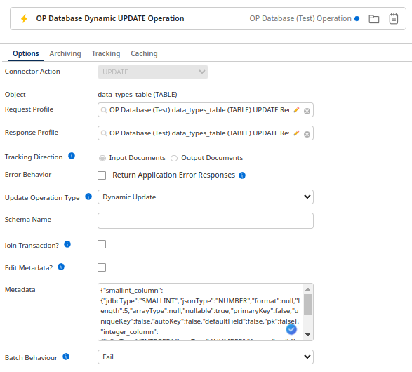

# OP Database - Partner operation

<head>
  <meta name="guidename" content="Integration"/>
  <meta name="context" content="GUID-04c0c167-9498-4069-968e-3eebab0aba4f"/>
</head>

The OP Database — Partner operations define how to interact with your database and represent a specific action (INSERT, GET, UPDATE, UPSERT, DELETE, and STORED PROCEDURE) to be performed against one/many database objects. Additionally, there is a VERSION operation to see which build you are using. Apart from the UPSERT and STORED PROCEDURE operations, all the other operations can be classified as:

* **Standard Operation**: Uses prepared SQL statements entered by the user.

* **Dynamic Operation**: Uses the statement class to build dynamic SQL queries during the runtime based on the user’s input.

* **Entity Operation**: Uses the statement class to build a dynamic SQL query during the runtime based on the primary keys—this operation is performed on a single entity.

## Browse

The Browse functionality connects to a target database, collects service metadata, and leverages this information to generate various fields. These include but are not limited to, the request and response profiles, primary keys, metadataContainer (containing table metadata), and the SQL query (applicable for standard operations only).

## Metadata Container

The metadata is a JSON string containing all information about a table's fields, which is automatically generated by the browse but can also be provided manually.

This information is needed throughout the execution of the operation, such as helping with conversions between JDBC and JSON. Boomi makes a call to the database to get this information each time it is needed. However, by generating the metadata during the browse step, no additional calls are necessary during the operation's execution, as all necessary information is stored as a parameter.

### Metadata Structure

The metadata structure consists of key attributes for each database column:

* **jdbcType**: The JDBC type of the field.

* **jsonType**: The corresponding JSON type of the field.

* **format**: (Optional) Specifies the format of the field, such as for dates or timestamps.

  * Example: `"yyyy-MM-dd HH:mm:ss"` for a timestamp field.

* **length**: The length or precision of the field.

* **jdbcTypeInfo**: Specifies additional information, such as enums, JSON, binary input type, and array type.

* **uniqueKey**: Indicates if the field is part of a unique key constraint.

* **primaryKey**: Indicates if the field is a primary key.

* **autoKey**: Indicates if the field is auto-incrementing.

* **nullable**: Indicates if the field allows null values.

* **defaultField**: Indicates if the field has a default value.

Here is how the structure would look:
````
{
  "column1": {
    "jdbcType": "string",
    "jsonType": "string",
    "format": "string",
    "length": "integer",
    "jdbcTypeInfo": "string",
    "uniqueKey": "boolean",
    "primaryKey": "boolean",
    "autoKey": "boolean",
    "defaultField": "boolean",
    "nullable": "boolean"
  },
  "column2": {
    "jdbcType": "string",
    "jsonType": "string",
    "format": "string",
    "length": "integer",
    "jdbcTypeInfo": "string",
    "uniqueKey": "boolean",
    "primaryKey": "boolean",
    "autoKey": "boolean",
    "defaultField": "boolean",
    "nullable": "boolean"
  },
}
````

By configuring metadata manually, you optimise performance and reduce external dependencies during execution. This ensures that all necessary information for data operations is readily available, enhancing the efficiency and reliability of your integration processes.

### Configuring Metadata

To configure metadata:

1. Identify each column in your database table.

2. Determine the appropriate JDBC type for each column.

3. Assign corresponding JSON types, formats (if applicable), lengths, and other attributes based on your table schema.

4. Ensure accuracy in specifying primary keys, auto-increment keys, and other constraints.

By configuring metadata manually, you optimise performance and reduce external dependencies during execution. This approach ensures that all necessary information for data operations is readily available, enhancing the efficiency and reliability of your integration processes.

The `jdbcTypeInfo` field provides additional information that complements specific JDBC types. It helps define how the data should be handled, particularly for more complex types like arrays, binary formats, or structured data. Below is a detailed breakdown of the `jdbcTypeInfo` for different JDBC types:

| JDBCType | JDBCTypeInfo | JSONType | Notes |
| :---- | :---- | :---- | :---- |
| ARRAY | 12 4 \-6 6 8 | ARRAY | SQL code representing the array's data type. |
| BINARY | BASE64 HEXDEC BYTEARRAY | STRING STRING ARRAY | Binary format input type ("BYTEARRAY", "BASE64", "HEXDEC"). |
| VARBINARY | BASE64 HEXDEC BYTEARRAY | STRING STRING ARRAY | Binary format input type ("BYTEARRAY", "BASE64", "HEXDEC"). |
| LONGVARBINARY | BASE64 HEXDEC BYTEARRAY | STRING STRING ARRAY | Binary format input type ("BYTEARRAY", "BASE64", "HEXDEC"). |
| BLOB | BASE64 HEXDEC BYTEARRAY | STRING STRING ARRAY | Binary format input type ("BYTEARRAY", "BASE64", "HEXDEC"). |
| OTHER | JSON | Varies | Contains additional data type information (e.g., "JSON" or "vector") to identify output. |
| STRUCT | "Konnekt"."complex" | String | Specifies the target struct type or table to cast the data to. |
| VARCHAR | enum | String | Specifies enum status. |
| VARCHAR | enum:"Konnekt"."primary\_key\_enum" |  | Specifies enum type to cast to, if applicable. |

## Get Operation

| Video Type | Link |
| :---- | :---- |
| Setting up standard get operation | [https://drive.google.com/file/d/1HZAlY1hCMHn3b8J2DD7OEj2IxXBJ1YyC/preview](https://drive.google.com/file/d/1HZAlY1hCMHn3b8J2DD7OEj2IxXBJ1YyC/preview) |
| Setting up dynamic get operation | [https://drive.google.com/file/d/1dOyVFXaQjLECPpvzLu2awV8CjSQ01Pmc/preview](https://drive.google.com/file/d/1dOyVFXaQjLECPpvzLu2awV8CjSQ01Pmc/preview) |
| Setting up entity get operation | [https://drive.google.com/file/d/12jwIo3CYrYnRUn-c1bhl7\_jCuhrfJRBD/preview](https://drive.google.com/file/d/12jwIo3CYrYnRUn-c1bhl7_jCuhrfJRBD/preview) |

The Get operation is an inbound action used to retrieve records from the database based on parameters defined on the connector’s Parameters tab. It takes input parameters from the user and fetches the corresponding records. Additionally, the output can be batched using the Document Batching option provided in the Get-Import wizard. You can configure this operation using the following parameters:

* **Get Operation Type**: A string specifying the type of get operation to use. The available options are: 

  * **Dynamic Get**: The query is built dynamically at runtime, based on input parameters mapped to the WHERE clause of the SQL SELECT statement.

  * **Standard Get**: The user manually enters the SQL statements in the SQL Query field, and the parameters for the select query are taken from the input JSON.

  * **Entity Get**: Uses the statement class to build a dynamic SQL query during runtime based on primary keys. This operation retrieves a single entity.

* **Schema Name**: An optional string specifying the name of your schema. This overrides the value in the connection (MariaDB does not use schemas)

* **SQL Query**: A string that defines the SQL query to be used (Note: For more than one statement separated by a semicolon you need to append a connection property allowMultiQueries=true to the database URL) (Only available in Standard Get)

* **Override Primary Keys?**: A boolean that when enabled allows manual modification of the primary keys (Only available in Entity Get)

* **Primary Keys**: A comma-separated list of all the primary keys that will be used to query the database (WARNING: If left empty, it will affect all records\!) (This will only be used if override primary keys is set to true) (Only available in Entity Get)

* **Sort By Columns**:  A comma-separated list of all the columns to sort by (This will only be used if override primary keys is set to true) (Only available in Entity Get)

* **Retrieve Columns**: A comma-separated list of all the columns to return (This will only be used if override primary keys is set to true) (Only available in Entity Get)

* **Edit Metadata?**: A boolean that when enabled allows manual modification of the metadata (When selected the browser will not update)

* **Metadata**: A string value containing all information about a table's fields, which is automatically generated by the browse but can also be provided manually

* **Link Element**: An optional string specifying the field, usually the primary key in the database, to split or group results into documents

* **Max Rows**: An optional integer that specifies the maximum number of rows to be returned from the database in a single request

* **Max Field Size**: An optional integer specifies the limit for the maximum number of bytes that can be returned for character and binary column values in a ResultSetObject produced by this Statement object. If the limit is exceeded, the excess data is silently discarded. Applies only to 

  * BINARY

  * VARBINARY

  * LONGVARBINARY

  * CHAR

  * VARCHAR

  * NCHAR

  * NVARCHAR

  * LONGNVARCHAR

  * LONGVARCHAR

* **Batch Count**: An integer specifying the number of records retrieved per output document for document batching

* **Batch Behaviour**: A string specifying the way batching should behave if some items within the batch do not match up

* **Fetch Size**: An optional integer specifying the number of rows fetched when there is more than one row of results on select statements


Input Format
#### Dynamic Get

````
{
  "WHERE": [
    {
      "column": "column name",
      "operatior" "operator symbol (e.g. =)",
      "value": "value"
    }
  ]
}
````
#### Entity & Standard Get

````
{
  "column name": "value"
}
````

## Insert Operation

| Video Type | Link |
| :---- | :---- |
| Setting up standard insert operation | [https://drive.google.com/file/d/1Bjy9EKqVd6Fh2lpBEHtA9sEzrvS-YBBN/preview](https://drive.google.com/file/d/1Bjy9EKqVd6Fh2lpBEHtA9sEzrvS-YBBN/preview) |
| Setting up entity insert operation | [https://drive.google.com/file/d/14cGjPH0mJx7fcQ0d5YvnrFhy6LQ2Vq3y/preview](https://drive.google.com/file/d/14cGjPH0mJx7fcQ0d5YvnrFhy6LQ2Vq3y/preview) |

Insert is an outbound action used to insert new records into a database table. It supports JDBC statement batching, where the connector batches SQL statements based on input requests. Upon successful insertion, the IDs of the records are returned in the response. You can configure this operation using the following parameters:

* **Insert Type**: A string specifying the type of insert operation to use. The available options are: 

  * **Standard Insert**: The user provides the SQL statement and input parameters, and the connector executes the query based on the input.

  * **Entity Insert**: Uses the statement class to build a dynamic SQL query based on primary keys at runtime. This operation inserts a single entity.

* **Schema Name**: An optional string specifying the name of your schema. This overrides the value in the connection (MariaDB does not use schemas)

* **SQL Query**: A string that defines the SQL query to be used (Note: For more than one statement separated by a semicolon, you need to append a connection property allowMultiQueries=true to the database URL) (Only available in Standard Insert)

* **Join Transaction?**: A boolean that allows the operation to join an existing transaction

* **Transaction Id**: A string defining the ID for the transaction (Only visible if Join Transaction is enabled)

* **Edit Metadata?**: A boolean that when enabled allows manual modification of the metadata (When selected the browser will not update)

* **Metadata**: A string value containing all information about a table's fields, which is automatically generated by the browse but can also be provided manually

* **Batch Behaviour**: A string specifying the way batching should behave if some items within the batch do not match up


Input Format

````
{
  "column name": "value"
}
````

## Update Operation

| Video Type | Link |
| :---- | :---- |
| Setting up standard update operation | [https://drive.google.com/file/d/1ji6s2w\_L-yF40Tjpp1Nz9LEaRMSTmoAz/preview](https://drive.google.com/file/d/1ji6s2w_L-yF40Tjpp1Nz9LEaRMSTmoAz/preview) |
| Setting up dynamic update operation | [https://drive.google.com/file/d/1HbbMaiU6LdTP\_HAAkkkWbNSixNyk7vWw/preview](https://drive.google.com/file/d/1HbbMaiU6LdTP_HAAkkkWbNSixNyk7vWw/preview) |
| Setting up entity update operation | [https://drive.google.com/file/d/11sn6IoYkJGHG6HgHPSnZ0J3B3vuHuuKx/preview](https://drive.google.com/file/d/11sn6IoYkJGHG6HgHPSnZ0J3B3vuHuuKx/preview) |

The Update operation is an outbound action used to update records in a database table. The connector operates with single-mode-like behaviour. It takes JSON documents as input and provides a JSON response document with the results. You can configure this operation using the following parameters:

* **Update Operation Type**: A string specifying the type of update operation to use. The available options are: 

  * **Dynamic Update**: The query is built by the connector at runtime based on user input.

  * **Standard Update**: The user provides the SQL statement and input parameters, and the connector executes the query based on the input.

  * **Entity Update**: Uses the statement class to build a dynamic SQL query based on primary keys at runtime. This operation updates a single entity.

* **Schema Name**: An optional string specifying the name of your schema. This overrides the value in the connection (MariaDB does not use schemas)

* **Override Primary Keys?**: A boolean that when enabled allows manual modification of the primary keys (Only available in Entity Update)

* **Primary Keys**: A comma-separated list of all the primary keys that will be used to query the database (WARNING: If left empty, it will affect all records\!) (This will only be used if override primary keys is set to true) (Only available in Entity Update)

* **Sort By Columns**:  A comma-separated list of all the columns to sort by (This will only be used if override primary keys is set to true) (Only available in Entity Update)

* **Retrieve Columns**: A comma-separated list of all the columns to return (This will only be used if override primary keys is set to true) (Only available in Entity Update)

* **SQL Query**: A string that defines the SQL query to be used (Note: For more than one statement separated by a semicolon you need to append a connection property allowMultiQueries=true to the database URL) (Only available in Standard Update)

* **Join Transaction?**: A boolean that allows the operation to join an existing transaction

* **Transaction Id**: A string defining the ID for the transaction (Only visible if Join Transaction is enabled)

* **Edit Metadata?**: A boolean that when enabled allows manual modification of the metadata (When selected the browser will not update)

* **Metadata**: A string value containing all information about a table's fields, which is automatically generated by the browse but can also be provided manually




Input Format

#### Dynamic Update

````
{
  "SET": [
    {
      "column": "column name",
      "value": "value"
    }
  ],
  "WHERE": [
    {
      "column": "column name",
      "operatior" "operator symbol (e.g. =)",
      "value": "value"
    }
  ]
}
````

#### Entity & Standard Update

````
{
  "column name": "value"
}
````

## Stored Procedure Operation

| Video Type | Link |
| :---- | :---- |
| Setting up stored procedure operation | [https://drive.google.com/file/d/1sAajk9VZKRSDzJURAMIPkipELBk3imOT/preview](https://drive.google.com/file/d/1sAajk9VZKRSDzJURAMIPkipELBk3imOT/preview) |

:::note Important

 Currently, MariaDB has an issue where a failure in one batch causes all subsequent batches to fail as well.

 :::

The Stored Procedure operation executes a procedure in the database. It uses callable statements to call the procedure, and the request/response profiles support input, output, and INOUT parameters of the procedure. If the procedure returns a result set, it is displayed in the response after successful execution. This operation supports JDBC batching if the procedure has only input parameters. You can configure this operation using the following parameters:

* **Join Transaction?**: A boolean that allows the operation to join an existing transaction

* **Transaction Id**: A string defining the ID for the transaction (Only visible if Join Transaction is enabled)

* **Batch Count**: An integer specifying the number of records retrieved per output document for document batching

* **Stored Procedure Query Format**: A string that specifies if the call statement should be wrapped in curly brackets

* **Edit Metadata?**: A boolean that when enabled allows manual modification of the metadata (When selected the browser will not update)

* **Metadata**: A string value containing all information about a table's fields, which is automatically generated by the browse but can also be provided manually

* **Max Field Size**: An optional integer specifies the limit for the maximum number of bytes that can be returned for character and binary column values in a ResultSetObject produced by this Statement object. If the limit is exceeded, the excess data is silently discarded. Applies only to 

  * BINARY

  * VARBINARY

  * LONGVARBINARY

  * CHAR

  * VARCHAR

  * NCHAR

  * NVARCHAR

  * LONGNVARCHAR

  * LONGVARCHAR

* **Schema Name**: An optional string specifying the name of your schema. This overrides the value in the connection (MariaDB does not use schemas)

* **Fetch Size**: An optional integer specifying the number of rows fetched when there is more than one row of result on select statements

Input Format
````
{
 "a": "value"
}
````
## Upsert Operation

| Video Type | Link |
| :---- | :---- |
| Setting up upsert operation | [https://drive.google.com/file/d/1hCpe4Ej7uh0n6xo3elznEZqJDKHQxKlq/preview](https://drive.google.com/file/d/1hCpe4Ej7uh0n6xo3elznEZqJDKHQxKlq/preview) |

The Upsert operation allows input to automatically either insert a new row or update an existing row in the database. The operation first determines the conflicting keys, and then automatically inserts or updates the data. When successful, the affected row count is displayed in the response if Commit by Profile is used. In batching, upon successful execution, the batch number and number of records are displayed. The connector supports only dynamic generation of SQL statements based on input parameters. You can configure this operation using the following parameters:

* **Schema Name**: An optional string specifying the name of your schema. This overrides the value in the connection (MariaDB does not use schemas)

* **Primary Keys**: A comma-separated list of all the primary keys that will be used to query the database (WARNING: If left empty, it will affect all records\!)

* **Force Casting**: A boolean that defines whether the database requires casting for each field on upsert statements

* **Join Transaction?**: A boolean that allows the operation to join an existing transaction

* **Transaction Id**: A string defining the ID for the transaction (Only visible if Join Transaction is enabled)

* **Edit Metadata?**: A boolean that when enabled allows manual modification of the metadata (When selected the browser will not update)

* **Metadata**: A string value containing all information about a table's fields, which is automatically generated by the browse but can also be provided manually


Input Format

````
{
 "column name": "value"
}
````

## Delete Operation

| Video Type | Link |
| :---- | :---- |
| Setting up standard delete operation | [https://drive.google.com/file/d/1sC6Vyi3L5grYfKJoTLFmc7CQleOkYELh/preview](https://drive.google.com/file/d/1sC6Vyi3L5grYfKJoTLFmc7CQleOkYELh/preview) |
| Setting up dynamic delete operation | [https://drive.google.com/file/d/1HvX6zvBit0vGUet71Rh9juPYfHZsJY8a/preview](https://drive.google.com/file/d/1HvX6zvBit0vGUet71Rh9juPYfHZsJY8a/preview) |
| Setting up entity delete operation | [https://drive.google.com/file/d/1mTDa1QIA8pqFAimPNPQkDghvc6Mspnl9/preview](https://drive.google.com/file/d/1mTDa1QIA8pqFAimPNPQkDghvc6Mspnl9/preview) |

The Delete operation is an outbound action used to delete records from the database based on inputs and SQL statements provided by the user. It operates with multi-model-like behaviour. JSON documents are taken as input, and the deleted records appear as a JSON response. You can configure this operation using the following parameters:

* **Delete Operation Type**: A string specifying the type of delete operation to use. The available options are: 

  * **Dynamic Delete**: The query is built by the connector at runtime based on user input.

  * **Standard Delete**: The user provides the SQL statement and input parameters, and the connector executes the query based on the input.

  * **Entity Delete**: Uses the statement class to build a dynamic SQL query during runtime based on primary keys. This operation deletes a single entity.

* **Schema Name**: An optional string specifying the name of your schema. This overrides the value in the connection (MariaDB does not use schemas)

* **Override Primary Keys?**: A boolean that allows manual modification of the primary keys (Only available in Entity Delete)

* **Primary Keys**: A comma-separated list of all the primary keys that will be used to query the database (WARNING: If left empty, it will affect all records\!) 

* **SQL Query**: A string that defines the SQL query to be used (Note: For more than one statement separated by a semicolon you need to append a connection property allowMultiQueries=true to the database URL) (Only available in Standard Delete)

* **Join Transaction?**: A boolean that allows the operation to join an existing transaction

* **Transaction Id**: A string defining the ID for the transaction (Only visible if Join Transaction is enabled)

* **Edit Metadata?**: A boolean that when enabled allows manual modification of the metadata (When selected the browser will not update)

* **Metadata**: A string value containing all information about a table's fields, which is automatically generated by the browse but can also be provided manually

* **Batch Behaviour**: A string specifying the way batching should behave if some items within the batch do not match up


Input Format


#### Dynamic Delete
````
{
  "WHERE": [
    {
      "column": "column name",
      "operatior" "operator symbol (e.g. =)",
      "value": "value"
    }
  ]
}
````

#### Entity & Standard Delete

````
{
  "column name": "value"
}
````

## Version Operation

Outputs the version of the build to ensure there are no mismatches between what Boomi says is being used and what is being used.

## Transaction Start

This creates a new connection dedicated to the transaction and associates it with a unique transaction key. You can either use the default global transaction or provide a custom Transaction ID (required if more than one transaction is open at the same time).


## Transaction Save Point

This sets a savepoint at the current stage of the transaction. You can either use the default global transaction or provide a Transaction ID. Additionally, you need to provide an ID for the savepoint.

## Transaction Commit 

This ends the transaction. You can either use the default global transaction or provide a Transaction ID.


## Transaction Rollback

This undoes all operations performed after the savepoint was created, returning the transaction to the state it was in at that point.
