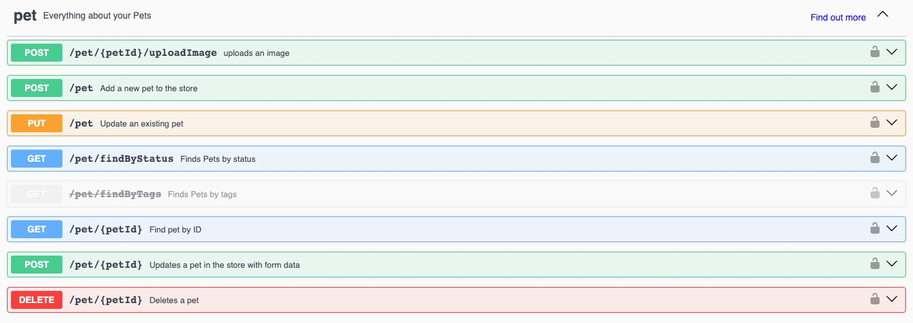

# OpenAPI Specifications File

<head>
  <meta name="guidename" content="Integration"/>
  <meta name="context" content="GUID-d9be7ce5-5c2c-42fc-bf58-fc6529c1a439"/>
</head>

The OpenAPI Specifications file defined according to the OpenAPI 3.0 standards helps you to process the requests and responses using the API platforms or prebuilt language interfaces.

## Syntax

Follow this syntax to create your Gradle file out of your OpenAPI 3.0 specifications file:

-   `openApiSpecification` - Location of the spec file with the extension. This parameter supports both JSON and YAML extensions of the file.

    You can also specify a local OpenAPI specification by entering the appropriate path to the file, for example, `/some/local/path/openapi.json`

-   `Server` - The OpenAPI connector requests and receives a response from this URL. The URL can be either an http or https address. If you're using an SSL connection, you need to manually import the certificate into the Java keystore for the successful functioning of your process.

-   `Operations`

    -   Define your Operation Action Names as Retrieve, Update, Create, Remove, Upload, Cancel, etc., based on your endpoint function.

    -   Enclose your operation type followed by the endpoint name.

    -   Endpoint name can be customized according to your requirements.

    -   `operationId` can either be a operationId contained in the specification or use the HTTP method and the path to point to a specific API from the specification.

    ```json
    operations {
        "Operation Action Name#1" {
    
               "Object Type Label#1" {
                    operationId "operationId from spec"          
                }
                ...
                "Object Type Label#N" {
                    operationId {
                        method "HTTP MethodName from spec"
                        path "relative path from spec"
                    }
                }
        }
        ...
    
        "Operation Action Name#N" {
            ...    
        }
    }
    
    ```

-   `authType` - Define the authentication type here by choosing one of the `defaultValue` parameters.

    -   `None` - No login information is required.

    -   `BASIC` - Basic authentication is a simple authentication scheme that is built into the HTTP protocol. The client sends HTTP requests with the Authorization header containing the word Basic followed by a space and a base64-encoded username:password string. Because base64 is easily decoded and is not secure, Basic authentication should only be used together with other security mechanisms such as HTTPS/SSL.

    -   `DIGEST` - Uses a two-step process to encrypt credentials by applying a hash function to the username and password. Password digest authentication is considered more secure than Basic authentication.

    -   `CUSTOM` - If you do not want to use one of the Integration authentication types with the connection, you can use custom authentication credentials. Custom authentication adds an Authorization header with a value provided from the Custom Authentication Credentials.

        This authentication type is most suited for API token-based authentication.

    -   `OAUTH2` - Choose this authentication type and add the following config parameters code to your code block. This config code works only to add the following grantType parameters as your OAUTH2 options:

        -   `code`
        -   `jwt-bearer`
        -   `client_credentials`
        
    ```json
    OAuth2Config {
            authorizationTokenEndpoint {
                 helpText "Custom helpText here"
                 defaultValue "abcxyz"
                 access "enabled" 
             }
            accessTokenEndpoint {
                helpText "Custom helpText here"
                defaultValue "abcxyz"
                access "enabled"
            }
            authorizationParameters {
                access "enabled"
                keyValuePairs "parameterName1": "parameterValue1", "parameterName2": "parameterValue1"
            }
            accessTokenParameters {
                access "enabled"
                keyValuePairs "parameterName1": "parameterValue1", "parameterName2": "parameterValue1"
            }
            scope {
                helpText "Custom helpText here"
                defaultValue "abcxyz"
                access "enabled"
            }
            grantType {
                helpText "Custom helpText here"
                defaultValue "code"
                includedValues "jwt-bearer","client_credentials"
            }
            jwtParameters {
                signatureAlgorithms {
                    helpText "Custom helpText here"
                    defaultValue "NONE"
                    includedValues "NONE", "SHA256withRSA"
                    access "enabled"
                }
                issuer {
                    helpText "Custom helpText here"
                    defaultValue "abcxyz"
                    access "enabled"
                }
                subject {
                    helpText "Custom helpText here"
                    defaultValue "abcxyz"
                    access "enabled"
                }
                audience {
                    helpText "Custom helpText here"
                    defaultValue "abcxyz"
                    access "enabled"
                }
                expiration {
                    helpText "Custom helpText here"
                    defaultValue "3600000" // value in ms
                    access "enabled"
                }
                signatureKey {
                    helpText "Custom helpText here"
                    access "enabled"
                }
                extendedClaims {
                    access "enabled"
                    keyValuePairs "claimName1": "claimValue1", "claimName2": "claimValue2", "claimName3": "claimValue3"
                }
            }
        }
    
    ```

:::note

OAuth2 fields can be visually modified by adding `access "hidden|readOnly|enabled"` to the closure.

-   `enabled` - allows you to edit the values defined in the auth config object.

-   `readOnly` - allows you to select the default values defined but won't allow for changing the values.

-   `hidden` - disables the usage of the parameter on the platform for the connector.

:::

## Example

The PetStore is a widely known OpenAPI specification hosted on Swagger at the following address: [https://petstore.swagger.io/](https://petstore.swagger.io/). You can send your requests and receive the responses using the hosted OpenAPI specification file on Swagger.

A sample DSL plugin for Petstore is available in the following Boomi repo: [https://bitbucket.org/officialboomi/connector-openapi/src/master/samples/pet-store-dsl/build.gradle](https://bitbucket.org/officialboomi/connector-openapi/src/master/samples/pet-store-dsl/build.gradle)

The following sample code contains the groovy code for defining the following endpoints:



```json
openAPIConnector {
    openApiSpecification "https://petstore3.swagger.io/api/v3/openapi.json"
    server "https://petstore3.swagger.io/api/v3"
    cookieScope "GLOBAL"
    includePublicCert {
        label "Custom Public Cert"
    }
    includePrivateCert false
    authType {
        defaultValue "CUSTOM"
        includedValues "OAUTH2", "DIGEST", "NONE", "CUSTOM", "BASIC"
        label "Custom label here"
        helpText "Custom helpText here"
    }

    operations {

	"Retrieve" {
        "Pet" {
            operationId {
                method "GET"
                path "/pet/{petId}"
            }
        }
        "Pets by Status"{
            operationId{
                method "GET"
                path "/pet/findByStatus"}}
        "Store Inventory" {
            operationId {
                method "GET"
                path "/store/inventory"
            }
        }
    }

    "Upload" {
        "Pet Picture" {
            operationId {
                method "POST"
                path "/pet/{petId}/uploadImage"
            }
        }
    }

    "Create" {
        "Pet" {
            operationId {
                method "POST"
                path "/pet"
            }
        }
        "Store Order" {
            operationId {
                method "POST"
                path "/store/order"
            }
        }
    }

    "Update" {
        "Pet" {
            operationId {
                method "PUT"
                path "/pet"
            }
        }
    }

    "Remove"{
        "Pet" {
            operationId {
                method "DELETE"
                path "/pet/{petId}"
            }
        }
        "Purchase Order" {
            operationId {
                method "DELETE"
                path "/store/order/{orderId}"
            }
        }
    }
}
}
```

