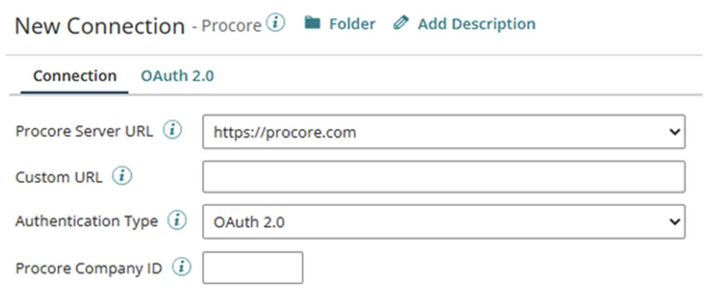

import TestConnection from './_TestCon.md'

# RutterKey Procore - Partner connection

<head>
  <meta name="guidename" content="Integration"/>
  <meta name="context" content="GUID-3644b9ca-ba5b-4961-9780-49521a247877"/>
</head>

The RutterKey Procore - Partner connection represents a single Bootstrap server (host: port) configuration to connect to the RutterKey server.

## Connection tab

To start using the RutterKey Procore - Partner Connector:

Create a connection in Boomi Integration and select the Procore Connector in the Connector field.

Next, configure your connection. The Connector provides most of the information you need.

Then select which Procore server to connect to - there's an option for a custom server for advanced debugging. The Procore Company ID is an optional field that pre-populates the Company ID field in all created Connector Operations using this connection.

## Connection Types

The connection only supports **OAuth 2.0** authentication which can be configured in the **OAuth 2.0** tab. Each field has help text associated to it, the Authentication Type field has some values you might need for OAuth configuration.

Next, populate the OAuth authentication fields with the desired connection data and click **Generate** to generate Action token which requires you to log in to Procore and authenticate your connection. Then the connection is ready to use.

<TestConnection />