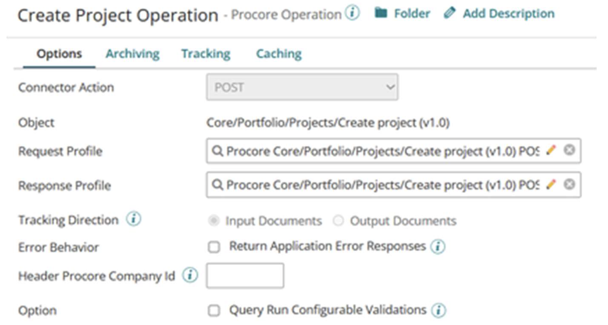

import OperationEnd from './_operationEnd.md'

# RutterKey Procore - Partner operation

<head>
  <meta name="guidename" content="Integration"/>
  <meta name="context" content="GUID-755f868f-22ca-4cf5-bcdc-ce768e5d9490"/>
</head>

The RutterKey Procore - Partner Connector imports operations from Procores 1100+ operations and provides dynamic documentation within connector relevant to the operation selected.

You can create a separate action and operation component for each action/object combination required for your integration.

## Import an Operation

Once a connection has been created, create a Connector Operation using the Procore connector.

- Click the **Import** button on the top-right of the window.
- Select the **Atom** and **Connection**.

You can also filter the results here; this supports wildcards and is case- insensitive. The Connector formats all operation labels in the same way for easy filtering and uniformity wth the following format: `[Endpoint] (v[API Version])`

- Once the Atom, Connection and any required filter has been set, click **Next** and the Procore connector will return all the Operations from Procore that match the filter.

- Select the required operation and click **Create**.

  The connector creates the operation, required request and response maps, and all required fields present with all the associated Procore API documentation.

  

## Procore Operation Documentation

The connector pulls extensive metadata from the Procore API. Then it is exposed via the Operation fields' help text with the Procore Company ID field containing the Procore API's description for the entire operation and a link to the Operation's page on the [Procore REST API Documentation](https://developers.procore.com/documentation/introduction) website.

<OperationEnd />