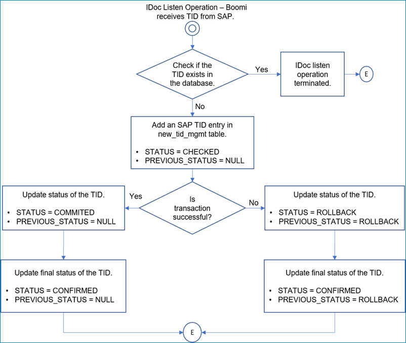

# SAP JCo V2 connector

<head>
  <meta name="guidename" content="Integration"/>
  <meta name="context" content="GUID-093cda95-a783-486b-b588-5a5a922c3ffc"/>
</head>


The SAP JCo V2 connector \(classified as an Enterprise connector\) enables you to connect to your SAP systems via SAP’s RFC protocol. You can execute BAPIs, Remote Function Modules \(RFMs\) and send/receive IDocs asynchronously.

This connector is the next-generation SAP Enterprise connector and is the connector that plans to maintain and deliver with on-going enhancements.

You can browse the list of available BAPI/RFMs and IDocs available in your SAP system and automatically generate the request and response profiles for use in processes and maps.

Features

The SAP JCo V2 connector supports the following features to connect to SAP systems using the SAP Java Connector library:

-   Discovery of BAPIs using the Business Object Repository by specifying a specific business object, or a wildcard containing a partial business object name.
-   Import of specific BAPI/RFM enabled function modules by specifying the BAPI or Remote Function Module name.
-   Execution of the BAPI/RFM generated via BOR or specific function module via RFC.
-   Sending and receiving IDocs to SAP by specifying the IDoc via Base Type, Extension and Segment, or Application Release as an option to build the segment profile.
-   Ability to use SAP Secured Network Communications \(SNC\) for secured connection with the SAP system.
-   Compatible with the SAP Java Connector \(JCo\) library version 3.0 and 3.1.

**Note:** The Atom Cloud does not support the use of the SAP JCo V2 connector.

## Connector configuration

To configure the SAP JCo V2 connector to communicate with the SAP system, set up two components:

-   SAP JCo V2 connection
-   SAP JCo V2 operation

This design provides reusable components containing connection settings such as user name, password, and SAP-specific settings including IDoc TID support. After configuring your connection and connector operation, you can use the connector operation within a process. When the SAP connector operation is defined properly within your process, can map to and from virtually any system using the SAP JCo V2 connector to interact with SAP via the RFC protocol.

## SAP JCo 3.0 and 3.1 feature changes

The SAP JCo V2 connector requires SAP Java connector libraries to be loaded into the Atom/Molecule. The connector is compatible with the SAP JCo library version 3.0 and 3.1. The differences between SAP JCo 3.0 and SAP JCo 3.1 are the following:

-   SAP JCo 3.1 supports the load-balance connection feature in the SAP JCo V2 connector. This uses the “Message Server Host” connection to connect to more than one SAP App server gateway for the IDoc Listener.
-   SAP JCo 3.1 creates all error logs logged in the dev\_jco\_trc.txt file, while SAP JCo 3.0 creates all error logs with the extension “.trc” \(i.e. dev\_jco\_trc.trc\).

## Additional Atom configuration

The SAP JCo V2 connector requires SAP Java Connector libraries to be loaded into the Atom/Molecule. To learn more, see the topic [Loading SAP Java connector libraries into an Atom or Molecule](int-SAP_JCo_V2_additional_atom_configuration_ec6e3d6a-29d5-4d20-805e-7bab737ba640.md).

## Additional Setup for using SAP SNC connection

To use the SNC connection for secure communications between the SAP Application server and the SAP JCo V2 connector, you must set up the PSE file and update the JCo properties file with the SNC parameters. See the Boomiverse article [Setup SAP JCo V2 Connector and Boomi Runtime with SAP SNC](https://community.boomi.com/s/article/Setup-SAP-JCo-V2-Connector-and-Boomi-Runtime-with-SAP-SNC-Part-1) for more information.

## Additional Mandatory SAP and database setup to receive IDocs

**Note:** Your SAP Administrator/BASIS professional can provide the RFC Server Program ID which is used by to connect to SAP and receive IDocs as an IDoc Listener.

The SAP JCo V2 connector automatically creates a table if it does not already exist for Transaction ID Management in the database configured in the SAP JCo V2 connection during the initial deployment of a process to receive IDocs. For reference purposes, additional details about the TID Management table schema is provided if your database administrator is required to create the table manually.

In this release of the SAP JCo V2 connector, a new TID Management table is created to handle support for additional TID Management features. The existing TID Management table is not automatically deleted.

**Note:** The TID Management table size grows over time and you are responsible for managing it, including purging the database when necessary. Delete only those records with a status of CONFIRMED and PREVIOUS\_STATUS of NULL as these Transactions have been completed from SAP system’s perspective. Although there are multiple statuses which are updated when receives IDocs from SAP, the final status of the transactions are updated as follows.

-   Successful transactions: STATUS as CONFIRMED and PREVIOUS\_STATUS as NULL.
-   Unsuccessful transactions: STATUS as CONFIRMED and PREVIOUS\_STATUS as ROLLBACK.

Columns -   
TID varchar \(255\)

PROG\_ID varchar \(255\)

STATUS varchar \(255\)

PREVIOUS\_STATUS varchar \(255\)

Primary Key
TID, PROG\_ID

STATUS Values -   
CHECKED - initial receipt of IDoc message.

CONFIRMED - all RFC functions have successfully been completed.

COMMITTED - all RFC functions have successfully been handled by the connector.

ROLLBACK – Status which is used by SAP to identify failed IDoc transfer to .

The following diagram illustrates the IDoc TID status management flow.



In addition to the new TID Management table, the IDOC\_PAYLOAD table is used for persisting the actual IDoc payload. This table is created automatically and is used only when the **TID Management Options** field value is set as FULL in the SAP JCo V2 connection.

Columns -   
TID varchar \(255\)

DOCNUM varchar \(255\)

DOCTYP varchar \(255\)

IDOCTYP varchar \(255\)

CIMTYP varchar \(255\)

IDOC text \(64k\)

TIMESTAMP timestamp

:::note

-   The IDOC text field stores the actual IDoc payload. Therefore, if the IDoc payload value exceeds 64 KB, the IDOC field value will be left empty and the processing will be stopped.
-   During the automatic table creation, if your database does not support field with text data type, an error occurs without creating the table. In this situation, contact your DBA to create the table manually with the IDOC text field of CLOB type or any other data type associated with your database that can accommodate a text value of a large size. Also, if the IDOC text field size of 64 KB is not adequate, your DBA can update the table manually based on the database used. This can be done in advance during the table creation or can be updated later.
-   If you are using the MSSQL database for TID Management,  the TIMESTAMP column should be updated with datetime2 data type. To do this,
    -   Create the IDOC\_PAYLOAD table manually by executing the below CREATE TABLE SQL in the database/schema used.

        ``` {#codeblock_yyq_23v_drb}
        CREATE TABLE IDOC_PAYLOAD(TID varchar(255), DOCNUM varchar(255), DOCTYP varchar(255), IDOCTYP varchar(255), CIMTYP varchar(255), IDOC text, TIMESTAMP datetime2)
        ```

    -   Make sure to execute the SQL statement before deploying the Listener to the Atom.
    -   If the table exists already, delete the existing table and create a new table.

:::

The connector also supports the high availability of the database used. If the connection to the database is lost \(DB timeout period\) during the TID and IDoc data/write action, the connector automatically tries to reestablish the connection by sending connection request for 3 times at an equal intervals within a period of one minute. During this connection retry period, the listener will delay receiving and processing additional IDocs until the TID data is available.

## IDoc Listener on a Molecule

The listener process is deployed to and runs on each node in a Molecule, and the node server name is identified by a generated unique ID \(UUID\). All nodes in a Molecule are connected to SAP via the SAP JCo V2 connector IDoc listener via the specific Program ID associated with the Registered Server Program for the RFC Destination in SAP. SAP handles the distribution of the IDocs across the RFC Server \( IDoc listener\) destination, therefore, does not have any control over which node will handle the IDocs sent from SAP. If a node becomes unavailable, the SAP system sends the IDoc to another available node in the Molecule for processing. You can determine which node of the molecule is processing the SAP IDoc via Process Reporting and “View Extended Information” or Node ID information in Execution properties. To learn more, see the topic [Execution properties](/docs/Atomsphere/Integration/Process%20building/c-atm-Execution_Properties_9c338d2a-092c-4d9b-bedf-2d39651ba9b4.md).

:::note

When you run the IDoc listener in a Molecule with multi-node setup, there may be chance of getting duplicate IDoc records with same reference number in the operation results. If you encounter such issue, it is recommended to execute the listener process in single node environment.

:::

## Using SAP JCo V2 connector in a Private Atom Cloud

To enable the connector on a Private Atom Cloud, change its security policy to Low. If you are using a Private Atom Cloud with Atom Worker enabled, you can perform Secure Listen operation by configuring the secure listen property in the Atom Management. To learn more, see the topic [Configuring the Secure Listen Property for an Atom Cloud](int-SAP_JCo_V2_configuring_secure_listen_property_for_an_atomcloud_0ec89fea-3bc4-4b7e-9bc2-3ad0d5a9fae1.md).

## Supported editions

The following editions are supported:

-   All SAP applications supporting the RFC protocol which are accessible using SAP Java Connector 3.0.and 3.1.
-   SAP R/3 4.0, 4.5, 4.6, 4.7
-   SAP ERP 6.0
-   SAP Solutions based on SAP Netweaver ABAP Application Server 6.10, 6.20, 6.30, 2004, 7.x
-   SAP S/4HANA EX \(STE\)
-   SAP S/4HANA On-Premise

## Tracked properties

This connector has the following tracked properties that you can set or reference in various step parameters:

**Transaction Id \(Send\)** - 
The unique transaction Id \(TID\) from SAP associated with the IDoc \(or IDoc package\)

**IDoc Number \(Listen\)** - 
A unique 20-digit number SAP assigns the IDoc.

**Status \(Listen\)** - 
Indicates the status of the IDoc.

**Test Flag \(Listen\)** - 
Indicates the Test Flag of the operation.

**Basic Type \(Listen\)** - 
Indicates the Basic type \(specific format and structure\) of the IDoc.

**Extension \(Listen\)** - 
Extensions \(customization\) added to an existing IDoc Type to meet additional data and business needs.

**Message Type \(Listen\)** - 
The category or type of document transmitted. Message Type is a mandatory part of the logical message definition and is used to identify the business process.

**Logical Message Variant \(Listen\)** - 
An optional part of the logical message definition, specified by the user, and used to identify the business process.

**Sender Port \(Listen\)** - 
Sender port \(SAP System, EDI subsystem\).

**Partner Type \(Listen\)** - 
Partner type of sender.

**Partner Number \(Listen\)** - 
Partner Number of Sender.

**Receiver Port \(Listen\)** - 
Receiver port \(SAP System, EDI subsystem\).

**Partner No of Receiver \(Listen\)** - 
Indicates the Partner Number of Receiver.

**Created Date \(Listen\)** - 
IDoc Created Date.

**Created Time \(Listen\)** - 
IDoc Created Time.

**Idoc Type \(Listen\)** - 
Indicates the Compound Document type \(specific format and structure\) of the IDoc.