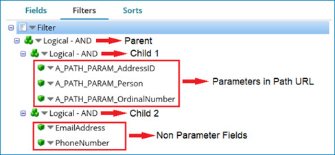

# SAP S/4HANA OData Cloud \(Tech Preview\) operation

<head>
  <meta name="guidename" content="Integration"/>
  <meta name="context" content="GUID-cfd4aca0-d5b2-46d1-ac07-6bb1e0d19be1"/>
</head>


The SAP S/4HANA OData Cloud \(Tech Preview\) operation defines the integration with SAP S/4HANA Cloud and represents a specific action \(Create, Get, Update, Delete, and Query\) to be performed against a specific entity.

Create a separate operation component for each action/object combination that your integration requires.

SAP S/4HANA OData Cloud \(Tech Preview\) operations support the following actions:

-   Inbound: Get and Query
-   Outbound: Create, Update and Delete

The SAP S/4HANA Cloud \(Tech Preview\) connector is implemented with a common browser mechanism which is responsible for fetching the Swagger API specification document from SAP API Business Hub. It uses the specification document to create/build the request and response profiles for the mentioned operations.

## Options tab

Click **Import Operation**, then use the Import wizard to select the object to integrate. When you configure an action, the following fields appear on the **Options** tab.


**Connector Action \(All operations\)** - 
:   Determines the type of operation the connector is performing, specify the proper connector action.

**Object \(All operations\)** - 
:   Defines the object with which you want to integrate and which was selected in the **Import Wizard**. For this connector, the objects are the path \(URL\) associated with the service selected during import.

:::note
For Get and Query operations, the fields displayed in the URL should be set as parameters with values. If not set, the connector will throw an exception.
:::

**Request Profile \(Get, Create, Update, and Delete\)** - 
:   The Request profile highlights the format \(Structured and Unstructured\) in which the File is to be processed. By default, the format will always be Structured.

**Response Profile \(Get, Create, and Query\)** - 
:   The Response profile highlights the format \(Structured and Unstructured\) in which the response is to be processed. By default, the format will always be Structured.

Url \(All operations\)
:   This will display the service selected in the **Import Wizard**. Once the Object is imported, the following fields are available based on the actions.

Select \(Get\)
:   You need to list all the properties/fields which need to be returned. If this field is null, the connector will display all the properties/fields of the entity. The format to enter the values for this field \(with commas and without space\) is AddressID,Person.

:::note
Enter only the property/field names \(not the fields within related entities\) which should be retrieved within the entity. If you want to retrieve the related entities within the entity, you need to enter the related entity name in the **Expand** field below \(not the field name within it\).
:::

Expand \(Get and Query\)
:   Enter the list of related entities which need to be expanded within the entity. The format to be followed is to\_EmailAddress,to\_FaxNumber

:::note
The related entities listed here should be present in the above **Select** field as well \(if the above field is not null\). If not listed above, the fields entered here will not be considered. Enter only the related entity name \(not the field name within it\). To read some examples, see the topic [Expanded and Non-Expanded Related Entity Examples](/docs/Atomsphere/Integration/Connectors/int-SAP_S4HANA_OData_Cloud_operation_examples_31d64890-0768-4297-a8c8-9ae004456de7.md)
:::

Url \(All operations\)
:   This dropdown provides the list of Artifacts listed in the SAP API Business Hub will display the service selected in the **Import Wizard**.

:::note
The service displayed here should be changed/modified only through the **Import Wizard**. If changed/modified directly in this field, the connector will throw an exception.
:::

Top \(Query\)
:   Show only the first n items. Only integers are allowed.

Skip \(Query\)
:   Skip the first n items. Only integers are allowed.

Inlinecount \(Query\)
:   Include the count of items. Displays the total number of entities.

Currently this connector will not support this field as the response will split into documents.

:::note
While setting the Parameters, follow below points

-   If there is an UUID field to be set as parameter, set in below format: e.g.: guid'fa163e3c-9712-1eea-96a9-c3c68725847f'
-   For Datetime parameter
-   For datetimeoffset, it should be set in below format: e.g.: datetimeoffset'9999-12-31T23:59:59Z'
-   For datetime, it should be set in below format: e.g.: datetime'9999-12-31T00:00:00'
:::

## Get

Get is an inbound action for which you provide the details of the record which you want to retrieve from SAP S/4HANA Cloud. For Get operation, the value for path parameters corresponding to the API service selected in the URL field must be defined as connector parameters. If the parameters are not specified, the connector will throw an error.

## Create

Create is an outbound action where you can upload and add an entity in SAP S/4HANA. If the Create operation is successful, the entity is created in the SAP S/4HANA and the connector returns a response in JSON format. The response code for a successful operation is 201. To create an entry, the connector will request an x-csrf-token from SAP S/4HANA Cloud as part of the operation.

There are two types of Create operations as given below.

Create without Parameters

The request URL will not have path parameters \(e.g.: /A\_BusinessPartnerAddress\). Below is the Input format

```java

  '{ 
  "AddressID": "23186", 
       "Person": "23198", 
                "OrdinalNumber": "1", 
                "IsDefaultEmailAddress": true, 
                "EmailAddress": "george.clark@domain.com", 
                "SearchEmailAddress": "GEORGE.CLARK@domain" 
}' 
```

Create with Parameters

The path parameters present in the create API URL will be added to the request schema \(e.g.: /A\_BusinessPartnerAddress\(BusinessPartner/AddressID\)/to\_EmailAddress\). The path parameters are prepended with A\_PATH\_PARAM\_ and are added at the beginning of the request profile. Below is the input format.

**Note:** Both Path parameters and Request body can be either in a Message step or set as parameters.

```java

  '{ 
"A_PATH_PARAM_AddressID":"22825", 
"A_PATH_PARAM_BusinessPartner":"17100002", 
   "AddressID": "22825", 
  "Person": "", 
  "OrdinalNumber": "12", 
  "IsDefaultEmailAddress": true, 
  "EmailAddress": " george.clark@domain.com " 
}'
```

## Update

Update is an outbound action where you can update an existing entity in SAP S/4HANA Cloud. In the Update operation, path parameters present in the update API URL will be added to the request schema. These are prepended with `A_PATH_PARAM_` and are added at the beginning of the request profile \(e.g.: `/A_AddressEmailAddress(AddressID/Person/OrdinalNumber`\). The response code of a successful operation is 204 with an empty response body. To update an entry in SAP, the connector will request an x-csrf-token and ETag token from SAP S/4HANA Cloud first and then use the information as part of the actual Update action.

Below is the Input format.

```java

'{ 
"A_PATH_PARAM_AddressID":"22825", 

"A_PATH_PARAM_OrdinalNumber":"1", 
"A_PATH_PARAM_Person":"22838", 
  "d": { 
      "IsDefaultEmailAddress": false 
       } 
}' 
```

## Delete

Delete is an outbound action where you can delete an existing entity in SAP S/4HANA. The request schema contains the path parameters present in the delete API URL \(e.g.:`/A_AddressEmailAddress(AddressID/Person/OrdinalNumber`\). If the delete operation is successful, the entity is deleted in SAP and the connector returns a response code. The response code of a successful operation is 204 with an empty response body. To delete an entity in SAP, the connector will request an x-csrf-token and ETag token from SAP S/4HANA Cloud first and then use the information as part of the actual Delete action.

```java

'{ 
"A_PATH_PARAM_AddressID":"22825", 
"A_PATH_PARAM_Person":"22838", 
"A_PATH_PARAM_OrdinalNumber":"1" 
}'
```

## Query

Query is an inbound action that looks up entities in the SAP S/4HANA Cloud and returns zero or more entities from a single Query request based on filter criteria. After you select the Query action and use the Import Wizard, the operation component page contains configuration options to add filters and set parameters to limit the results. You can refine the query on the **Filters** tab and define expressions. The response code for a successful operation is 200. You need to set Input for path parameters in the filter section only If the URL contains path parameters.

Fields tab filters

This will display the list of fields in an entity. Select the list of fields to display in the output. Select the related expandable entities which are listed in the **Expand** field.

Filters tab filters

​All the parameter fields listed in the Object \(URL Selected\) should be added in the filter section with the operator as “Equal to”. The parameter fields should be added under Logical Sub-group \(AND/OR\) since only one expression is allowed. The other non-parameter fields can either be added within another logical subgroup \(If multiple\) or as an expression.

**Note:** Only one expression will be considered within a logical subgroup. Below is an example. You need to set Input for path parameters in the filter section only If the URL contains the path parameters.

Adding Path Parameters in the Query Response profile

-   Consider this path `/A_AddressEmailAddress(AddressID='{AddressID}',Person='{Person}',OrdinalNumber='{OrdinalNumber}')`

    The above path will be shortened and displayed as `/A_AddressEmailAddress(AddressID/Person/OrdinalNumber)`

-   This service has **AddressID**, **Person**, and **OrdinalNumber** as path parameters and has **EmailAddress** as a non-parameter field.
-   These parameter fields **AddressID**, **Person**, and **OrdinalNumber** are prefixed with A\_PATH\_PARAM in the filters section to distinguish path parameters with other fields. To provide input, follow below steps:

    

    Steps

    1.  Add Logical Sub-group \(Consider this as parent logical group\) in the filter section.
    2.  Add another Logical Sub-group under parent logical group with AND \(consider this as child logical group\).
    3.  Add three expressions under Child Group for the Path Parameters fields \(e.g. AddressID, Person, and OrdinalNumber\).
    4.  Add filter name for the expression and Choose the respective Path Parameters with operation set as “Equal to”.
    5.  To add the non-parameter field to the Query Operation \(e.g. EmailAddress\), add the expression under the parent logical group. If you need to add multiple fields, you can create another child logical group and add the required non-parameter fields.
    **Note:** The input value for the Path parameters should be provided on the parameters section. The Logical expression \(AND/OR\) for parent and first child logical sub-groups will be ignored.


The fields in the filter section are as follows.

-   Filter Name: The name of the filter expression.
-   Field: Select the fields for which you need to apply filters.
-   Operator: Equal to, Not Equal to, Greater than, less than, Greater than or equal, Less than or equal, In and Has.

Sorts tab

This is used to sort \(Ascending or Descending\) the filter results based on a selected field.