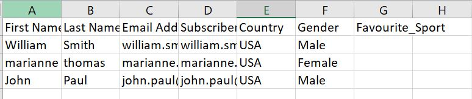
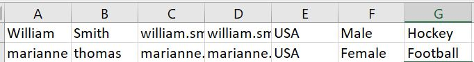

import RequestProfile from './_RequestProfile.md'
import ResponseProfile from './_ResponseProfile.md'
import OperationEnd from './_operationEnd.md'
import TrackingDirection from './_TrackingDirection.md'
import ReturnErrRes from './_ReturnResponse.md'
import ReqRes from './_ReqRes.md'
import TrackingDir from './_TrackObject.md'

# Salesforce Marketing Cloud operation

<head>
  <meta name="guidename" content="Integration"/>
  <meta name="context" content="GUID-d7179658-f77c-4506-93d3-1bc8d173f4e7"/>
</head>


Salesforce Marketing Cloud connector enables you to connect and interact with the Salesforce Marketing Cloud \(SFMC\) platform through the Marketing Cloud APIs.

Create a separate operation component for each action/object combination that your integration requires.

The Salesforce Marketing Cloud connector's operations use SOAP request \(Except Retrieve and Delete\). It supports the following actions:

-   Create Subscriber — Create a new subscriber in the SFMC platform.
-   Retrieve Subscriber — Fetches details of the existing subscriber\(s\) in the SFMC platform.
-   Update Subscriber — Update details of an existing subscriber in the SFMC using the unique Subscriber Key input.
-   Delete Subscriber — Delete subscriber\(s\) in the SFMC platform using the unique subscriber input.
-   Create List — Create a new subscriber list in the SFMC platform.
-   Retrieve List — Retrieve details of single or multiple subscriber list in the SFMC platform.
-   Update List — Update an existing subscriber list in the SFMC platform.
-   Delete List — Delete one or more subscriber list in the SFMC platform using the unique List ID input.
-   Send Email — Send triggered email to any subscriber within a subscriber list, in response to an subscriber action. This operation requires the External Key of the email message and the subscriber key used as an unique identifier in the SFMC platform.
-   Import Subscriber — Import a list of subscribers onto the SFMC platform via SFTP server.

## Options tab

Click **Import Operation**, then use the Import wizard to select the object to integrate. In the import wizard, along with the Connection and Atom details, you must specify in the Web Services Definition Language \(WSDL\) URL in the **WSDL URL** field. The WSDL will be unique to your Marketing Cloud tenant account. The web service method available for the tenant's account will be listed in the **Object Type** field and you can select the required method according to the operation to be performed; Create operation should have Create object selected, Delete operation should have Delete object selected, etc.,

**Note:** For Send Email and Import Subscriber operation, Create object must be selected.

The Request and Response Profile will be generated based on the tenant's WSDL URL specified.

**Note:** If your Request and/or Response profile has more than 10 recursive levels of data, a warning will be displayed during the import. Please ignore the warning and proceed. You can expand the profile and see all the profile elements.

When you configure an action, the following fields appear on the **Options** tab.

**Connector Action \(All Operations\)** - 
Determines the type of operation the connector is performing related to Inbound or Outbound, selected on the **Connector step - General** tab.

<TrackingDir />

<RequestProfile />

<ResponseProfile />

<ReturnErrRes />

**SOAP API URL \(All Operations\)** - 
Provide the SFMC SOAP API URL for the selected operation. The URL contains the SOAP API with your Tenant's Endpoints. `Format: https://YOUR_SUBDOMAIN.soap.marketingcloudapis.com/Service.asmx.` `Example: https://mcmnrd0n6x1vkyqgyp4927gslgx8.soap.marketingcloudapis.com/Service.asmx.` For more information, refer to the [SOAP API with Your Tenant's Endpoints](https://developer.salesforce.com/docs/marketing/marketing-cloud/guide/wsdl-endpoint-links.html#soap-api-with-your-tenant's-endpoints) topic.

**Properties \(Retrieve Subscriber, Retrieve List\)** - 
Define any additional attributes like createddate associated with the subscriber record, that you want to view in the output payload. For multiple properties, provide as Comma separated.

**Note:** Make sure the properties included here are retrievable properties. If not, the connector will throw an error message "The Request Property\(s\) Lists do not match with the fields of Subscriber retrieve.".

-   Retrievable Properties for Retrieve Subscriber — Client.ID, Client.PartnerClientKey, CreatedDate, ID, ListID, ModifiedDate, ObjectID, Status, SubscriberKey.
-   Retrievable Properties for Retrieve List — Refer to the [List Properties](https://help.salesforce.com/s/articleView?id=sf.mc_es_list_properties.htm&type=5) topic.

**External Key \(Send Email\)** - 
\(Mandatory\) Specify the unique identifier of the triggered email message configured in the SFMC platform. The triggered email message primarily contains the email content and the subscriber list. For details, refer to the [SFMC Documentation on Triggered Emails](https://help.salesforce.com/s/articleView?id=sf.mc_es_create_triggered_email_interaction.htm&type=5).

**Email Address \(Send Email\)** - 
This is an optional field. Provide the email address of the subscriber to receive the email. This email address should be present in the list configured in the triggered email message. This field allows single email address entry only.

**Subscriber Key \(Send Email\)** - 
\(Mandatory\) Provide the subscriber key associated to the above email address.

**Import Definition \(Import Subscriber\)** - 
Define the settings to import the CSV file containing the subscribers to be added to the subscriber list on the SFMC platform. This operation requires an SFTP account configured for your SFMC account. You must have full permissions to the folder on the SFTP server. Contact your Marketing Cloud account representative to enable SFTP in your account. The available import options are,

-   Create & Start — Create an import definition \(i.e. Import Activity\) record containing the import settings like name, unique key, source file location, file type, destination type, file mapping etc., And, then trigger the import activity.
-   Start — Start the existing import definition. This requires the unique customer key of the import definition.

## Create Subscriber

Create Subscriber is an outbound action that you can use to create a new subscriber in your SFMC platform, using the SFMC SOAP API. The request and response profile will be generated based on the WSDL link selected during the import action. The new subscriber creation SOAP request should be provided via a Message step. The connector requires only the request body in the input as shown below.

**Important:** If the request contains any attribute\(s\) with prefix, make sure to declare the namespace element for the prefix in the parent tag of the SOAP request body. This is applicable for Create \(Subscriber, List, and Import Definitions\) and Update \(Subscriber and List\) actions.

```xml

Namespace declaration syntax — xmlns:prefix="URI"
Example namespace declaration for the prefix (xsi) — xmlns:xsi="http://www.w3.org/2001/XMLSchema-instance"
```

Sample Create SOAP Request body:

```xml
'<CreateRequest xmlns="http://exacttarget.com/wsdl/partnerAPI" 
xmlns:xsi="http://www.w3.org/2001/XMLSchema-instance">
<Options>
<SaveOptions>
<SaveOption>
<PropertyName>*</PropertyName>
<SaveAction>AddOnly</SaveAction>
</SaveOption>
</SaveOptions>
</Options>
<Objects xsi:type="Subscriber">
<ObjectID xsi:nil="true"></ObjectID>
<SubscriberKey>newuser_sub</SubscriberKey>
<EmailAddress>newuser_sub@gmail.com</EmailAddress>
<Lists>
<ID>2408921</ID>
<ListClassification>PublicationList</ListClassification>
<Status>Active</Status>
<ObjectID xsi:nil="true"></ObjectID>
</Lists>
</Objects>
</CreateRequest>'
```

For sample Create Subscriber SOAP Envelope, see the [Salesforce Marketing Cloud documentation](https://developer.salesforce.com/docs/marketing/marketing-cloud/guide/creating_a_subscriber.html#how-to-use-the-soap-api-to-create-a-subscriber).

You can provide the list ID and list classification to which the subscriber should be added to. If the list detail is not included in the request, the subscriber will be created in the **All-Subscribers** list.

## Retrieve Subscriber

Retrieve Subscriber is an inbound action that allows you to view the information available for a specific subscriber in the SFMC, by passing the valid subscriber key in the Message step. You can provide multiple subscriber keys to fetch their corresponding details. Additionally, on the **Options** tab, in the **Properties** field, you can provide any additional attributes associated with the Subscriber, that you want see in the output payload. By default, the response contains Return Status, Number of Results and Status Message.

## Update Subscriber

Update Subscriber is an outbound operation that helps you to update a subscriber through the SFMC SOAP API call. You can provide the SOAP request with the values of Subscriber attributes to be updated. If the request includes any attribute\(s\) with prefix, make sure to declare the namespace \(example, xmlns:xsi\) element in the SOAP request as given in the sample below.

Sample Update SOAP Request body:

```xml
'<UpdateRequest 
            xmlns="http://exacttarget.com/wsdl/partnerAPI" xmlns:xsi="http://www.w3.org/2001/XMLSchema-instance">
             <Objects xsi:type="Subscriber">
                <SubscriberKey>swetadas@gmail.com</SubscriberKey>
 <EmailAddress>sweta@accenture.com</EmailAddress>
                <Lists>
                    <ID>2408921</ID>
                 <Status>Active</Status>
                    <Action>Update</Action>
                </Lists>
            </Objects>
 </UpdateRequest>'
```

Sample Update SOAP Request Body for subscriber with multiple attributes update.

```xml
'<UpdateRequest xmlns="http://exacttarget.com/wsdl/partnerAPI" xmlns:xsi="http://www.w3.org/2001/XMLSchema-instance">
<Objects xsi:type="Subscriber">
<SubscriberKey>subscribername</SubscriberKey>
<EmailAddress>subscriber@boomiteam.com</EmailAddress>
<Attributes>
<Name>First Name</Name>
<Value>subscriber1</Value>
</Attributes>

<Attributes>
<Name>Last Name</Name>
<Value>ViaAPI</Value>
</Attributes>

<Attributes>
<Name>Gender</Name>
<Value>Male</Value>
</Attributes>
<Lists>
<ID>2408921</ID>
<Status>Active</Status>
</Lists>
</Objects>
</UpdateRequest>'
```

## Delete Subscriber

Delete Subscriber operation enables to delete subscriber\(s\) in the SFMC platform through the SFMC SOAP API . You must provide the unique subscriber key of the subscriber\(s\) to be deleted.

## Create List

CREATE List is an outbound operation that allows to create a new subscriber list in the SFMC platform. You can provide the SOAP request along with the required list details.

**Important:** If the request contains any attribute\(s\) with prefix, the namespace element for the prefix must be defined in the parent tag of the SOAP request body.

Sample Create List SOAP Request body:

```xml
'<CreateRequest xmlns="http://exacttarget.com/wsdl/partnerAPI" xmlns:xsi="http://www.w3.org/2001/XMLSchema-instance">
    <Options></Options>
    <Objects xsi:type="List">
    <ListName>BoomiList</ListName>
    <ListClassification>PublicationList</ListClassification>
    <Type>Public</Type>
    </Objects>
    </CreateRequest>'
```

## Retrieve List

Retrieve List operation helps you to view the information of a particular subscriber List using the List ID. On the **Options** tab, use the **Properties** field to view any additional properties associated with the List , in the output payload. Make sure you provide only retrievable properties supported for Retrieve List.

## Update List

Update List allows to update a subscriber list through the SOAP API. You can provide the SOAP request with the details about the List attributes to be updated. If the request includes any attribute\(s\) with prefix, make sure to declare the namespace \(example, xmlns:xsi\) element in the parent tag of the request body.

Sample Update List Request body:

```xml
<UpdateRequest xmlns="http://exacttarget.com/wsdl/partnerAPI" xmlns:xsi="http://www.w3.org/2001/XMLSchema-instance">
<Objects xsi:type="List">
<ListName> </ListName>
<ID>2428779</ID>
<Type>Public</Type>
</Objects> </UpdateRequest>
```

## Delete List

Delete List allows to delete a list in the SFMC using the List ID. You must provide the unique list Id to be deleted from the SFMC platform.

## Send Email

Send Email \(i.e. Triggered Emails\) operation allows to send email message to an individual subscriber in response to a subscriber action. To use the Send Email functionality, make sure the following settings are done on the SFMC platform:

-   Triggered Email Message template containing the message content to be sent and subscriber list.

On the **Operation - options** tab, provide the external key, subscriber key, and email address \(optional\) details. Here, the Subscriber key is a mandatory input. For more details about Triggered Emails, refer to the [Salesforce documentation - Triggered Emails](https://help.salesforce.com/s/articleView?id=sf.mc_es_triggered_emails.htm&type=5).

## Import Subscriber

Import Subscriber allows you to perform bulk addition of subscribers to a list in the SFMC platform. Importing the subscribers onto the SFMC platform is performed via an SFTP server. The SFTP server settings must be configured in the SFMC platform. When you use SFTP, the Marketing Cloud creates a folder on the SFTP server for your organization. This folder is for your organization only, so use a special user ID and password to access the folder. You will have full permissions to the folder. To enable SFTP in your account, contact your Marketing Cloud account representative.

-   For more details, refer to the [Marketing Cloud Guide](https://help.salesforce.com/s/articleView?id=sf.mc_es_enhanced_ftp_guide.htm&type=5) topic.
-   For details about the steps to configure an SFTP account in the Marketing Cloud, refer to the [Salesforce Help - Configure Marketing Cloud SFTP](https://help.salesforce.com/s/articleView?id=sf.mc_es_configure_enhanced_ftp.htm&type=5) topic.

Subscriber import can be done in two ways:

1.  Create & Start — Create the import definition and then start the subscribers import.
2.  Start — Perform subscriber import using an existing import definition.

The list of subscribers and corresponding details are included in the CSV file. You can map the attributes in your .csv file to the attributes in your Marketing Cloud account either by Map by Header Row or Map by Ordinal. A valid CSV file must contain the attributes matching the attributes of the subscriber record in your SFMC account.

Sample CSV file - Map by Header Row:



Sample CSV file - Map by Ordinal:



The .csv file specification, field mapping preference \(Map by Header row/Map by Ordinal\), update type preference should be specified in the input SOAP request sent via Message step. For more details, refer to the [SFMC Documentation - Import Definition](https://developer.salesforce.com/docs/marketing/marketing-cloud/guide/creating_an_import_definition.html) topic.

Sample SOAP request body for subscriber import:

**Important:** If the request includes any attribute\(s\) with prefix, make sure to declare the namespace element in the parent tag of the request body as given in the sample request below. Syntax for namespace declaration: xmlns:prefix="URI"

```xml
<CreateRequest xmlns="http://exacttarget.com/wsdl/partnerAPI" xmlns:xsi="http://www.w3.org/2001/XMLSchema-instance">
            <Options></Options>
            <Objects xmlns:ns1="http://exacttarget.com/wsdl/partnerAPI" xsi:type="ns1:ImportDefinition">
                <CustomerKey>Import_To_DE_Market2Lead_Key</CustomerKey>
                <Name>Import_To_DE_Market2Lead</Name>
                <Description>Import_To_DE_Market2Lead</Description>
                <AllowErrors>true</AllowErrors>
                <DestinationObject xsi:type="ns1:DataExtension">
                    <CustomerKey>UsingAPI_For_Market2Lead_Key</CustomerKey>
                    <ObjectID xsi:nil="true"/>
                </DestinationObject>
                <FieldMappingType>InferFromColumnHeadings</FieldMappingType>
                <FileSpec>Import2M2L.csv</FileSpec>
                <FileType>CSV</FileType>
                <Notification>
                    <ResponseType>email</ResponseType>
                    <ResponseAddress>response@example.com</ResponseAddress>
                </Notification>
                <RetrieveFileTransferLocation>
                    <CustomerKey>ExactTarget Enhanced FTP</CustomerKey>
                </RetrieveFileTransferLocation>
                <UpdateType>AddAndDoNotUpdate</UpdateType>
            </Objects>
        </CreateRequest>
```

For more details on SOAP Request for Import Definition Creation, refer to the [Salesforce Marketing Cloud documentation](https://developer.salesforce.com/docs/marketing/marketing-cloud/guide/creating_an_import_definition.html).

<OperationEnd />