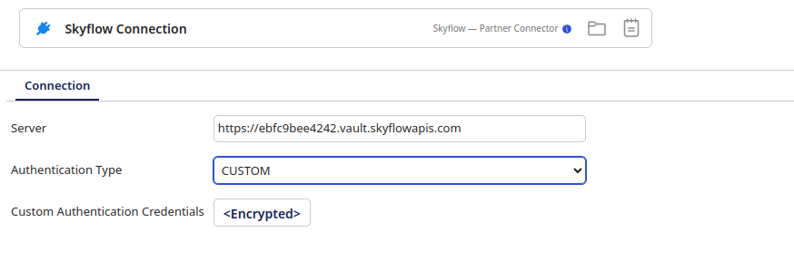

# Skyflow - Partner connection

<head>
  <meta name="guidename" content="Integration"/>
  <meta name="context" content="GUID-da6dea40-f8d6-4bbb-a7ff-bf8d61890145"/>
</head>

## Connection tab

:::info Important

The documentation for this connector is provided by a Boomi partner. This documentation was last updated in August 2024.

:::

To create a connection from the Skyflow API to Integration:
1. Click **Create** to add a new connection.
2. Select the Skyflow - Partner connector from the list of available connectors.
3. Enter your Skyflow Vault URL in the **Server URL** field.
4. Set the **Authenticated Type** to `CUSTOM`.
5. Enter your Skyflow API Key in **Customer Authentication Credentials**.

## Test Connection

You can test your connection settings before you use the connection in a process or even before you save the connection. Test Connection ensures that the connection settings that you specify are correct, valid, and can be accessed. If the test connection is successful, you can save the connection. Otherwise, review and correct any incorrect settings, then test again.