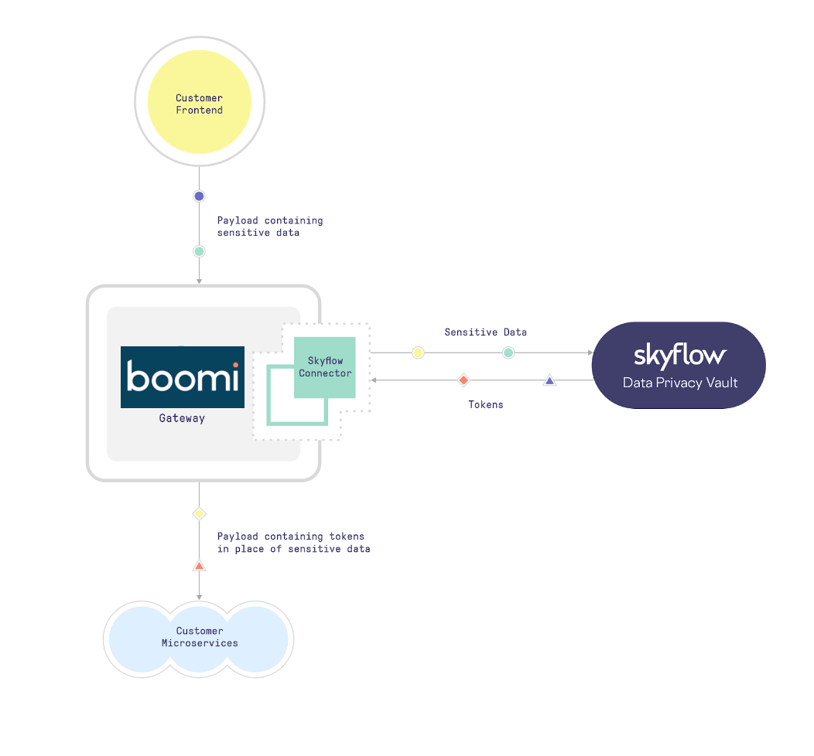

import PartnerSupport from './_PartnerSupport.md'

# Skyflow - Partner connector

<head>
  <meta name="guidename" content="Integration"/>
  <meta name="context" content="GUID-7419c0e8-f161-49fe-b4ca-838561c8029b"/>
</head>

<PartnerSupport />

The Skyflow Boomi connector enables you to easily integrate with Skyflow’s APIs to Isolate, Protect, and Govern access to sensitive data in a globally distributed manner. This approach ensures that your backend services need not have to handle sensitive data directly, thereby significantly reducing your compliance scope and increasing your security posture by mitigating the sensitive data sprawl problem. 

Skyflow is a data privacy vault that makes achieving data privacy, security, compliance, and governance easy via a simple API. Designed specifically for sensitive customer data (PII), Skyflow encrypts and stores data in a zero-trust vault, and makes it accessible only via specific data governance rules you create. Your data is isolated in your vault, which can be located globally to meet data locality and residency requirements. You can use Skyflow’s powerful tokenization capabilities to reduce your compliance scope by replacing sensitive data with tokens, and you can also use Skyflow to securely share sensitive information directly with third-party services in tokenized or encrypted formats. Advanced data privacy functionality built into Skyflow includes polymorphic encryption, data masking, fine-grained access controls, auditability, and more.

## Connector configuration
To configure the connector to communicate with the Skyflow API, set-up these components:

- Skyflow API connection
- Skyflow API operation

# Prerequisites
To use the Skyflow Boomi Connector, you'll need the following:
- A Skyflow account
- Your Skyflow Vault URL and Vault ID
- A Skyflow API Key with the necessary permissions

## Supported editions​

The connector supports the following version of the Skyflow API: 33

## Tracked properties​

This connector has no predefined tracked properties. See the topic [Adding tracked fields to a connector operation](https://help.boomi.com/docs/Atomsphere/Integration/Process%20building/t-atm-Adding_tracked_fields_to_a_connector_operation_f71821dd-95ee-4ebd-bfc9-3333262f56f6) to learn how to add a custom tracked field.