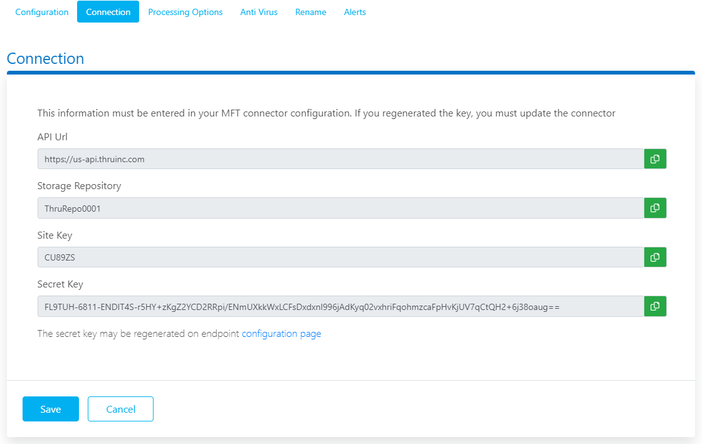

# Thru MFT – Partner connection

<head>
  <meta name="guidename" content="Integration"/>
  <meta name="context" content="GUID-7ae20f02-326c-471f-a11c-b032008c867f"/>
</head>

The Thru MFT - Partner connection represents a single Thru Flow Endpoint credential.

## Connection tab

:::info Important

The documentation for this connector is provided by a Boomi partner. This documentation was last updated in July 2024.

:::

The Thru MFT – Partner connector uses the following information to connect to Thru MFT. 

This information is created when a [Thru iPaaS Connector](https://guides.thruinc.com/taftug/thru-ipaas-connector) endpoint is added to [FlowStudio](https://guides.thruinc.com/taftug/flow-studio) in Thru. The Endpoint becomes a [Flow Endpoint](https://guides.thruinc.com/taftug/flow-endpoint-editor) and the connection details are available from the [connections](https://guides.thruinc.com/taftug/connection) tab.

**API Url** - 
The Thru MFT API URL.

**Storage Repository** - 
The Storage URL (Storage is also referred to as 'Site').

**Site Key** - 
The Storage secret key.

**Secret Key** - 
The Secret key for the flow to access an Thru MFT Transport.

## Test Connection

You can test your connection settings before you use the connection in a process or even before you save the connection. Test Connection ensures that the connection settings that you specify are correct, valid, and can be accessed. If the test connection is successful, you can save the connection. Otherwise, review and correct any incorrect settings, then test again.