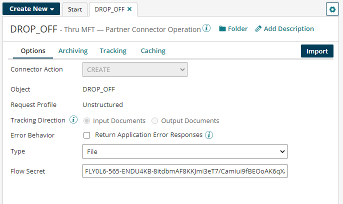

import OperationEnd from './_operationEnd.md'

# Thru MFT – Partner operation

<head>
  <meta name="guidename" content="Integration"/>
  <meta name="context" content="GUID-0db29724-5930-4592-aefb-4129a679ac47"/>
</head>

The Thru MFT - Partner operation defines how to interact with your Thru MFT instance and which flow to use with connection parameters.

:::info Important

The documentation for this connector is provided by a Boomi partner. This documentation was last updated in July 2024.

:::

The operation represents a specific action, such as **Create** and **Get** to be performed against a specific Flow for a file, metadata or exception. The Thru MFT - Partner operation uses binary and JSON formats. The following actions are supported:
* **Get** - Inbound 
* **Create** - Outbound

## Get

Get is an inbound action to download \(pickup\) a file from Thru MFT Flow. It is also used to get File metadata.

-   The Thru MFT API returns only one file for each request.
-   Specify the Secret Key in the parameter value for the File pick up operation.
-   Specify the FileCode in the parameter value for the File_Metadata operation.

The connector returns an error if the parameters are not set. 

When the Get operation is successful, the file is returned in binary format along with the Filename and File code as the document properties in the output.

The File metadata operation returns JSON output with all the available details for the corresponding File code provided in the input parameter for the File_Metadata operation.

## Create

Create is an outbound action to upload \(Drop-Off\) a file into a THRU MFT.

Upload files in chunks; there is no size limit.. Include the file payload, name, and size in the message.

Provide the file code of the original file if the outgoing file is the result from processing an incoming file (e.g., exceptions in the data).

-   Specify the file name using the document property.
-   Select the Type option of the file. 
-   Create can also be used to post aggregated exception information back to Thru MFT. To do so, select Exception in the **Type** drop-down list.
-   The File code must be specified using the document property if the drop off is the Exception type.

The connector returns a error message if the File name is not mentioned in the document property, . The Filecode is required for the Exception type operation. When the file drop-off operation is successful, the connector returns a response JSON with the response from all steps of a drop-off process to Thru MFT API calls.

## FLOW PICKUP Request and Response

- The Request parameter ID value should be a static value in the following form : FLZMP9-83-ENDU4KB (you can see it is the first part of the Flow Secret without the encrypted key.)
- The Response is 200: Binary data with the document properties File Name and File Code.
- The Response may contain a 204: empty success response.
- The Response may contain a 403 or 500: execution stops with an exception message.

## FILE\_METADATA Request and Response

-   The Request parameter ID value should be FILE\_CODE.
-   The Response is 200: file metadata with a JSON body.
-   The Response may contain a 400 or 500: execution stops with an exception message.

## DROP\_OFF\_FILE Request and Response

-   The Request is binary data with FileName.
-   The FileName document property is required.
-   The Response is JSON.

For example, you may build a process that reads the file from disk. The binary file output from disk is provided to the Drop-off operation. The filename from disk is set to the document property. Finally, the connector performs a Create operation to drop off the file into Thru MFT.

## DROP OFF EXCEPTION Request and Response

-   The Request is binary data with File Code.
-   The File Code document property is required.
-   The Response is JSON.

<OperationEnd />