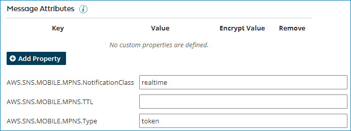

import OperationEnd from './_operationEnd.md'

# Amazon SNS operation 

<head>
  <meta name="guidename" content="Integration"/>
  <meta name="context" content="GUID-1947a8d0-9d8a-4d00-8bb3-dbcd7a4121b9"/>
</head>

The Amazon SNS operation defines how to interact with your Amazon SNS account.

The operation represents a specific action performed against a specific Amazon SNS record type or object. Create a separate operation component for each action and object combination required for your integration. The Amazon SNS operation does not contain any batch options or custom fields.

The Amazon SNS operation supports the following actions:

-   Create — add messages to a topic. The maximum message size is 256 KB.

-   Execute — publish notification messages to apps on mobile devices that can appear as message alerts, badge updates, or sound alerts. This option supports the following services:

    -   APNS — Apple Push Notification Service that sends push notification messages to iOS and OS X apps.

    -   APNS – Sandbox — Apple Push Notification Service that sends push notification messages to the APNS sandbox for development use.

    -   ADM — Amazon Device Messaging that sends push notification messages to Kindle Fire apps.

    -   GCM — Google Cloud Messaging for Android that sends push notification messages to Android apps.

    -   BAIDU — the Chinese cloud service that sends push notification messages to mobile devices.

    -   WNS — Windows Push Notification Services that sends push notification messages and updates to Windows 8 \(and later\) and Windows Phone 8.1 \(and later\) apps.

    -   MPNS — Microsoft Push Notification Service for Windows Phone that sends push notification messages to Windows 7+ and Windows Phone 8.0 apps.

## FIFO topics 

The connector supports processing and sending messages to First-In-First-Out \(FIFO\) topics, providing message sequence and ordering, and deduplicated message delivery to one or more subscribers. When using the Create operation to add messages to a topic, and when using the **Import Operation** wizard to browse, the connector lists all topics, including FIFO topics.

If you select a FIFO topic, two document properties appear in the **Set Properties** step so you can specify the **Message Group Id** value and **Deduplication Id** value sent to the service. Once set, the properties remain with the document as it moves through the subsequent steps in the process. Additionally, the XML response profile created by the connector includes a **SequenceNumber** element. It includes this element in the output document body, and it helps ensure the message's processing is in the correct order.

## Reserved message attributes 

The connector supports the delivery of message attributes, and enables you to provide structured metadata items \(such as time stamps, geospatial data, signatures, and identifiers\) about the message to the service. The sent message body contains the message attributes. The message receiver can use the information to determine how to handle the news without first processing the message body. For mobile push notification services, there are reserved message attributes.

When using the Execute operation to publish notification messages to apps on mobile devices, and you use the **Import Operation** wizard to browse, you select an **Object Type** representing the mobile push notification service. Some object types \(such as MPNS\) have reserved message attributes that you can use to structure your push notification message. After selecting the object type and completing the **Import Operation** wizard, the **Message Attributes** section of the operation page displays the reserved message attributes and their default values \(set by the service\).

If necessary, you can change the default values for the attributes.

:::note

-   You can override the service's default values and those provided in the operation using dynamic operation properties. To learn more, see the topic [Connector step dialog, Dynamic Operation Properties tab](../Process%20building/int-Connector_shape_dialog_dynamic_operation_properties_tab_e473feba-b349-4b3b-8d82-2c3c9f94469b.md).
-   Suppose you provide a **Message Attributes** key-value pair having the same name as a reserved message attribute for the same object type. In that case, the value provided in **Message Attributes** or its dynamic operation property \(if specified\), takes precedence over the reserved message attribute.
-   If you do not provide a value in a message attribute, the platform ignores the empty value and does not send it to the service.

:::

## Options tab 

The following table describes the default field definitions for each action type:

**Object** - 
  Unstructured input \(see the following **JSON Message Structure** for an alternative option\).

**Subject** - 
 \(Create and Execute\) An optional parameter used as the **Subject** line when delivering the message to email endpoints and is included in standard JSON messages delivered to other endpoints.

 **Note:** Subjects must be ASCII text beginning with a letter, number, or punctuation mark. It must not include line breaks or control characters, and it must be less than 100 characters in length.

**JSON Message Structure** - 
 \(Create and Execute\) If selected, it returns the message in JSON. To send different messages for both transport protocols, select this check box and use a JSON object for the message content.

**Message Attributes** - 
 \(Create and Execute\) Specify key-value pairs and define the attributes to add to the message, such as timestamps, signatures, identifiers, and so on. You can dynamically override the value with the corresponding Message Attributes dynamic operation property. If you provide a blank or empty value, it ignores the key-value pair and is not sent to the service as a message attribute.

The message receiver can use this information and decide how to handle the message without having to first process the message body. For direct attribute mapping between Amazon SNS and Amazon SQS, each message can have up to 10 attributes.

<OperationEnd />
