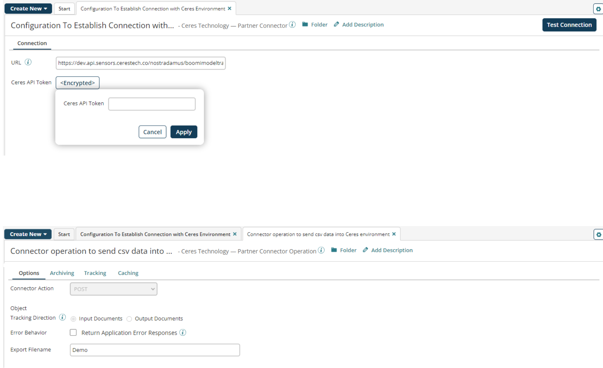
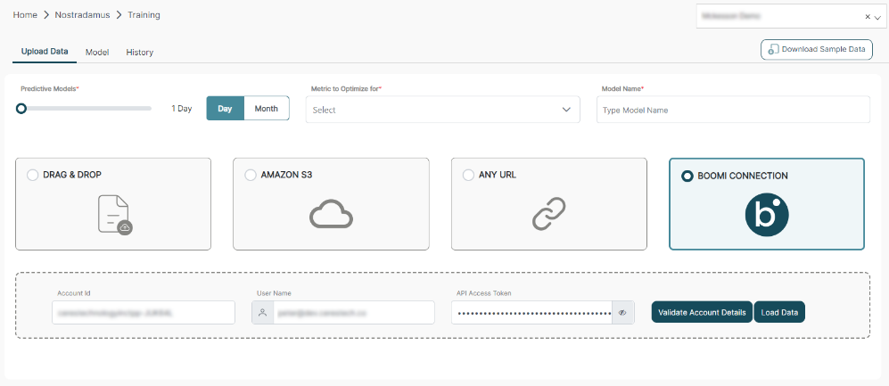

# Ceres Technology - Partner connection 

<head>
  <meta name="guidename" content="Integration"/>
  <meta name="context" content="GUID-9a36a54a-73b9-4fc4-9d92-db8e0a8caa77"/>
</head>

The Ceres Technology connection represents and contains all of the information that is needed to connect your account to Boomi Integration. If you have multiple Ceres Technology accounts, use a separate connection for each one and configure the token accordingly. You can pair a single connection with different Ceres Technology operations to perform a unique action against a Ceres Technology account.

## Connection tab 

The Ceres Technology connection uses access keys, which consist of an endpoint and a secret token key. Obtain the URL and the Ceres API Token from the Ceres Technology support team.

Below are the screenshots showing the connector components and use of the Ceres token:

## Test Connection troubleshooting 

You can test your connection settings before you use the connection in a process or
even before you save the connection. **Test Connection** ensures that the connection
settings you specify are correct, valid, and can be accessed. If the test connection is
successful, you can then save the connection. Otherwise, review and correct any
incorrect settings, and then test again.

:::info Attention

You can only run the **Test Connection** against containers associated with your account (local Atoms, Molecules, and Atom Clouds).

:::

## Test Connection troubleshooting

To ensure that Test Connection and browsing are successful, verify that you have proper permissions and that the URL and Ceres API Token are correct.

## Add-On

In addition to using the Boomi Ceres connector to push data to the Ceres Nostradamus
platform, customers also have the option of configuring a Boomi connection from within
the Ceres user interface to import data from a Boomi listener process.

