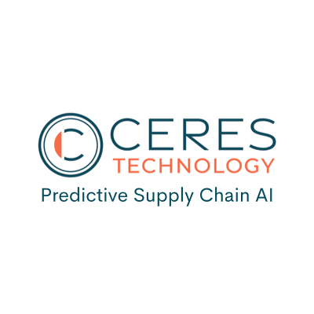
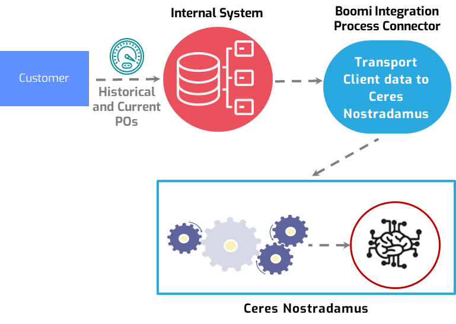
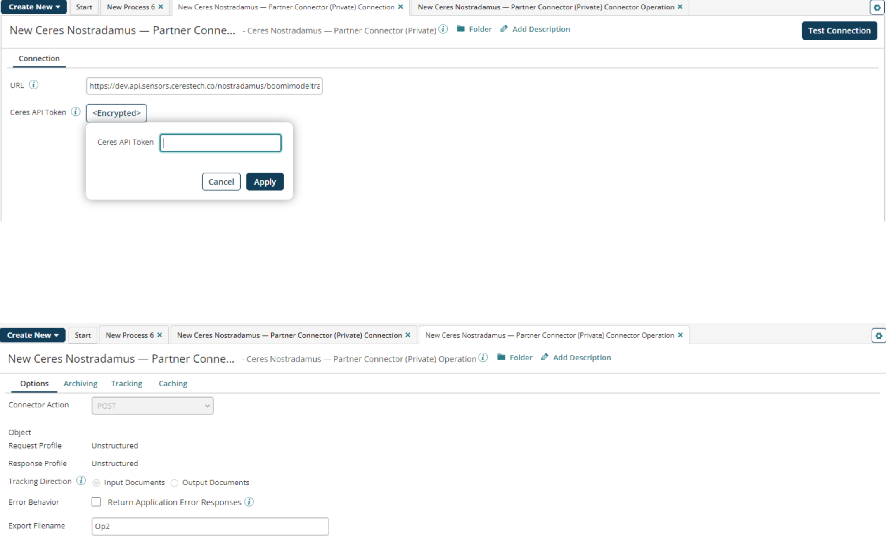

import PartnerSupport from './_PartnerSupport.md'

# Using AI to Forecast Supply Chain Disruptions for Procurement, Planning, and Better Resilience with Ceres Technology - Partner connector 

<head>
  <meta name="guidename" content="Integration"/>
  <meta name="context" content="GUID-5a328f60-ba7e-4f63-8041-58527fb5212f"/>
</head>

<PartnerSupport />

Ceres Technology offers an AI platform that enables clients to forecast supply chain disruptions and delays, often months in advance. Our AI engine empowers you to identify which raw materials, components, finished goods, and suppliers are at risk of delays or disruptions *before* you place your purchase orders. This capability allows for better planning and procurement, helping you understand which suppliers are vulnerable, manage inventory more effectively, improve on-time deliveries, enhance supply resilience, and meet Service Level Agreements. Not only do we identify risks, but we also quantify the expected severity of any delays, that is how long the delay is likely to last. Our AI incorporates over 25,000 global indicators (as of this writing) including geopolitical information, commodities prices, financial data, global news, and micro- and macro-economic data. We combine these external sources with clients' historical purchase order information to forecast potential delays.

The Ceres Technology integration platform enables users to work in real-time with the data generated by our customers’ applications. The Ceres Technology — Partner Connector enables customers to use their data inside the Ceres Nostradamus™ platform for the purpose of using AI to predict supply chain delays or disruptions. The system will intake historical purchase order data and train the system to learn the client’s supply chain. Once the Nostradamus AI system has learned the customer’s supply chain (in other words, the purchase order lifecycle),
the customer can then begin using Nostradamus for its predictions.

The minimum number of data fields needed to train and use Nostradamus AI are listed below. While different clients have different names for the data types, please read the description for more information on each data type the system requires. Most customers will have this information contained within their purchase orders.

**Supplier**   
Internal or legal name of the supplier

**Product Name**   
Name of Product

**Purchase Order** \#   
Purchase order number

**Supplier Origin**  
The address or general location \(city and country\) of the supplier

**Destination**   
The location of the shipment destination

**Price**   
Price paid for the order

**Order Quantity**   
Quantity of the product ordered

**Expected Delivery Date**   
The date on which the shipment is expected to arrive

**Actual Delivery Date**   
The date on which the shipment actually arrived \(applies to training and test data sets\)

Data is imported into the system using standard formats \(CSV, XML, etc.\) from any source. We can connect to SAP, Oracle, etc. Additionally, the Boomi connector will make this integration easier for our customers. The connector will also make the integration automatic.

## Benefits

By integrating the Ceres Technology Nostradamus AI with your supply chain platform, you will enhance your ability to predict and proactively respond to supply chain delays and improve resilience. By using the Boomi Partner connector, you will dramatically reduce the time required to integrate and transmit your data, which will virtually eliminate data errors and reduce the time required to launch Nostradamus within your supply chain ecosystem. The result will be enhanced procurement, improved planning, and increased resilience.

## Connector configuration 

To configure the connector to communicate with Ceres Technology, set up the following two components:

-   Ceres Technology connection

-   Ceres Technology operation

This design provides reusable components which contain connection settings and operation settings. After building your connection and operation, set up your connector within a process. When the process is defined properly, Boomi Integration can map to and from virtually any customer system. The Ceres Technology - Partner connector uploads data from the customer’s internal system \(data sources\) in order to determine which purchase order will be delivered on time.

## Prerequisites

To use the connector, request the URL and Ceres API Token from the Ceres Team. Below are the screenshots showing the use of the Ceres token.

## Tracked properties

This connector has no predefined tracked properties. See the topic [Adding tracked fields to a connector operation](../Process%20building/t-atm-Adding_tracked_fields_to_a_connector_operation_f71821dd-95ee-4ebd-bfc9-3333262f56f6.md) to learn how to add a custom tracked field.

## Add-On

In addition to using the Boomi Ceres connector to push data to the Ceres Nostradamus
platform, customers also have the option of configuring a Boomi connection from within
the Ceres user interface to import data from a Boomi listener process.

