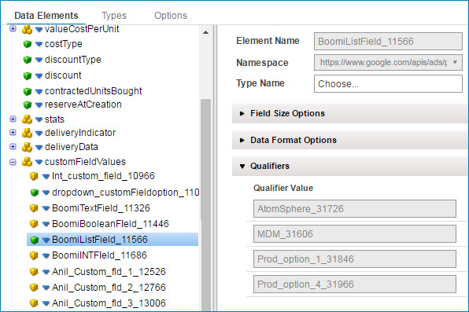

import TrackingDir from './_TrackObject.md'
import OperationEnd from './_operationEnd.md'
import ReturnErrRes from './_ReturnResponse.md'

# Google Ad Manager operation 

<head>
  <meta name="guidename" content="Integration"/>
  <meta name="context" content="GUID-c74af84c-3fb1-440f-a680-74f9063e6713"/>
</head>

The Google Ad Manager operation defines how to interact with your Google Ad Manager account and represents a specific action, such as Query, and Create to perform against a specific Google Ad Manager service and object type. 

You must create a separate operation component for each object required for your integration. The Google Ad Manager connector supports the following actions:

## Get 

Read files by supplying a single internal ID for the object record you want to retrieve. To learn which Get operations are available in Google Ad Manager, search the Google Ad Manager API documentation for operation names starting with the keyword *get* and do not contain *By Statement*.

:::note

The getAllRoles and getAllNetworks operations are not supported. When some inputs for Get operations are blank because they are not required, they cause the SDK to show an error. You can avoid this by adding character inputs for the ID parameter. For example, even though UserService -\> getCurrentUser operation is an SDK Get that does not need input parameters, add a value for the ID parameter.

:::

## Query 

search files by selecting the Query operation and using the **Import Wizard**. You can add query filters. The Query operation returns zero to many object records from a single Query request based on zero or more filters that you add. You can define multiple expressions and group them into logical subgroups to create sophisticated query logic. The operator at the logical group level defines the evaluation of the multiple expressions or logical subgroups within that logical group.

:::note

Boomi does not currently support the OR logical group. To find the available Query operations in Google Ad Manager, search the Google Ad Manager API documentation for operation names starting with the keyword *get* that contain *By Statement*.

:::

## Create 

To create one or more new files, find the available Create operations in Google Ad Manager, and search the Google Ad Manager API documentation for operation names starting with the keyword *create*.

## Update 

Replace older files with newer files by supplying a single internal ID for the object record. To find the available Update operations in Google Ad Manager, search the Google Ad Manager API documentation for operation names starting with the keyword *update*.

## Execute 

 All other procedural API calls. To find the available Execute operations in Google Ad Manager, search the Google Ad Manager API documentation for operation names starting with the keyword *perform*. If a perform operation contains actions such as Activate or deactivate, the connector uses a separate operation for each action for that object and service.

## Exceptions

Here are exceptions to the general rules previously described:

|Service|Operation|SDK operation to use|
|-------|---------|--------------------|
|ForecastService|getDeliveryForecast|Execute|
||getDeliveryForecastByIds|Execute|
||getAvailabilityForecast|Execute|
||getAvailabilityForecastById|Execute|
|LineItemCreativeAssociationServer|getPreviewUrl|Execute|
|NetworkService|makeTestNetwork|Create|
|PublishQueryLanguageService|select|Execute|
|ReportService|runReportJob|Execute|
||getReportDownloadURL|Executee|
||getReportDownloadUrlWithOptions|Execute|

## Custom fields

The profile includes active custom fields before importing the profile. However, if you add custom fields later, you need to reimport the profile to see the changes. Therefore, only user-friendly custom fields (those ending with `{ID}` are displayed). If custom fields are marked `visibility = READ_ONLY`, you cannot edit them, and they are not updated.

In custom drop-down fields, Google Ad Manager generates an ID with the option name. Append this ID after an underscore to the value. To get an option ID, open your imported profile, click an element, and click the arrow next to **Qualifiers** to view them.

## Options tab 

Click **Import Operation**, then use the Import wizard to select the object with which you want to integrate.

<TrackingDir />

<ReturnErrRes />

**Maximum Page Size** \(Query only\)  
 Enter the maximum number of results to return for each page. The default and upper limit is 100. Each result is put into one document. When querying large data sets, you can reduce the number of requests required to retrieve a full data set by increasing this value.

<OperationEnd />