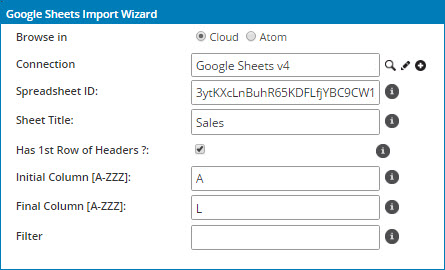

# Google Sheets operation 

<head>
  <meta name="guidename" content="Integration"/>
  <meta name="context" content="GUID-542afcd0-ad2d-4c8f-8899-819a5a32873e"/>
</head>

The Google Sheets operation defines how to interact with your Google Sheets account and represents a specific action \(Query, Create, and Update\) to perform against a specific Google Sheets object type such as spreadsheet or sheet.

Create a separate operation component for each action and object combination required for your integration.

The Google Sheets operations use JSON format and support the following actions:

-   Inbound: Get, Query
-   Outbound: Create, Delete, Update

## **Options** tab 

Click **Import Operation**, then use the Import wizard to select the object with which you want to integrate. The following table describes the fields for each action type:

**Permanently Delete** \(Delete operation for Spreadsheets\)  
 This field toggles how you can delete a spreadsheet:

  -   If selected, deletes the spreadsheet file permanently.

 -   If cleared, it moves the spreadsheet file to the trash.

 **Note:** If the Spreadsheet ID to be deleted is for a file or folder on a Google Drive, then the file/folder and its descendants are deleted.

**Spreadsheet ID** \(Query\)  
 Optionally enter a spreadsheet ID, allowing you to override the ID selected when browsing. The ID applies only to the RecordData object type. The spreadsheet ID is the value between /d/ and /edit in the spreadsheet URL. If left blank, the operation uses the Spreadsheet ID selected when browsing. You can override the ID using the Spreadsheet ID dynamic operation property.

**Sheet Title** \(Query\)  
 Optionally enter the sheet title identifying the tab on the spreadsheet. This allows you to override the title selected when browsing. The title applies only to the RecordData object type. If left blank, the operation uses the Sheet Title you selected when browsing. You can override the title using the Sheet Title dynamic operation property.

## Create 

The Create operation lets you create new spreadsheets, sheets (tabs), rows, or columns to your Google Sheets. This operation is used for outbound action that uses JSON for input and returns:

-   Spreadsheets — uses the Spreadsheet Title as input; returns a newly-generated Spreadsheet ID and Spreadsheet Title.

-   Sheets — uses Sheet Title as input; returns newly-generated Sheet ID and Sheet Title.

-   Record Data — uses dynamically-generated field values; returns newly-generated field values.

**Examples:**

- **Create a New Spreadsheet:**
  - **Use Case:** A team wants to generate a new spreadsheet to track daily sales.
  - **Action:** Use the Create operation to create a spreadsheet titled **Daily Sales Report**.
  - **Result:** A new spreadsheet is added to your Google Drive.

- **Add Rows to an Existing Sheet:**
  - **Use Case:** Add new entries for sales transactions.
  - **Action:** Specify the target spreadsheet and sheet title and provide data to insert into new rows.  

- **Result:** New rows are appended to the specified sheet.

## Delete 

Delete is an outbound action that deletes defined sheets, and spreadsheets. The data format for the delete operation is `spreadsheetId\|sheetId`. You must supply the object type \(sheets or spreadsheets\) in the **Import Wizard** to delete the existing object record.

The Delete operation removes specific rows, columns or even entire spreadsheets. For spreadsheets, you can delete them permanently or move them to the trash.

**Examples:**

- **Delete Specific Rows:**
  - **Use Case:** Remove outdated records from the **Employee Directory** sheet.
  - **Action:** Specify the row numbers (e.g., rows 5–10) for deletion.
  - **Result:** The specified rows are deleted from the sheet.

- **Permanently Delete a Spreadsheet:**
  - **Use Case:** Remove an obsolete project spreadsheet from your system.
  - **Action:** Enable the **Permanently Delete** option in the Delete operation and provide the Spreadsheet ID.
  - **Result:** The spreadsheet is permanently deleted from Google Drive.

- **Move to Trash:**
  - **Use Case:** Archive a spreadsheet temporarily instead of deleting it permanently.
  - **Action:** Uncheck the **Permanently Delete** option in the Delete operation.
  - **Result:** The spreadsheet is moved to the trash folder in Google Drive.

## Get 

The Get operation retrieves data from a Google Sheet based on specific criteria. This is useful for inbound operations.

**Examples:**

- **Retrieve a Range of Data:**
  - **Use Case:** Fetch all employee names and IDs from the **Employee Details** sheet.
  - **Action:** Specify the range (e.g., A1:B50) to extract data.
  - **Result:** The data within the specified range is returned.

- **Get Data by Spreadsheet ID:**
  - **Use Case:** Extract data from a specific spreadsheet without browsing.
  - **Action:** Provide the Spreadsheet ID in the operation.
  - **Result:** Data from the specified spreadsheet is retrieved.

## Query 

Query is an inbound action that searches spreadsheets, sheets \(using spreadsheetID\), and record data \(using spreadsheetID and sheetTitle\) objects. You can supply static or dynamic request parameters \(filters\) to control the object records selected from Google Sheets. It can return zero or more object record documents from a single Query request.

:::note 

The Query operation does not support filters for the RecordData object, and a query on this object returns all cells in the row. If you attempt to add a filter for this object, no fields appear for you to select in the **Field** drop-down list.

:::

**Examples:**

- **Filter Rows by Criteria:**

  - **Use Case:** Retrieve all rows where **Status** is **Incomplete** in the **Task Tracker** sheet.
  - **Action:** Use the Query operation with a filter condition like `Status = Incomplete`.
  - **Result:** Only rows with the specified status are returned.

- **Override Sheet Title:**

  - **Use Case:** Retrieve data from a specific tab named `Q2 Sales` within a spreadsheet.
  - **Action:** Use the Sheet Title field in the Query operation to specify `Q2 Sales`.
  - **Result:** Data from the specified tab is returned.

## Update 

Update is an outbound action that modifies sheets identified by ID and title, or record data identified by the rowindex parameter. Also the operation modifies existing data within the spreadsheet, such as updating cell values, rows, or entire sheets.

**Examples:**

- **Update Cell Values:**

  - **Use Case:** Correct a typo in a customer's email address in the **Customer Data** sheet.
  - **Action:** Specify the cell location (e.g., B3) and the updated value.
  - **Result:** The cell is updated with the new information.

- **Modify Rows:**

  - **Use Case:** Change the status of orders from **Pending** to **Shipped** for specific entries.
  - **Action:** Use the Update operation to identify rows matching the **Pending** status and update the **Status** column.
  - **Result:** The selected rows are updated with the new status.

## **Google Sheets Import Wizard** 

The following fields in the **Google Sheets Import Wizard** are applicable only to the RecordData object:

-   Spreadsheet ID
-   Sheet Title

-   Has 1st Row of Headers

-   Initial Column \[A-ZZZ\]

-   Final Column \[A-ZZZ\]