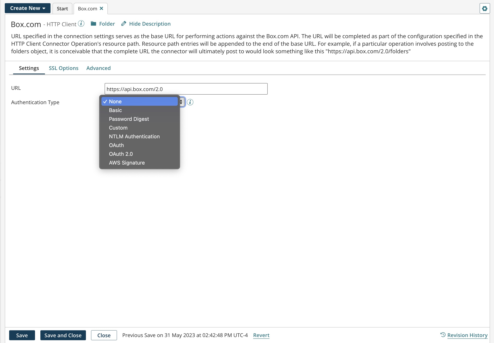
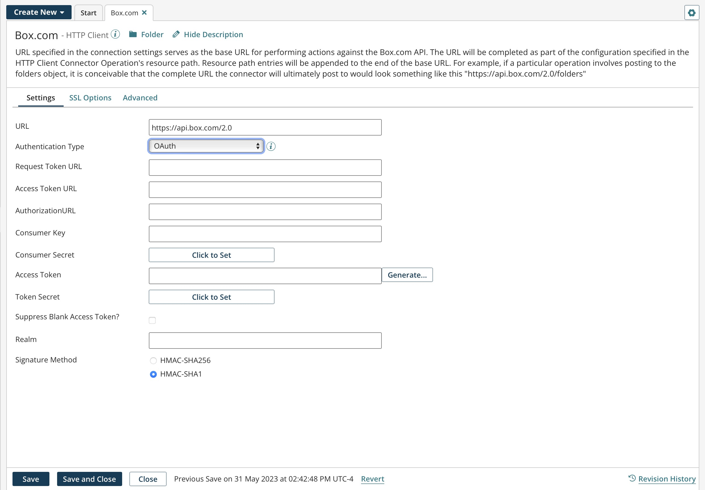
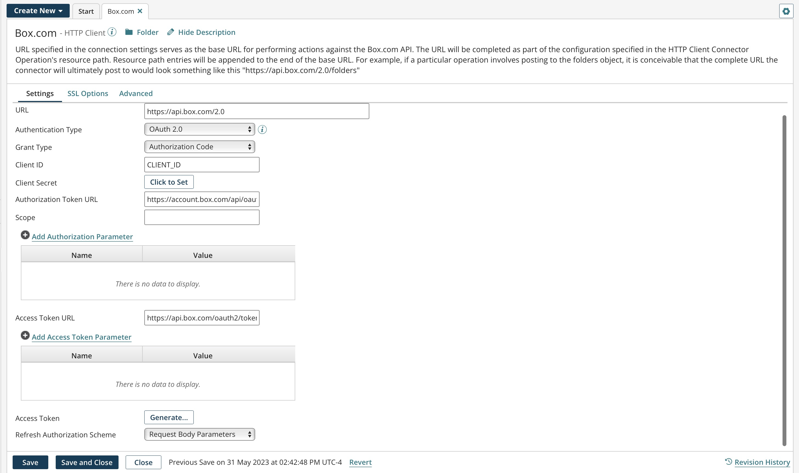
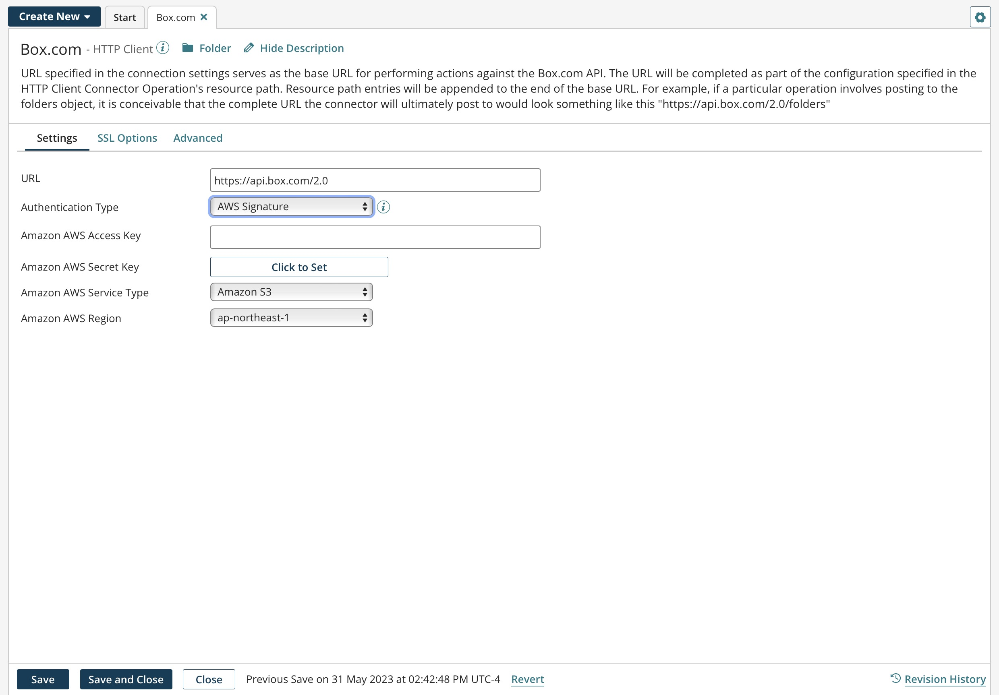

# HTTP Client connection 

<head>
  <meta name="guidename" content="Integration"/>
  <meta name="context" content="GUID-8943f71e-1290-4dbd-9092-6dd36b483532"/>
</head>

The HTTP Client connection represents a single HTTP instance, including login credentials.

You can pair a single connection with different HTTP Client operations to perform a unique action against an HTTP instance.

## Settings tab 

Configure the HTTP Client connection to authenticate a user to a web server.

**URL** - 
The URL of the server to connect to. This can be an `http` or `https` address but must be URL encoded.

**Authentication Type** - 
Identifies the secure login type:

-   None — No login information in required.
-   Basic — Uses base64 encoding. Because user passwords are not encrypted and the target server is not authenticated, Basic is not a secure authentication.
-   Password Digest — Uses a two-step process to encrypt credentials by applying a hash function to the user name and password. Password digest authentication is considered more secure than Basic authentication.
-   Custom — This setting automatically replaces any header or resource path replacement variable named "password" or "username" with the respective values from this security section. This is a base URL to which the operation can add via the resource path.
-   NTLM Authentication — This authentication includes Microsoft's Kerberos protocol. NTLM uses an encrypted challenge/response protocol to authenticate a user. The system requesting authentication performs a calculation that proves it has access to the secured NTLM credentials.

    
    :::note

    While the HTTP Authentication protocol handler supports SPNEGO, which includes the NTML and Kerberos sub-mechanisms, Boomi has not tested Kerberos and does not provide technical support for it.

    :::

 -   In Kerberos, clients obtain from the Kerberos Key Distribution Center \(KDC\) tickets representing the client's network credentials. These tickets are presented to servers when connections are established.

#### Using NTLM authentication on Windows

To use NTLM authentication on Windows, Boomi recommends running the Atom or Molecule under the account of the currently logged in user. You can then use NTLM authentication using the Windows user credentials. When an Atom or Molecule runs as a Windows service, it typically runs under a "Local System Account". This prevents the Atom or Molecule from using the user account credentials. To successfully use NTLM authentication, consider running the Atom or Molecule as a desktop application from the ATOM\_HOME/bin directory, or run the Atom or Molecule as a service under the currently logged in user.

When using NTLM authentication on Windows, your Windows user credentials are used to authenticate, instead of the credentials provided in the HTTP Client connector.

You can run Atoms and Molecules under a specific user account as a Windows service. For more information, see the linked related tasks. If you are running the Atom or Molecule as a desktop application, you can perform a Run as on the desktop application.

-   OAuth — See the OAuth settings section.
-   OAuth 2.0 — See the OAuth 2.0 settings section.
-   AWS Signature — See the AWS Signature settings section.

**User Name** \(Basic, Custom, Password Digest\)
The user name for authentication.

**Password** \(Basic, Custom, Password Digest\)
The password for authentication.

## OAuth settings 

Integration supports OAuth authorization for versions 1.0 and 1.0a for both on-premise and cloud integrations.

When the HTTP Client connection's authentication type is set to OAuth, enter the following information:

**Request Token URL** - 
The URL to obtain an unauthorized request token.

**Access Token URL** - 
The URL to exchange the user-authorized request token for an access token.

**Authorization URL** - 
The URL to obtain user authorization for consumer access.

**Consumer Key** - 
A value the consumer uses to identify itself to the service provider.

**Consumer Secret** - 
A secret the consumer uses to establish ownership of the consumer key.

**Access Token** - 
A value the consumer uses to gain access to the protected resources on behalf of the user instead of using the user's service provider credentials. This token may not be required by the web site or application.

**Token Secret** - 
A secret the consumer uses to establish ownership of a given token. This token may not be required by the web site or application.

**Suppress Blank Access Token?** - 
If selected, the OAuth header is generated, and the empty access token and secret fields are included.

If cleared, the OAuth header is generated, but the empty access token and secret fields are suppressed \(not included\).

**Realm** - 
Optionally enter a realm that the client may request access to. This parameter, similar to Scope in OAuth 2.0, is added to the authorization header most often to identify the caller companyId. Another use is to invoke a Restlet for NetSuite.

**Signature Method** - 
For the server \(destination endpoint\) to verify the authenticity of the request and prevent unauthorized access, choose a signature method to sign requests and prove rightful ownership of the credentials.

-   HMAC-SHA256 — \(Default for new connections\) Select this secure hash signature method to sign requests and provide a more secure authentication method over HMAC-SHA1.
-   HMAC-SHA1 — \(Default for existing connections\) Authentication requests using HMAC-SHA1 are not considered secure. Some services \(for example, NetSuite as of version 2021.2\) do not provide OAuth 1.0 support for SHA1 and require SHA256 in new integrations to authenticate.

:::info Important

Boomi recommends that if the service you are connecting to supports SHA256 in OAuth 1.0, update the **Signature Method** in your connections to use HMAC-SHA256 instead of SHA1. You should also consider switching to OAuth 2.0. If that is not possible, the recommendation is to use SHA256 in OAuth 1.0. For more information about NetSuite's HMAC-SHA1 signature deprecation, impact, and the steps you need to complete, see the Boomiverse article [NetSuite HMAC-SHA1 Signature Deprecation Update](https://community.boomi.com/s/article/NetSuite-HMAC-SHA1-Signature-Deprecation-Update).

:::

## OAuth 2.0 settings 

Integration supports OAuth 2.0 authorization for on-premise and cloud-based integrations. OAuth 2.0 is not backwards compatible with OAuth 1.0 or 1.0a. If you use custom policy files, you must edit account permissions to use OAuth 2.0 authentication with your cloud application.

:::note

For OAuth 2.0 authentication, you may need to specify in the external application the Boomi callback or redirect URL. The callback URL is `https://platform.boomi.com/account/<your_account_ID>/oauth2/callback` where `<your__account_ID>` is your Integration account ID. You can also find your account ID in the Integration platform at **Settings > Account Information** and **Setup > Account Information**.

:::

When the connection's authentication type is set to OAuth 2.0, enter the following information \(the fields vary according to grant type\):

**Grant Type** - 
Select the grant type to use. The supported grant types are:

-   Authorization Code — The standard, 3–Legged OAuth2 authorization where you grant the client an authorization code that can be exchanged for an access token.

    
    :::note

    To accommodate services requiring a client id and client secret as part of the authorization header to refresh the token, select this grant type, and then use the corresponding **Refresh Authorization Schema** drop-down list to choose which schema to use to pass the client id and client secret as part of the request body.

    :::

-   Resource Owner Credentials — Requires username and password

-   Client Credentials — Uses client credentials to retrieve an access token directly instead of asking for user authorization. This authorization is typically used for administration tasks specific to a client.

**Client ID** - 
The client ID obtained from the application.

**Client Secret** - 
The client secret obtained from the application.

**Authorization Token URL** \(Authorization Code\)
The endpoint URL to use to obtain an authorization token.

**Scope** - 
You can add one or more permissions, which are case-sensitive and separated by a space, to application request URLs. If you change scope permissions, you need to re-authenticate to ensure that all of the requested permissions are granted.

**Add Authorization Parameter \(Authorization Code\)** - 
\(Optional\) The name and value of extensible endpoint parameters.

**Access Token URL** - 
The endpoint address provided by the application to make API requests.

**Add Access Token Parameter** - 
\(Optional\) The name and value of additional or custom token parameters required by your application.

**Access Token \(Authorization Code, Resource Owner Credentials\)** - 
The encrypted access token retrieved from the application that is used to access protected resources.

**Generate \(Authorization Code, Resource Owner Credentials\)** - 
Click to generate the access and refresh tokens. When a new window opens asking you to confirm offline access, click **Accept**. A second message indicates the access token was received and successfully generated.

**Refresh Authorization Schema** - 
\(Applicable for the **Grant Type** of Authorization Code\) When refreshing an OAuth 2.0 token, the connector needs to pass the client id and client secret with the token refresh request. Select the schema to pass the client id and client secret:

-   Request Body Parameters — \(Default\) The client id and client secret is passed as request body parameters.

-   Basic Authorization — Base64 encoding of "clientId:clientSecret" is passed as part of the request's Authorization header.

## Extending OAuth 2.0 fields 

OAuth 2.0 fields are extensible. When the connection settings values have been configured, overrides are applied after the cached version of the access token expires and refreshes.

-   To use extensions with the **Client Credentials** grant type, click the Extensions tab in your process. In the Extensions window, click the Connection Settings tab. In the Select extensible properties list, select **OAuth2 Access Token**. When selected, this field applies overrides even though you do not see an access token field in the connection settings Client Credentials grant type. If the field is cleared, the connection executes the default settings. The connector automatically retrieves refresh tokens.

- In addition to the existing fields that are extensible, we have added extensibility for the following:
    - Access Token parameters
    - Authorization parameters

    If you select any of these to be extensible via the Connection Settings tab in the Extensions dialog, any overrides provided for them will be applied.

-   You can update the Environment Extensions object using the Boomi AtomSphere API to implement the **Refresh Authorization Schema** drop-down list for OAuth 2.0 refresh tokens. Because this feature is designed to be in the form of a list selection, you must pass a fixed value, either req\_body\_params\_auth or basic\_auth. To learn more, including an example on how to implement this feature, see the topic [Environment Extensions object](https://developer.boomi.com/api/platformapi#tag/EnvironmentExtensions).

## AWS Signature settings 

Amazon APIs require that each request is sent with a unique signature that is calculated using the contents of the API request. can calculate the required signature for each request that is made to the Amazon APIs. This helps decrease development time and improves time to value while integrating with the AWS APIs.

The following image is an example of the AWS Signature settings.

When the HTTP Client connection's authentication type is set to AWS Signature, enter the following information:

:::note

This connector uses Amazon access keys, which consist of an access key ID and a secret access key. Create these keys using the AWS Management Console. You can access them later from the **My Security Credentials** page.

:::

**Amazon AWS Access Key** - 
Type or paste your Amazon AWS access key.

**Amazon AWS Secret Key** - 
Click on **Click to Set** and then type or paste your Amazon AWS secret key.

**Amazon AWS Service Type** - 
This drop-down list contains some of the more common Amazon AWS services that you can connect to, such as Amazon API Gateway, Amazon Mobile Analytics, Amazon S3, etc. Select the service and the region, and then specify the URL to the server \(destination endpoint\) in the **URL** field. For example, to connect to the Amazon Glacier service in the US West 1 region, enter https:// glacier.us-west-1.amazonaws.com in the **URL** field. If you do not see the service that you want to connect to in this drop-down list, select Custom and specify the custom service entry in the **Custom AWS Service** field.

**Custom AWS Service** - 
Enter the custom name of the Amazon AWS service that you want to connect to. For example, AWS CodePipeline. The connection uses the custom AWS service instead of a service from the **Amazon AWS Service Type** field. A custom AWS service allows you to extend the AWS services. Enter the custom AWS service name, select the region of the service, and then specify the URL to the server \(destination endpoint\) in the **URL** field.

**Amazon AWS Region** - 
Select the name of the AWS region in which your account resides. For example, US East 1 and AP South 1. Select the service and the region, and then specify the URL to the server \(destination endpoint\) in the **URL** field. If you do not see the region in which your account resides, select **Custom** and specify the custom AWS region in the **Custom AWS Region** field.

**Custom AWS Region** - 
Enter the custom name of the AWS region in which your account resides. For example, if you want to use the AP South 2 region, enter **ap-south-2**. The connection uses the custom region instead of a region from the **Amazon AWS Region** field. A custom AWS region allows you to extend the regions for the Amazon AWS services. Select the service, enter the custom AWS region, and then specify the URL to the server \(destination endpoint\) in the **URL** field.

    **Note:** The Custom AWS Region field is only visible when you select the **Custom** option in the **Amazon AWS Region** list, or in the **Select extensible properties** list on the Extensions page.

## SSL Options tab 
You can optionally configure client certificate authentication and self-signed SSL certificates if they are required by the destination endpoint. All of the SSL options for the HTTP Client connection are available as extensions.

**Use Client SSL Authorization** - 
:   \(Optional\) If selected, the connection adds a private certificate. If your endpoint requires client authentication \(also called mutual or two-way authentication\), use this option and select a Client SSL Certificate.

**Client SSL Certificate** - 
\(Available if Use Client Authorization is on\) Used to select, edit, or create a private certificate component for SSL Client Authentication. Your private certificate is used to verify your identity when sending requests to the endpoint. To set up a client authentication, you must manually export your public certificate and provide it to your endpoint owner. See the Certificate Components topic linked below for more information.

**Use Trusted SSL Certificate** - 
\(Optional\) If selected, the connection adds the public certificate you select in Trust SSL Server Certificate. Use this option and define the server in Trust SSL Server Certificate if the endpoint uses a self-signed certificate that is not provided by a trusted root certification authority \(CA\) such as Verisign or Thawte.

-   The HTTP connector automatically applies CA certificates. You do not need to import or configure certificates in the connection.
-   After you add a trusted certificate to an HTTP connection that uses a process, and after you deploy the process to an Atom, every process that uses that Atom and connects to that server can use the same trusted certificate. However, do not configure the HTTP connections in other processes to Use Trusted SSL Certificate.

-   If you disable this option or remove the certificate from the connection, the underlying certificate component is not deleted from your account.

-   If you detach the original process containing the certificate from the Atom, the certificate is removed and other processes that used this certificate are no longer able to connect to the endpoint.

-   If the endpoint uses a wildcard server certificate \(for example, \*.mycompany.com\), do not enable. Manually import the certificate into the Java keystore.

**Trust SSL Server Certificate** - 
\(Available if Use Trusted SSL Certificate is on\) Used to select, edit, or create a public certificate component for SSL server authentication. Contact the owner of the endpoint to obtain its public certificate and then import it into a certificate component.

:::note

The Java system property https.protocols, which specifies the enabled Transport Layer Security \(TLS\) protocol\(s\) for HTTPS connections, is exposed as an Atom property of possible interest to Atom owners running Java 8 and 11.

:::

-   Java 8 enables TLSv1, TLSv1.1, and TLSv1.2 by default.
-   Java 11 enables TLSv1.3 by default.

To set this property, you must have the Atom Management privilege. If you have the Atom Management Read Access privilege, you cannot set the property.

1.  Go to **Manage** \> **Atom Management**.

2.  Select the Atom and click **Properties**.

3.  In the Atom Properties panel, select the **Advanced** tab.

4.  In the properties list, select **HTTPS Protocols**.

5.  Click **Add Property**.

6.  Enter the property value as a comma-delimited list of TLS protocols — for example, TLSv1.1,TLSv1.2.

7.  Click **Save**.

8.  Click **Yes, restart Atom now**.

:::note

On March 28, 2018, Boomi disabled support for TLS v1.0 on the Boomi EU and ANZ Atom Clouds and all Boomi Hub Clouds. On May 23, 2018, Boomi additionally disabled support for TLS v1.0 on the Boomi Enterprise Platform and the Boomi U.S. Atom Cloud. On October 29, 2021, Boomi disabled support for TLS v1.0 for Atoms and Molecules.

:::

## Advanced tab 

You can override the default timeouts in the vmoptions file. If you set a long timeout in the Cloud, the process is stopped by the Atom Worker Maximum Execution Time.

Cookie scope is a cookie handler that specifies the persistence of cookies. Persistence is whether cookies can be reused in multiple sessions, and where they are used. You can use trace logging to see if cookie scope is set to Connector step or Ignored.

**Connect Timeout \(ms\)** - 
Optionally set a connection timeout \(in milliseconds\) to tell the connector how long to wait to complete a connection handshake until it times out without changing the timeouts at the Atom or operating system level. If blank, the default timeouts are used. If zero, the timeout is infinite.

**Read Timeout \(ms\)** - 
Optionally set a read timeout \(in milliseconds\) to tell the connector how long to wait for an HTTP read request to complete until it times out without changing the timeouts at the Atom or operating system level. If blank, the default timeouts are used. If zero, the timeout is infinite.

**Cookie Scope** - 
Used to set the persistence of cookies:

-   Global — cookies are shared in all processes throughout the Atom JVM life cycle. This is the default.
-   Connector step — cookies are isolated and shared only for the duration of the Connector step execution.

-   Ignored — cookies are discarded, even if they are requested by the server.