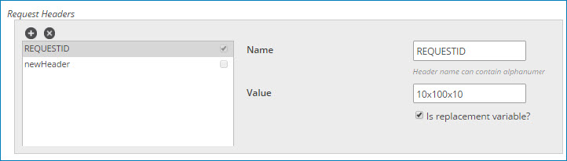
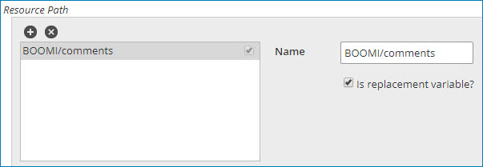
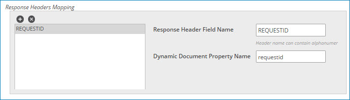
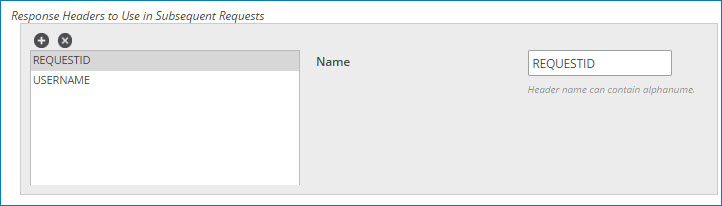

import OperationEnd from './_operationEnd.md'

# HTTP Client operation 

<head>
  <meta name="guidename" content="Integration"/>
  <meta name="context" content="GUID-be7c3036-1c53-429a-99f2-29bc28f055e1"/>
</head>

The HTTP Client operation determines how to interact with the HTTP site defined in the HTTP Client connection.

The operation supports two types of actions:

-   Get — Retrieves data from the HTTP site by sending a simple request that returns the data as the response.
-   Send — Sends data to the HTTP site.

Sending multipart/form-data MIME documents in an HTTP request

Consider the following:

-   If you create a MIME document using a method other than the Data Process step \(for example, the Disk step\), you must manually set the "MIME Document" MIME property in the Set Properties step before sending the document over HTTP.

    Setting the "MIME Document" property sends top-level headers within the MIME document separately as HTTP headers, and the remaining document as the request payload. Creating the document in the Data Process step automatically applies this property.

-   To be set as HTTP headers in the operation, MIME properties must be set on the document before entering the Map JSON to multipart/form-data MIME step of the Data Process step.

-   The preamble headers MIME-Version, Content-Transfer-Encoding, and Content-Type, set during the Map JSON to multipart/form-data MIME step of the Data Process step cannot be overridden by MIME Properties.

-   Even if they do not contain values, MIME properties set on the document as headers take precedence over HTTP operation request headers of the same name that do contain values.

-   A custom MIME property named "Authorization" can be used to override the connector-generated Authorization header values on HTTP Get actions only.

## Options tab 

When you configure a Get or Send action, the following fields appear on the Options tab.

**Select Request Profile Type** - 
Defines the request profile type: None, XML, JSON

**Request Profile** - 
Available when **Select Request Profile Type** is XML or JSON. The Request Profile selects the profile definition representing the data structure that is sent by the connector. XML and JSON profile definitions are not required for simple HTTP calls. Multiple content types are accepted.

**Select Response Profile Type** - 
Defines the response profile type: None, XML, JSON

**Response Profile** - 
Available when **Select Request Profile Type** is XML or JSON. The Response Profile selects the profile definition representing the data structure that is received by the connector. XML and JSON profile definitions are not required for simple HTTP calls. Multiple content types are accepted.

**Content Type** - 
Defines the type of file being transmitted: text/XML, text/plain, text/HTML, application/binary, application/EDIFACT, application/EDI-X12, application/XML, application/json, application/x-www-form-urlencoded.

**HTTP Method** - 
Defines the type of request being performed: GET, POST, PUT, DELETE.

**Return HTTP Errors** - 
If cleared and if an error \(300-, 400- or 500-level status code\) occurs, this part of the process fails. No application status code or message is recorded. You can use Try/Catch, Decision and/or Message steps to report the response.

If select and if an error \(300-, 400- or 500-level status code\) occurs, the process continues successfully. The response, including the status code and message, is recorded in the Document Property after the document has successfully passed through the given step. For more information about returned status codes, see the topic [Meta information document properties](../Process%20building/c-atm-Meta_Information_Document_Properties_6cdd45d8-67af-4642-ab77-f03450f536af.md)

**Follow Redirects** - 
Follow Redirects works in conjunction with Return HTTP Errors. You can capture response header information for non-2XX \(Success\) HTTP errors in the trace logs and override process errors.

| |Return HTTP Errors cleared|Return HTTP Errors selected|
|---|--------------------------|---------------------------|
|Follow Redirects cleared|Response details are not displayed and process fails with an error message.|Error messages and descriptions appear in document properties, and response header information is displayed for headers configured in the operation.|
|Follow Redirects selected|Receives responses from alternate locations if listener is down.|Error messages do not appear in the document properties.|

**Return HTTP Responses** \(Send only\) - 
If cleared and there are no errors \(100- or 200-level status codes\) and if **Return HTTP Errors** is cleared, the response from the server is not recorded. You can use Decision and/or Message steps to report the response. When cleared, the operation returns the input document as the output document.

If selected and there are no errors \(100- or 200-level status codes\), the response, including the status code and message, is recorded in the Document Property after the document has successfully passed through the given step. For more information about returned status codes, see the topic [Meta information document properties](../Process%20building/c-atm-Meta_Information_Document_Properties_6cdd45d8-67af-4642-ab77-f03450f536af.md).

If using the Send operation and the Return HTTP Responses option is cleared, the input document simply becomes the output document.

**Process Response as MIME** \(Send only\) - 
The **Process Response as MIME** option appears when the **Return HTTP Reponses** option is selected.

If cleared, determines that the document is not of MIME type.

If selected, indicates that the output document is of multipart/form data MIME type. This option results in a perfectly formed MIME document consisting of both the payload and HTTP headers. Use this option when you want to perform actions like mapping multipart/form data MIME to JSON in the Data Process step. Selecting this option automatically adds a "MIME Document" MIME property to the ouput document.

:::caution

Only select the **Process Response as MIME** option when the outgoing document is of multipart/form-data MIME type, and when you want MIME information to be returned in the response. Selecting this option when the output is not a multipart/form-data MIME document will result in an error and may potentially break your process.

:::

The following list details specific MIME headers that the HTTP response filters for and includes in the resulting MIME document. The HTTP response ignores any headers that are not currently specified in the list.

-   MIME-Version
-   Content-ID
-   Content-Description
-   Content-Transfer-Encoding
-   Content-Type
-   Content-Base
-   Content-Location
-   Content-features
 -   Content-Disposition
 -   Content-Language
-   Content-Alternative
-   Content-MD5
-   Content-Duration

**Request Headers** - 
Request headers provide information about the HTTP request being performed. You can add multiple headers.

-   Clicking ** Add Header** adds a header.

-   Clicking ** Delete Header** deletes the selected header.

The following settings apply to each defined request header:

**Name** - 
Defines the name of the request header. Header names can contain alphanumeric characters and special characters !\#$%&'\*+.^\`~-\_.

**Value** - 
Static header value that pairs with the name. This field should be blank if you select **Is replacement variable?** - 

**Is replacement variable?** - 
If selected, a dynamic value defined in the step’s Parameters tab replaces the header value.

:::note

When sending data using an HTTP POST or PUT request, and also setting replacement variable values, avoid using the Parameters tab in the HTTP Client Connector step. Doing so results in a blank payload being sent from the connector to the endpoint. Instead, use a Set Properties step and set dynamic document properties before the HTTP Client connector step. When setting the dynamic document properties, make sure that the names exactly match \(case sensitive\) the header name defined in the HTTP Client connector operation. This ensures that the payload is successfully sent.

:::

**Resource Path** - 
The resource path builds onto the base URL from the client connection. You can add multiple path elements. The individual elements are combined in the order they appear in the list. A forward slash “/” character is automatically added between the base URL defined in the connection and the resource path defined in the operation.

-   Clicking ** Add Path Element** adds a path element.

-   Clicking ** Delete Path Element** deletes the selected path element.

The following settings apply to each defined path element:

**Name** - 
Defines the resource path.

**Is replacement variable?** - 
If selected, a dynamic value defined in the step’s Parameters tab replaces the resource path value.

:::note

When sending data using an HTTP POST or PUT request and also setting replacement variable values, avoid using the Parameters tab in the HTTP Client Connector step. Doing so results in a blank payload being sent from the connector to the endpoint. Instead, use a Set Properties step and set dynamic document properties before the HTTP Client connector step. When setting the dynamic document properties, make sure that the names exactly match \(case sensitive\) the replacement variables defined in the HTTP Client connector operation. This ensures that the payload is successfully sent.

:::

**Response Headers Mapping** - 
Used to extract response headers. You can map multiple headers.

-   Clicking ** Add Header** adds a header mapping.

-   Clicking ** Delete Header** deletes the selected header mapping.

The following settings apply to each defined response header mapping:

**Response Header Field Name** - 
The name of the response header that you want to read \(not case-sensitive\).

**Dynamic Document Property Name** - 
Case-sensitive names assigned to an internal system ID.

**Response Headers to Use in Subsequent Requests** - 
Optionally, enter response headers to use as request headers in subsequent requests of different documents. This is useful when you want to forward server-specified values such as CSRF tokens. Initial requests always use the header defined in the HTTP operation. Subsequent requests also use that header, unless an override is defined in this field.

-   Clicking ** Add Header** adds a header mapping.

-   Clicking ** Delete Header** deletes the selected header mapping.

<OperationEnd />