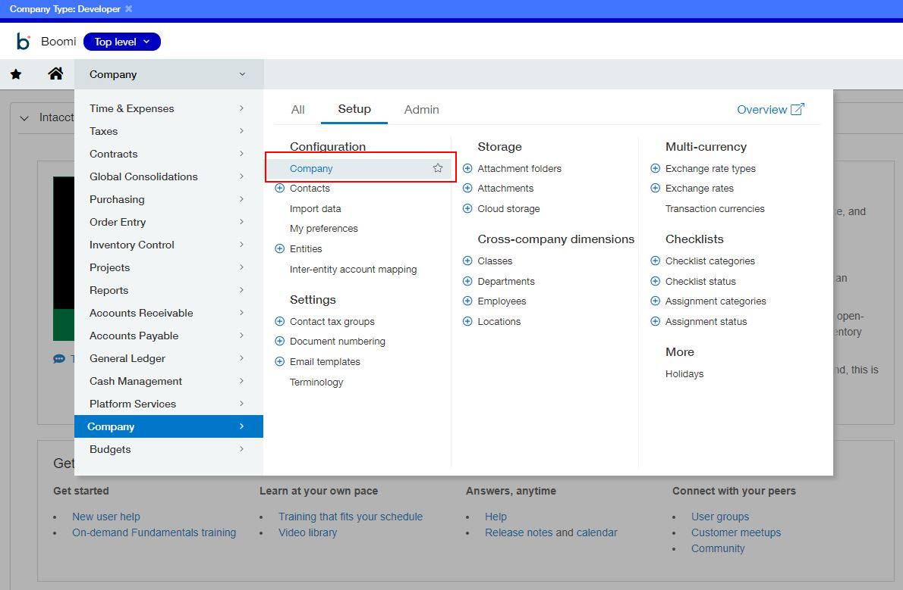
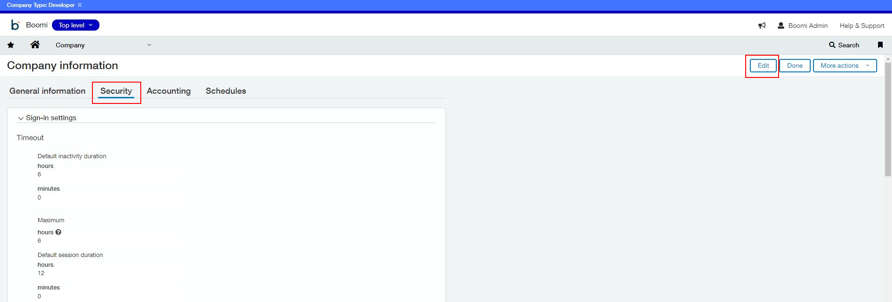
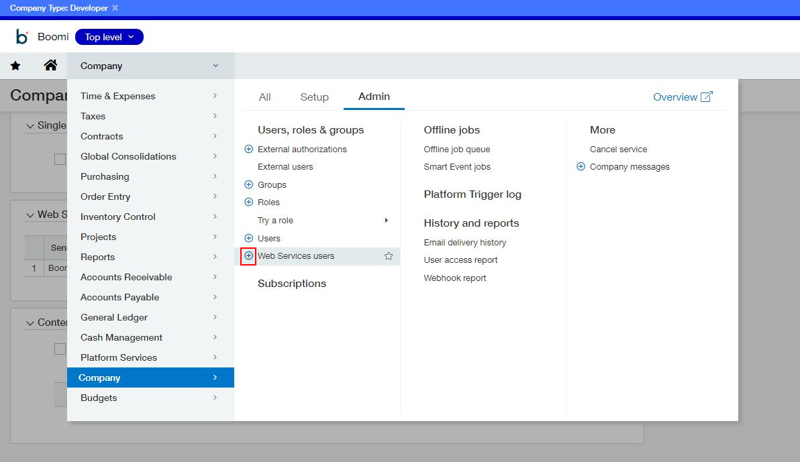
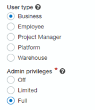
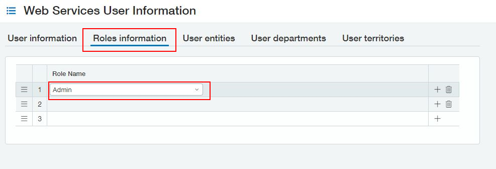

import TestConnection from './_TestCon.md'

# Intacct connection 

<head>
  <meta name="guidename" content="Integration"/>
  <meta name="context" content="GUID-4444e616-7148-47ce-8a08-0eb9edf37273"/>
</head>

The Intacct connection represents and contains all of the information to connect and sign in to Intacct's On-Demand Financial Application Suite. You need a separate connection for each Company ID.

## Connection tab 

**Authentication Type** - 
 You can choose whether to authenticate using your Intacct application sign-in credentials or API Session-based authentication. The default is API Session-based authentication. Sign-in-based authentication is available for backward compatibility purposes for all users.

**URL** - 
 You must manually define the URL to which to connect. You can find the URL in the [Intacct documentation](https://www.intacct.com/ia/xml/xmlgw.phtml).

**Sender ID** - 
 Intacct provides your Sender ID when you obtain a mandatory Sage Intacct Web Services developer license. These credentials are distinct from your User ID and Password.

**Sender Password** - 
 Your Sender Password is provided to you by Intacct when you obtain a mandatory Sage Intacct Web Services developer license.

**User ID** - 
 Your Intacct application sign-in User ID, or your Web Services User ID. Intacct recommends creating a designated Web Services User ID with appropriate privileges for your needs. Details on how to create a Web Services user are below.

**Company ID** - 
 Your Intacct application sign-in Company ID.

**Password** - 
 Your Intacct application sign-in password.

**DTD Version** - 
  The DTD version — 2.1 or 3.0. Version 2.1 is the default.

:::note

The connector automatically handles the HTTPS certificate. You do not need to manually import a certificate component.

:::

## Authorizing your SenderID for WebServices 

You must authorize your SenderID for WebServices in Sage Intacct.

1.  Open Sage Intacct.
2.  From the **Applications** menu, choose **Company**.
3.  From the **Company** submenu, select **Setup**, then choose **Company** again. 
4.  From the **Company Information** menu, select **Security**, then **Edit**. 
5.  In the **Web Services authorizations** section, select **Add**.
6.  Enter your **Sender ID** in the corresponding field, then select **Save**.

## Create Web Services User 

The best practice is to create a dedicated Web Services user profile for signing into Intacct. You can also use your Boomi credentials.

1.  Open Sage Intacct.
2.  From the **Application** menu, choose **Company**.
3.  Select the **+** icon located next to the **Web Services users** tab.

    

4.  From the **Web Services User Information** page, enter your desired User ID. You will reuse this ID in the Boomi connection document.
5.  Enter the name and email address of the person responsible for managing this User ID. Ensure the email you enter is accessible because it sends a temporary sign-in password automatically.
6.  Set your desired roles and privileges for the user's data access needs. For example, if you need to grant full administrator access to a user profile, first add them as a business user with full access.

    

7.  Select the **Roles Information** tab, then add the new user to the **Admin** role. Select **Save**. 
8.  Enter your password to create a new Web Services user. It sends the password the email address designated in Step 5.

<TestConnection />