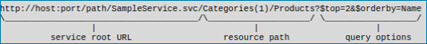

import OperationEnd from './_operationEnd.md'

# Microsoft Dynamics 365 for Customer Engagement operation 

<head>
  <meta name="guidename" content="Integration"/>
  <meta name="context" content="GUID-3742250b-0cc5-47ff-ba7a-693c05dfcec9"/>
</head>

The Microsoft Dynamics 365 for Customer Engagement operation defines how to interact with the Microsoft Dynamics service's URL endpoint defined in the connection component and represents an action \(Create, Delete, and so on\) to perform against a specific Dynamics 365 entity object.

The Microsoft Dynamics 365 for Customer Engagement operation supports the following actions:

-   **Inbound**: Get and Query, which are supported in all versions of Dynamics 365. To request data, it requires unique parameters at run-time. Review the topic about parameter values to understand how to statically or dynamically define these values in a process for runtime. The Get action retrieves data for an entity specified as the resource with a unique identifier, and is available only for entity objects. The Query action applies options to set criteria for the data and to return specific entity properties, and is available for entity objects.

-   **Outbound**: Create, Delete, Update. Use the Create action to generate and retrieve data from the Dynamics 365 for Customer Engagement service. Use the Delete action to remove entities or individual properties of entities. Use the Update action to Upsert objects. These actions are available for all entity objects in the connector. For all outbound operations, send request JSON data to the connector that corresponds with the defined JSON profile. Typically, request documents are the destination output of a map. You can also set parameters on the outbound connector's **Parameters** tab within the process to supply static or dynamic request values.

:::note

Not all actions are available for every object. You must create a separate operation component for each action and entity object combination required for your integration.

:::

In Dynamics 365 for Customer Engagement, objects are *entities* or *entity types*. A collection of objects is an *entity set*. Entity objects with simple names correspond to the entity set. Some entities can have concurrency protection in place.

## Metadata caching 

When gathering metadata from the service, it saves the metadata in the connector cache and reuses it for each operation to produce faster response times. If caching the metadata impacts the Atom's available memory, disable metadata caching by setting the `com.boomi.connector.odata.disableMetadataCaching` container property to `true`.

## Concurrency 

When you enable concurrency, the server provides an `@entityTag` or `etag` for the entity in Get, Delete, and Update actions. For example, you can use ETags in the header of documents to offer web cache validation that compares ETag values in the cached version of an object to the server version. In addition, the server ensures that no one has modified the entity since the last time you provided an ETag. To use concurrency, put a **Set Properties** step after the connector step in your process and add an ETag property.

## Get 

You can use the Get action with entity objects. For the Get action, you must supply the entity key as the objectId using either a value or a property value mapping.

## Query

You can use the Query action with entity objects. The Query action allows to look up object records based on specific search criteria. The Query action returns zero-to-many documents from a single request based on zero or more filters. After you select the Query connector action and use the **Import Wizard**, you can select fields, add query filters, and sort the results by field. The bottom half of the **Operation component** page contains tabs on which you configure these options.

The Query action supports the following filter operators: Equal To \(eq\), Not Equal To \(ne\), Greater Than \(gt\), Greater Than or Equal To \(ge\), Less Than \(lt\), and Less Than or Equal To \(le\).

The Microsoft Dynamics 365 for Customer Engagement connector automatically formats duration, binary, enum, and string values used in filters correctly based on the construction rules in the OData 4.0 specification. You do not need to surround the values with quotes, or provide a prefix.

The connector supports a complex query language, and you can use a Custom Expression operator with filtering for more advanced operators such as arithmetic. To query an entity object and use the Custom Expression operator in a filter, navigate to and select **CustomFilter** in the **Filter** field. The **Operator** is set to **Custom Expression**.

With the custom filter and expression selected, you can use Dynamic 365’s filter language to create, for example, a free-form filter in a parameter value. You must format the values based on the field data type using the construction rules in the OData 4.0 specification. The contents of the parameter value input is substituted into the filter expression according to the custom filter’s placement in the configured filter expression. For example, this filter: **AND\(LogicalFilter\(‘price’, ‘equals’, 5\), CustomFilter\(‘NOT\(name eq ‘Smith’\)’\)\)** results in the expression filter: **price eq 5 and NOT\(name eq ‘Smith’\)**.

In the Dynamics 365 for Customer Engagement connector, **CustomFilter** is one you can select, which has a **Custom Expression** operator. Use this to configure a value that appends as a filter to the URI.

:::note

Dynamics 365’s “NOT\(\)” unary query filter operator is not supported. As a workaround, use [DeMorgan's Laws](http://en.wikipedia.org/wiki/De_Morgan%27s_laws). Dynamics 365’s precedence operator “\(\)” is supported only in custom filters.

:::

:::note

When you select fields to query, the field names are appended to the URL. As a result, you can exceed the browser’s URL length limit, which generates a 502 server error. If this happens, clear all fields.

:::

## Create 

Use the Create action with entity objects.

When you use the Create action with entity profiles, use the `EntitySet/EntityType/Properties` element to specify values for properties for the created entity.

When you use the Create action with entity profiles, you can also establish an association to a collection of elements. For example, to create a supplier with a list of offered products, use the `EntitySet` element to enumerate the collection of elements.

## Delete 

Use the Delete action with entity objects to perform basic object deletion.

When you use the Delete action with entity profiles, you must supply the entity key as input. You can use the `@entityTag` attribute on the `EntitySet/EntityType` element in Delete actions.

## Update 

Use the Update action with entity objects to perform basic updates to objects, to retrieve data from objects you are updating, or to Upsert objects. When you Upsert an object, it creates the entity if it does not exist, and updates the entity if it does exist.

:::note

When employing the Update operation, the requirement is to populate the **@odata.editLink** field in the operation's request profile. Excluding the *editLink* value from the editLink value from the Update request profile results in an error. Alternatively, it returns this value automatically in Query and Get operations and is populated in the response profile for both operations by default.

:::

When using the Update operation and you select **If-Match** in the **Concurrency Mode** field, set the **ETag** document property with a parameter value of \* to update an existing object without creating a new object. Similarly, if you select **If-None-Match**, set the **ETag** document property with a parameter value of \* to create a new object without performing updates to any existing objects.

## **Options** tab 

:::note

Fields in operations are clear by default — you need to select the fields that you want returned in a response.

:::

Click **Import Operation**, then use the Import wizard to select the object with which you want to integrate. The available objects vary based on the Dynamics 365 service to which you connect.

This table describes the default field definitions for each action type:

**Request Profile** - 
 \(Create, Delete, and Update only\) The JSON profile definition that represents the JSON structure sent by the connector.

**Response Profile** - 
 \(Get and Query only\) The JSON profile definition that represents the JSON structure received by the connector.

**Return Application Error Responses** - 
  This setting controls whether an application error prevents an operation from completing:

-   If selected, processing continues and passes the error response to the next component to be processed as the connection output.

 -   If cleared, the process aborts and reports the error on the **Process Reporting** page. It returns 501 errors a document in this format: `(<code>)<message>[<http status>]`.

**$top \(Query operation only\)**   
 \(Query only\) Selects only the first N items of the set. Like all filters, $top reduces processing time by limiting the number of returned records. For example, when querying a set of 10,000 records when $top = 200, it returns entries 1–200 only. The default value of -1 turns off this option.

**Filter** - 
 You might need to filter items in the **Import Wizard** when the generic browse operation exceeds the limit of 500 object types. The filter is case-sensitive. Use a ? to replace any single character; use an \* to replace zero or more characters. The filter applies to object names.

**Concurrency Mode** - 
  \(Get, Update, Delete\) This setting controls when the Dynamics 365 server updates concurrent objects:

 -   If match — \(On by default.\) Perform the action only if the current ETag matches my version.
-   If none match — Perform the action even if the ETag does not match my copy.

**Custom URL Query Parameters** - 
 \(Get, Query, Create, Delete, and Update\) The properties you add \(a key, and value\) are parameters \(`query options` section in the following image\) to the query string of the URL in each request. This allows you to customize or extend the way the operation interacts with the service and its data.

Parameter example

 The `$filter` query parameter is included automatically by the connector in the request URL when a Query operation runs with a configured filter. However, another query parameter, such as `cross-company`, is not automatically included, and you must add it based on your requirements. In this example, if you add `cross-company` as the key and true as the value, it adds the following URL query parameter at the end of the URL \(query options section in the previous image\) generated by the connector for the request:

`cross-company=true`

 Add the parameter after `&` or `$` in the URL, depending on whether there are previous URL query parameters.

 Property details

 -   You can override the properties using the Custom URL Query Parameters dynamic operation property.
 -   You cannot specify properties with blank or repeated keys or properties with repeated keys.
 -   The custom URL query parameters are encoded by the connector into percent-encoded \(URL-encoded\) UTF-8 representations based on the encoding mechanism provided by the Olingo library \(a custom variation of [RFC 3896](https://www.ietf.org/rfc/rfc3986.txt)\). The Query operation already applies the same encoding to URL query parameters for filters, field selection, sorting, top, and skip.
  -   For the Update operation, all property details apply regardless of the type of edit link provided in the input documents \(the edit link being absolute or relative\).
  -   For the Query operation, only the request for the first page is prepared to include the custom URL query parameters. The requests for subsequent pages use the links for next pages returned by the Dynamics services. The requests may or may not include the custom URL query parameters set in the first request.
  -   Metadata requests are not affected by the properties.

## Entity object profiles 

The Dynamics 365 for Customer Engagement entity profile contains information needed for various types of operations. The entity set name is at the root of the profile. The first nested element is the definition of the entity type. An entity uses the Properties element to list the information describing various attributes of the entity.

## Custom fields 

The Dynamics 365 for Customer Engagement connector supports dynamic properties \(custom fields\), which are included on an object but not declared in the metadata. The connector treats these properties as simple types. Because the dynamic properties are not declared, you cannot include them in the profile upon import. Instead, the output JSON provides them if returned by the server. To process the dynamic properties, add profile elements to the profiles manually.

<OperationEnd />