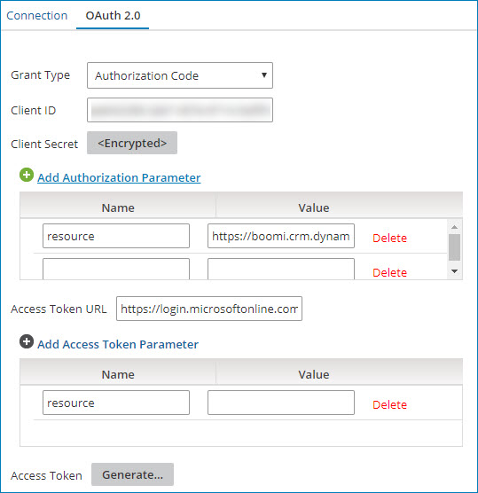

import TestConnection from './_TestCon.md'

# Microsoft Dynamics 365 for Finance and Operations connection

<head>
  <meta name="guidename" content="Integration"/>
  <meta name="context" content="GUID-b4df7b4e-94d4-4604-b6b9-ead843752b1a"/>
</head>

The Microsoft Dynamics 365 for Finance and Operations connection represents a single Microsoft Dynamics 365 for Finance and Operations account instance including sign-in credentials.

You can pair this connection with different Microsoft Dynamics 365 for Finance and Operation connector operations to perform a unique action against a Dynamics 365 for Finance and Operations service.

## Connection tab 

Compose the **API Root URL** using the following components. For example, use `http://boomi.cloudax.dynamics.com/api/data/` as the URL to interact with the Dynamics 365 for Finance and Operations API.

**Protocol** - 
 Enter the appropriate protocol, either `https://` or `http://`.

**Base URL** - 
 Enter the URL you normally use to open the web application. For online instances of Dynamics 365, use `<tenant>.cloudax.dynamics.com`.

**Web API path** - 
 Enter the path for the web API. For Dynamics 365, use `/api/data/`.

**Honor Atom Proxy Settings** - 
 Select to honor and apply the **Proxy Host**, **Proxy Port**, **Proxy User ID**, **Encrypted Proxy Password**, and **Non Proxy Hosts** Atom proxy settings \(container properties\) to the connection. By honoring these settings, you can use the connection in situations requiring one to a Dynamics 365 for Finance and Operations service through a proxy. To learn more about these proxy settings, see the topic [Properties panel, Advanced tab](../Integration%20management/r-atm-Properties_panel_Advanced_tab_c39737e8-1b16-4fdd-b414-152694364c14.md).

**Connection Timeout \(ms\)** - 
  \(Optional\) Enter the number of milliseconds that the connector waits to complete the connection handshake to the Microsoft Dynamics 365 for Finance and Operations service until it times out.

 -   If you leave this field blank, the connection uses the *system default* corresponding to the time-out configuration from the underlying JVM or operating system.
 -   If you enter zero \(0\), the connection waits indefinitely.
 -   If you enter a negative value, the connection uses the network time-out settings specified for the Atom. For more information, see the [Changing network timeouts](../Integration%20management/t-atm-Changing_network_timeouts_be7b06eb-0788-48dc-a086-f95c9457a89d.md) topic.

**Read Timeout \(ms\)** - 
 \(Optional\) Enter the number of milliseconds that the connector waits to complete the data transfer to the Microsoft Dynamics 365 for Finance and Operations service until it times out.

 -   If you leave this field blank, the connection uses the *system default* corresponding to the time-out configuration from the underlying JVM or operating system.
 -   If you enter zero \(0\), the connection waits indefinitely.
 -   If you enter a negative value, the connection uses the network time-out settings specified for the Atom. For more information, see the [Changing network timeouts](../Integration%20management/t-atm-Changing_network_timeouts_be7b06eb-0788-48dc-a086-f95c9457a89d.md) topic.

Use the Microsoft Dynamics 365 for Finance and Operations operation to create the resource action you intend to use \(Create, Delete, Get, Query, and so on\) with the Web API URL. See related links for more information.

## OAuth 2.0 tab

Method calls to the web services must be authorized with the identity provider for that service endpoint.

:::note

For OAuth 2.0 authentication, you may need to specify in the external application the Boomi callback or redirect URL. The callback URL is `https://platform.boomi.com/account/<youraccount_ID>/oauth2/callback` where `<youraccount_ID>` is your Integration account ID. You can also find your account ID in the Integration platform at **Settings > Account Information and Setup > Account Information**.

::: 

  

**Grant Type** - 
 Select the grant type to use. The supported grant types are:

 -   Authorization Code - this is the standard, 3-Legged OAuth2 authorization where you grant the client an authorization code they can exchange for an access token.
 -   Client Credentials - uses client credentials to retrieve an access token directly instead of asking for user authorization. This authorization is used for administration tasks specific to a client.

**Client ID \(Authorization Code and Client Credentials grant types\)** - 
  The unique application ID used to request authorized access to client data.

 To find the application ID in the **Microsoft Azure** portal, navigate to **Azure Active Directory** \> **App registrations** and view the application details.

**Client Secret \(Authorization Code and Client Credentials grant types\)** - 
 The alphanumeric key value created in the Microsoft Azure portal.

 To create a key in the **Microsoft Azure** portal, navigate to **Azure Active Directory** \> **App registrations**, open your application's details, and click **Settings** \> **Keys**. Create and save a new password to generate the key value.

**Add Authorization Parameter \(Authorization Code grant type\)** - 
  The name and value of additional or custom authorization parameters required by your application.

 \(**Required**\) The Dynamics 365 for Finance and Operations connection automatically populates a resource authorization parameter with resource as the name. Enter the resource value that contains the protocol and base URL of the web API \(for example, `https://boomi.cloudax.dynamics.com`). To ensure that the resource value is successful in testing your connection, ensure that you configure a reply URL in your application's **Settings** found in the **Azure Active Directory** \> **App Registrations** tab of the **Microsoft Azure** portal.

 Optionally, add the name and value of additional extensible endpoint parameters as needed.

**Access Token URL \(Authorization Code and Client Credentials grant types\)**   
 The endpoint address \(URL\) provided by the application to make API requests.

 When using the Authorization Code grant type, enter `https://login.microsoftonline.com/common/oauth2/token` as the common URL for generating a token to authenticate API calls to the Dynamics 365 service.

  When using the Client Credentials grant type, enter the tenant-specific URL `https://login.microsoftonline.com/<tenant_id>/oauth2/token`, replacing `<tenant_id>` with your Directory ID found in the Microsoft Azure Portal. To find the Directory ID, navigate to **Azure Active Directory** \> **Properties** \> **Directory ID** in the Microsoft Azure portal.

**Add Access Token Parameter \(Authorization Code and Client Credentials grant types\)**     
\(**Required**\) The name and value of additional or custom token parameters required by your application. Enter the same resource values used to populate the **Add Authorization Parameter** resource fields.

:::info Important

Due to a known Dynamics 365 for Finance and Operations issue, the URL for the value field cannot include a trailing slash \(/\). Otherwise, the authentication fails.

:::

**Access Token \(Authorization Code grant type\)** - 
 The encrypted access token issued by the **Azure Active Directory** used to authorize access to the Dynamics 365 for Finance and Operations account.

 Click **Generate** to fetch the token.

 In the **Microsoft Azure** portal, add the Microsoft Dynamics ERP and Windows Azure Active Directory APIs as required permissions.

<TestConnection />