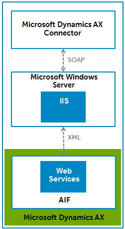

import TrackedProperties from './_TrackedProperties.md'

# Microsoft Dynamics AX connector

<head>
  <meta name="guidename" content="Integration"/>
  <meta name="context" content="GUID-c54698b6-1003-45de-9808-c00bad415133"/>
</head>

The Microsoft Dynamics AX connector enables moving data into and out of the Microsoft Dynamics AX business management application.

The connector uses web services to connect to the Microsoft Dynamics AX Application Integration Framework \(AIF\). The connector enables you to query, add, modify, and delete various types of records including Accounts, Customers, Sales Orders, Invoices, and more.

The connector uses Application Integration Framework \(AIF\) web services to exchange documents between Microsoft Dynamics AX and Boomi Integration using SOAP web services. You must install these web services on an IIS server following the instruction in the AIF Installation Guide.

The IIS server acts as a gateway between the Integration connector and the Microsoft Dynamics AX server, as shown in the following diagram.

## Connector configuration 

To configure a connector to communicate with Microsoft Dynamics AX, set up two components:

-   Microsoft Dynamics AX connection — that represents a specific Microsoft Dynamics AX instance \(IIS server instance that is listening for AIF services\). You create one connection for each Microsoft Dynamics AX instance.

-   Microsoft Dynamics AX operation — that represents an action against a specific record type. Create one or more operations, one for each type of interaction required by your integration scenario.

## Supported editions 

Boomi Integration supports the following editions:

-   Microsoft Dynamics AX 2009

-   Microsoft Dynamics AX 2012

## Supported operations 

The connector supports all operations that AIF exposes. Microsoft Dynamics AX includes over 70 standard documents. Each document supports a common business process. The AIF lets you customize these standard documents or create your own documents for your individual business processes.

For more information about the included documents with Microsoft Dynamics AX, see *Standard Axd Documents* in the Microsoft Dynamics AX SDK Help.

## Prerequisites 

Before creating a Microsoft Dynamics AX connector, install and configure AIF, set up a document exchange and generate the web services.

<TrackedProperties />