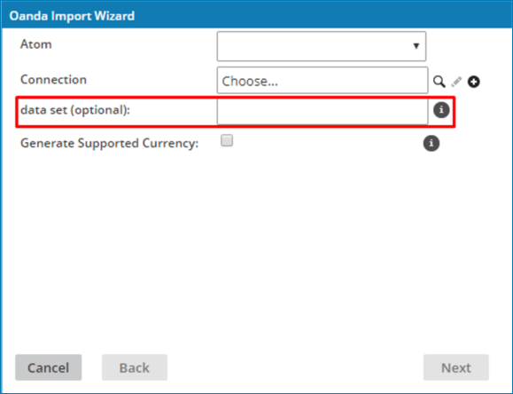
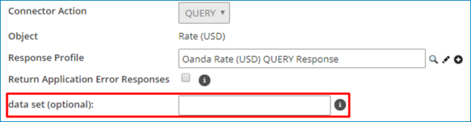
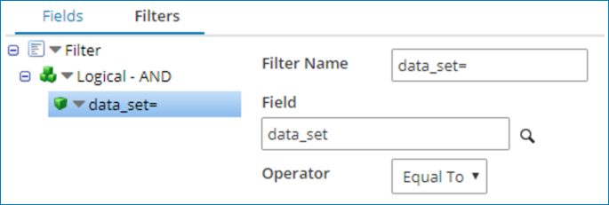

# OANDA –Partner connector data set 

<head>
  <meta name="guidename" content="Integration"/>
  <meta name="context" content="GUID-e23eaf92-8a7f-4177-82d3-f035ff3dde09"/>
</head>

The OANDA – Partner connector data set defines what data set the OANDA Exchange Rates API is expected to query against for Currencies and Rates \(as well as the specific Rate call\).

You can define the data set in three places:

-   In the **Import Wizard**, as shown the following image.

-   In the Operation panel, as shown in the following image.

:::note

Defining the data set in the **Import Wizard** automatically selects the data set in the **Operation** panel.

:::

-   In the filter, as shown in the following image.

:::note

If you define the data set in both the filter and through the field in the operation panel, the data set defined through the filter takes precedence and overrides the data set selected in the operation panel. Therefore, the data set does not apply to the Remaining Quotes operation and does not affect this operation.

:::