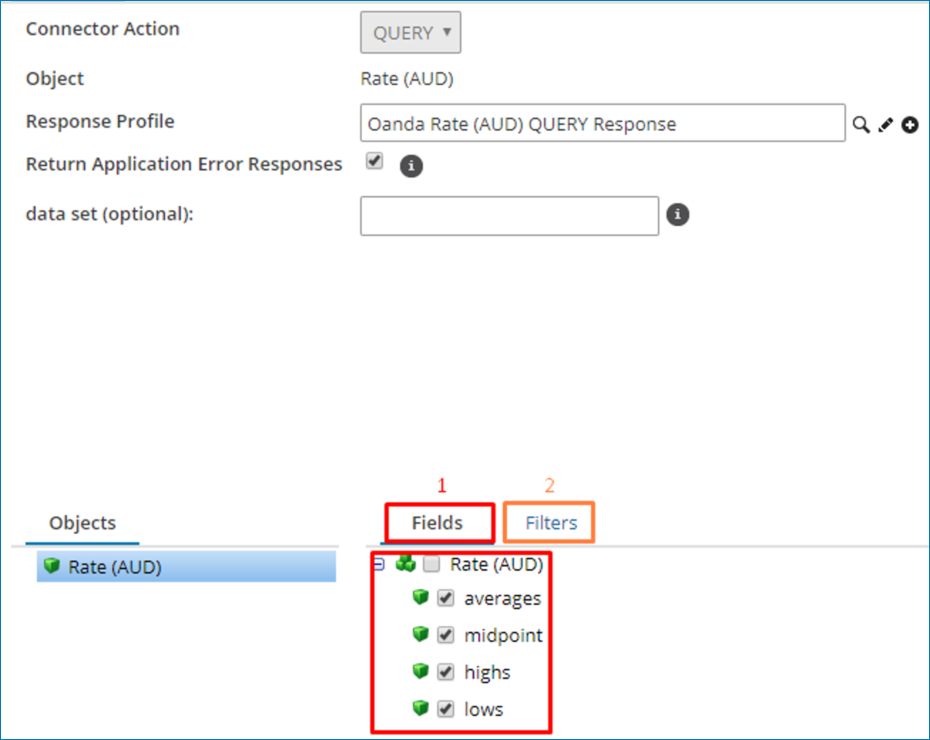
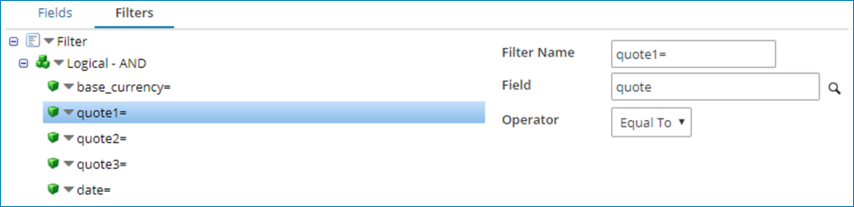
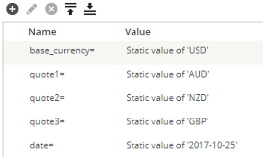

import OperationEnd from './_operationEnd.md'
import TrackingDir from './_TrackObject.md'
import ReturnErrRes from './_ReturnResponse.md'

# OANDA – Partner operation 

<head>
  <meta name="guidename" content="Integration"/>
  <meta name="context" content="GUID-158cc80b-f9b2-4b23-9ae7-6842d9cdf610"/>
</head>


The OANDA – Partner operation defines how to interact with the OANDA API.

You must create a separate operation component for each action that your integration requires.

The OANDA connector operation supports the Inbound: Query action.

## Options tab 

The OANDA connector supports the Query action. Click **Import Operation**, then use the Import wizard to select the action to take with OANDA. The following table describes the default field definitions for each action type:

<TrackingDir />

**Response Profile**   
The XML profile definition that represents the structure received by the connector.

<ReturnErrRes />

**data set \(optional\)** - 
An optional field that allows you to configure the data set to query against. This field only applies to the Currencies and Rates action.

## OANDA – Partner operation actions 

You configure the OANDA – Partner operation to retrieve document records with the OANDA API. For all inbound operations, it requires unique parameters at runtime to request the data. Review this information and understand how to statically or dynamically define these values in a process.

**Query action** - 

Depending on the selected action, the Query action may or may not require static or dynamic request parameters \(filters\) to control the document to query from OANDA. Each Query request returns a single document.

The operation supports following objects:

**Currencies** - 
  Returns all the supported currencies under the specified data set. If you do not provide a data set value, the API uses the OANDA data set.

**Remaining Quotes** - 
 Returns the Remaining Quotes limit for the specific connection API Key.

**Rates** - 
 Returns the Currency Exchange Rate with the specified parameters.

**Rate** \(XXX\)  
  Returns the Currency Exchange Rate for a specific base currency. For example, Rate \(USD\) returns the Currency Exchange Rate with United States Dollar \(USD\) as the base currency.

**Note:** When importing, this object type is only accessible by enabling the **Generate Supported Currency** option.

After using the **Import Wizard**, select the fields and add query filters if necessary, as shown in the following image.



In the previous image:

1.  Field selection. Determines the field that the OANDA API response returns.

    **Note:** This functionality is subject to availability.

2.  Filter setup. You can set up the required parameters for a specific object.

**Filter setup** - 

Depending on the selected object and the required information, you might need to set up some filters. The filter for the **Rates** and **Rate \(XXX\)** objects include the following:

-   data\_set. Represents the data set to query. Overrides the operation level. For more information, see the linked OANDA data set topic.
-   quote
-   date
-   start
-   end
-   decimal\_places
-   base\_currency. Represents the base currency that the Rates call uses. This filter is not available in Rate \(XXX\).

:::note

For the **Rates** object requires the filter for base\_currency. For the **Rate \(XXX\)** object, the filter is not present because the system automatically sets the base currency according to the selected currency in **Rate \(XXX\)**, where XXX is the currency code used for that purpose.

:::

The filter for the **Remaining Quotes** object includes the following:

-   proceed\_without\_remaining\_quote. Set this parameter to false or true. Allows the process to either halt or continue with an error with the Remaining Quotes, assuming that you select **Return Application Error Responses**.

The filter for the **Currencies** object includes the following:

-   data\_set. Represents the data set to query; overrides the operation level. For more information, see the linked OANDA data set topic.

The following image illustrates a sample filter for **Rates** with several quotes and dates.



The following image illustrates the corresponding value for each filter.



**Data returned by Query actions** - 

Querying Currencies, Rates, and Remaining Success returns a document, as shown in the following example.

```
<response>
  <currencies>
    <currency>
      <code>AUD</code>
      <description>Australian Dollar</description>
    </currency>
    <currency>
      <code>BGN</code>
      <description>Bulgarian Lev</description>
    </currency>
  </currencies>
</response>
```

If you select the **Return Application Error Responses** check box, it returns errors from all objects. The following is an example of an error response for the Remaining Quotes operation.

```
<response>
  <code>53</code>
  <message>Rate limit violation.</message>
</response>
```

<OperationEnd />