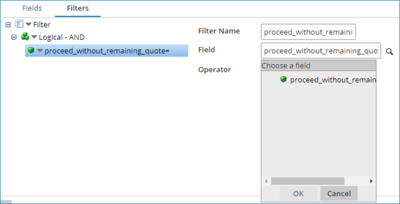
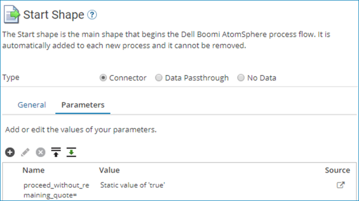

# OANDA –Partner connector Remaining Quotes operation 

<head>
  <meta name="guidename" content="Integration"/>
  <meta name="context" content="GUID-70323ff7-56dd-4ed4-9c28-ce43a6e0c2ef"/>
</head>

The OANDA –Partner connector Remaining Quotes operation has a specific feature that allows a step to continue and pass the data to the next step.

You can utilize this feature, or halt it if it encounters an error with the Remaining Quote. You can set this feature using a filter in Remaining Quote. Set it to active by setting the value to true.

The following images illustrate how to set this feature.

When set to true, the step can pass through despite the error in the Remaining Quote indicated by the returned response.

:::note

You must enable the **Return Application Error Responses** option in the **Operation** panel for the step to pass through in the event of an error. When not enabled, the process halts when it encounters an error in the Remaining Quotes query.

:::
