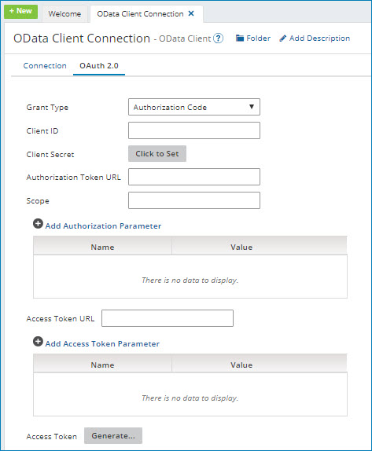

# OData Client connection 

<head>
  <meta name="guidename" content="Integration"/>
  <meta name="context" content="GUID-ab9971a6-cf7e-4561-8cd0-4df19f9fcf30"/>
</head>

The OData Client connection contains information for a single endpoint URL to an OData service, including login credentials. If you use multiple services, you need a separate connection component for each.

You can pair this connection with different OData Client operations to perform a unique action against an OData service.

## Connection tab 

**Service Root URL** - 
The root URL for the OData service.

**OData Version** - 
The version of the OData protocol to use. The available versions are V 1.0, V 2.0, and V4.0.

**OData Format** - 
\(OData V1.0 and V2.0 only\). The OData communication method to use, either Atom or JSON.

Some services may be able to receive data in only one of these formats. The format that you select affects only the transmission protocol that is used to send data. It does not affect how the data is stored or manipulated by Integration. Integration converts incoming data to an XML format that exposes services provided by OData.

**Authentication Type** - 
The authentication type that is used by the service:

-   None
-   Basic — you provide a user name and password
-   NTLM — you provide a user name and password
-   OAuth 2.0 — works only with OData V4.0

**Preemptive authentication** - 
\(Basic authentication on OData Version 4\). In general, preemptive authentication means that HTTP basic authentication credentials \(username and password\) are sent before the server replies with an unauthorized response asking for them. Use preemptive authentication when you trust the server and to reduce the overhead of making an additional request.

-   When selected, the connector builds and sends the authorization header to the HTTP server ahead of time in the initial request.
-   When cleared, the authorization header is not sent to the HTTP server ahead of time in the initial request. The server sends the response back to the connector indicating the information it expects to authenticate.

You can view the logging information \(equivalent to the "FINE" setting\) by selecting the Atom's Enable Debug Logging property \(com.boomi.container.debug\) check box.

**Username** - 
The user name that is required to authenticate with the OData service.

If you are using NTLM authentication, you can provide a domain and user name in either of these formats: `domain/username` or `domain\username`.

**Password** - 
The password that is required to authenticate with the OData service.

**Honor Atom Proxy Settings** - 
Select to honor and apply the **Proxy Host**, **Proxy Port**, **Proxy User ID**, **Encrypted Proxy Password**, and **Non Proxy Hosts** Atom proxy settings \(container properties\) to the connection. By honoring these settings, the connection may be used in situations requiring a connection to an OData service through a proxy. To learn more about these proxy settings, see the topic [Properties panel, Advanced tab](../Integration%20management/r-atm-Properties_panel_Advanced_tab_c39737e8-1b16-4fdd-b414-152694364c14.md).

**Connection Timeout \(ms\)** - 
\(Optional\) Enter the number of milliseconds that the connector waits to complete the connection handshake to the OData service until it times out. The timeout applies only to OData V4.0.
-   If you leave this field blank, the connection uses the "system default" corresponding to the timeout configuration from the underlying JVM or operating system.
-   If you enter zero \(0\), the connection waits indefinitely.
-   If you enter a negative value, the connection uses the network timeout settings specified for the Atom. For more information, see the [Changing network timeouts](../Integration%20management/t-atm-Changing_network_timeouts_be7b06eb-0788-48dc-a086-f95c9457a89d.md) topic.

**Read Timeout \(ms\)** - 
\(Optional\) Enter the number of milliseconds that the connector waits to complete the data transfer to the OData service until it times out. The timeout applies only to OData V4.0.

-   If you leave this field blank, the connection uses the "system default" corresponding to the timeout configuration from the underlying JVM or operating system.
-   If you enter zero \(0\), the connection waits indefinitely.
-   If you enter a negative value, the connection uses the network timeout settings specified for the Atom. For more information, see the [Changing network timeouts](../Integration%20management/t-atm-Changing_network_timeouts_be7b06eb-0788-48dc-a086-f95c9457a89d.md) topic.

## **OAuth 2.0** tab

:::note

For OAuth 2.0 authentication, you may need to specify in the external application the Boomi callback or redirect URL. The callback URL is `https://platform.boomi.com/account/<your_account_ID>/oauth2/callback` where `<your__account_ID>` is your Integration account ID. You can also find your account ID in the Integration platform at **Settings > Account Information** and **Setup > Account Information**.

:::

Boomi Integration supports OAuth 2.0 authorization for on-premise and cloud-based integrations. OAuth 2.0 is not backwards compatible with OAuth 1.0 or 1.0a. You must edit account permissions to use OAuth 2.0 authentication with your cloud application *if you use custom policy files*.

OAuth 2.0 fields are extensible. When the connection settings values have been configured, overrides are applied after the cached version of the access token expires and refreshes.

:::note

To use extensions with the Client Credentials grant type, in your process click on the Extensions tab. In the Extensions window, click on the Connection Settings tab. In the Select extensible properties list, turn on **OAuth2 Access Token**. When on, this field applies overrides even though you do not see an access token field in the connection settings Client Credentials grant type. If the field is off, the connection executes the default settings and does not generate the acc.xml overrides file.

:::

The connector automatically retrieves refresh tokens.

When the connection's authentication type is set to OAuth 2.0, enter the following information \(the fields vary according to grant type\):

**Grant Type** - 
Select the grant type to use. The supported grant types are:

-   Authorization Code - this is the standard, 3-Legged OAuth2 authorization where you grant the client an authorization code that can be exchanged for an access token.
-   Client Credentials - uses client credentials to retrieve an access token directly instead of asking for user authorization. This authorization is typically used for administration tasks specific to a client.

**Client ID \(Authorization Code and Client Credentials grant types\)** - 
Enter the unique identifier to request authorized access to client data. The client ID is obtained from the application.

**Client Secret \(Authorization Code and Client Credentials grant types\)** - 
The client secret obtained from the application.

**Authorization Token URL \(Authorization Code grant type\)** - 
The endpoint address \(URL\) of the server authorizing the client.

**Scope \(Authorization Code and Client Credentials grant types\)** - 
You can add one or more permissions, which are case-sensitive and separated by a space, to application request URLs. If you change scope permissions, you need to re-authenticate to ensure that all of the requested permissions are granted.

**Add Authorization Parameter \(Authorization Code grant type\)** - 
\(Optional\) The name and value of extensible endpoint parameters.

**Access Token URL \(Authorization Code and Client Credentials grant types\)** - 
The URL of the token endpoint provided by the application to make API requests.

**Add Access Token Parameter \(Authorization Code and Client Credentials grant types\)** - 
\(Optional\) The name and value of additional or custom token parameters required by your application.

**Access Token \(Authorization Code grant type\)** - 
The encrypted access token retrieved from the application.

Click **Generate** to generate the access and refresh tokens. When a new window opens asking you to confirm offline access, click Accept. A second message indicates the access token was received and successfully generated.

import TestConnection from './_TestCon.md'

<TestConnection />

## Test Connection troubleshooting 

When testing the OData Client connection, the connector attempts to retrieve entity sets for the OData service. If there are no entity sets for the OData service and your connection settings are correct, you will see a successful connection.

:::note

Boomi has not tested NTLM authentication for Test Connection.

:::