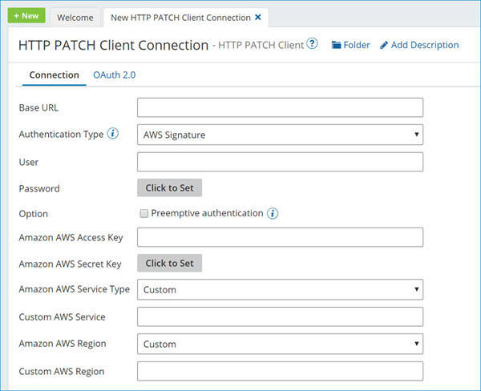

# HTTP PATCH Client (Deprecated) connection

<head>
  <meta name="guidename" content="Integration"/>
  <meta name="context" content="GUID-a7d94359-1254-4310-a3c0-cc7c4c54271a"/>
</head>

The HTTP PATCH Client (Deprecated) connection represents a single HTTP instance.

:::note

The REST Client connector should now be used for PATCH functionality. For a comparison of the REST Client connector and the HTTP Client connector functionality, see this [Community article](https://community.boomi.com/s/article/REST-Client-Connector-vs-HTTP-Client-Connector).

:::

This connector does not support all the authentication types the HTTP Client connector supports. However, this connector can connect to services that use authentication, and services that do not use authentication. To send requests to a service requiring authentication, you can do either of the following:

-   Use the connector's supported authentication types \(see the Connection tab section\).
-   Use a process to generate an authentication token and send the token in the request to the service with an HTTP Authorization header.

## Connection tab 

Configure the HTTP PATCH Client (Deprecated) connection to a web server.

**Base URL** - 
The URL of the HTTP service to connect to. This can be either an `http` or `https` address. For example, `https://services.odata.org/TripPinRESTierService` When using an SSL connection for the PATCH action, you must manually import the certificate into the Java keystore so your process works successfully.

**Authentication Type** - 
Identifies the secure login type:

-   None — No login information in required.
 -   Basic — Uses base64 encoding. Because user passwords are not encrypted and the target server is not authenticated, Basic is not a secure authentication.
 -   Password Digest — Uses a two-step process to encrypt credentials by applying a hash function to the username and password. Password digest authentication is considered more secure than Basic authentication.
-   OAuth 2.0 — See the OAuth 2.0 tab section.
-   AWS — See the AWS Signature settings section.

**User \(Basic, Password Digest\)** - 
The user name for authentication.

**Password \(Basic, Password Digest\)** - 
The password for authentication.

**Preemptive authentication** - 
\(Optional\) Applicable for Basic and OAuth 2.0 authentication. When selected, the connector builds and sends the authorization header to the HTTP server ahead of time in the initial request. Use preemptive authentication when you trust the server and to reduce the overhead of making an additional request. When cleared, the authorization header is not sent to the HTTP server ahead of time in the initial request. The server sends the response back to the connector indicating the information it expects to authenticate. You can view the logging information \(equivalent to the "FINE" setting\) by selecting the Atom's Enable Debug Logging property \(com.boomi.container.debug\) check box.

## **OAuth 2.0** tab

Integration supports OAuth 2.0 authorization for on-premise and cloud-based integrations. OAuth 2.0 is not backwards compatible with OAuth 1.0 or 1.0a. If you use custom policy files, you must edit account permissions to use OAuth 2.0 authentication with your cloud application.

:::note

For OAuth 2.0 authentication, you may need to specify in the external application the Boomi callback or redirect URL. The callback URL is `https://platform.boomi.com/account/<your_account_ID>/oauth2/callback` where `<your__account_ID>` is your Integration account ID. You can also find your account ID in the Integration platform at **Settings > Account Information** and **Setup > Account Information**.

:::

When the connection's authentication type is set to OAuth 2.0, enter the following information \(the fields vary according to grant type\):

**Grant Type** - 
Select the grant type to use. The supported grant types are:

-   Authorization Code — The standard, 3–Legged OAuth2 authorization where you grant the client an authorization code that can be exchanged for an access token.
-   Resource Owner Credentials — Requires username and password.

-   Client Credentials — Uses client credentials to retrieve an access token directly instead of asking for user authorization. This authorization is typically used for administration tasks specific to a client.

**Client ID** - 
The client ID obtained from the application.

**Client Secret** - 
The client secret obtained from the application.

**Authorization Token URL** \(Authorization Code\)
The endpoint URL used to obtain an authorization token.

**Scope** - 
You can add one or more permissions, which are case-sensitive and separated by a space, to application request URLs. If you change scope permissions, you need to re-authenticate to ensure that all of the requested permissions are granted.

**Add Authorization Parameter \(Authorization Code\)** - 
\(Optional\) The name and value of extensible endpoint parameters.

**Access Token URL** - 
The endpoint address provided by the application to make API requests.

**Add Access Token Parameter** - 
\(Optional\) The name and value of additional or custom token parameters required by your application.

**Access Token \(Authorization Code, Resource Owner Credentials\)** - 
The encrypted access token retrieved from the application to access protected resources.

**Generate \(Authorization Code, Resource Owner Credentials\)** - 
Click to generate the access and refresh tokens. When a new window opens asking you to confirm offline access, click **Accept**. A second message indicates the access token was received and successfully generated.

## Extending OAuth 2.0 fields 

OAuth 2.0 fields are extensible. When the connection settings values have been configured, overrides are applied after the cached version of the access token expires and refreshes.

To use extensions with the Client Credentials grant type, in your process click the Extensions tab. In the Extensions window, click the Connection Settings tab. In the Select extensible properties list, select **Access Token**. When selected, this field applies overrides even though you do not see an access token field in the connection settings Client Credentials grant type. If the field is cleared, the connection executes the default settings.

The connector automatically retrieves refresh tokens.

## AWS Signature settings 

Amazon APIs require that each request is sent with a unique signature that is calculated using the contents of the API request. Integration can calculate the required signature for each request that is made to the Amazon APIs. This helps decrease development time and improves time to value while integrating with the AWS APIs.

The following image is an example of the AWS Signature Settings in the HTTP PATCH Client (Deprecated) connection.

When the HTTP PATCH Client (Deprecated) connection's authentication type is set to AWS Signature, enter the following information:

:::note

This connector uses Amazon access keys, which consist of an access key ID and a secret access key. Create these keys using the AWS Management Console. You can access them later from the **My Security Credentials** page.

:::

**Amazon AWS Access Key** - 
Type or paste your Amazon AWS access key.

**Amazon AWS Secret Key** - 
Click on **Click to Set** and then type or paste your Amazon AWS secret key.

**Amazon AWS Service Type** - 
This drop-down list contains some of the more common Amazon AWS services that you can connect to, such as Amazon API Gateway, Amazon Mobile Analytics, Amazon S3, etc. Select the service and the region, and then specify the URL to the server \(destination endpoint\) in the **Base URL** field. For example, to connect to the Amazon Glacier service in the US West 1 region, enter https:// glacier.us-west-1.amazonaws.com in the **Base URL** field. If you do not see the service that you want to connect to, select **Custom** and specify the custom service entry in the **Custom AWS Service** field.

**Custom AWS Service** - 
Enter the custom name of the Amazon AWS service that you want to connect to. For example, AWS CodePipeline. The connection uses the custom AWS service instead of a service from the **Amazon AWS Service Type** field. A custom AWS service allows you to extend the AWS services. Enter the custom AWS service name, select the region of the service, and then specify the URL to the server \(destination endpoint\) in the **Base URL** field.

:::note

The Custom AWS Service field is only applicable when you select the **Custom** option in the Amazon AWS Service Type list, or in the **Select extensible properties** list on the Extensions page.

:::

**Amazon AWS Region** - 
Select the name of the AWS region in which your account resides. For example, US East 1 and AP South 1. Select the service and the region, and then specify the URL to the server \(destination endpoint\) in the **Base URL** field. If you do not see the region in which your account resides, select the **Custom** option and specify the custom AWS region in the **Custom AWS Region** field.

**Custom AWS Region** - 
Enter the custom name of the AWS region in which your account resides. For example, if you want to use the AP South 2 region, enter **ap-south-2**. The connection uses the custom region instead of a region from the **Amazon AWS Region** field. A custom AWS region allows you to extend the regions for the Amazon AWS services. Select the service, enter the custom AWS region, and then specify the URL to the server \(destination endpoint\) in the **URL** field.

:::note

The Custom AWS Region field is only applicable when you select the **Custom** option in the **Amazon AWS Region** list, or in the **Select extensible properties** list on the Extensions page.

:::

## SSL settings 

You can optionally configure and upload private client certificates and public certificates for SSL authentication when creating the connection if they are required by the destination endpoint.

**Client SSL Certificate** - 
Select, edit, or create a private certificate component for SSL Client Authentication. Your private certificate is used to verify your identity when sending requests to the endpoint. You must manually export your public certificate and provide it to your endpoint owner.

**Trust SSL Server Certificate** - 
Select, edit, or create a public certificate component for SSL server authentication. Contact the owner of the endpoint to obtain its public certificate and then import it into a Boomi Integration certificate component.

If you are connecting to a secure site \(i.e., the URL begins with https\) that does not use a certificate signed by a trusted root authority, such as Verisign or Thawte, obtain a copy of the site's public certificate and import it into your Integration account. Once imported and added to the connection, it is applied implicitly whenever the connector connects to that site. However, if the site uses a certificate from a trusted root authority, you do not need to import the certificate; it is applied automatically by Integration.