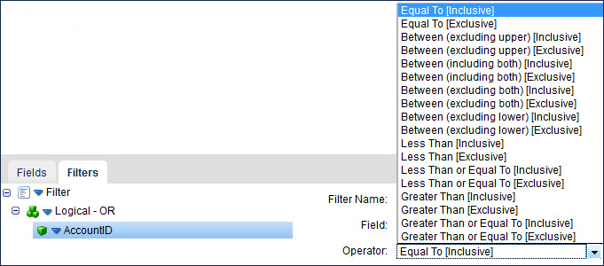
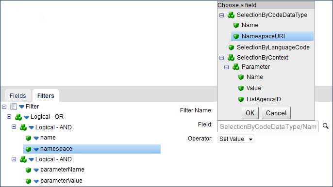

# SAP Business ByDesign operation’s inbound actions 

<head>
  <meta name="guidename" content="Integration"/>
  <meta name="context" content="GUID-705d6688-4f2a-4588-a387-43b774937438"/>
</head>


You can configure the SAP Business ByDesign operation to retrieve object records from a SAP Business ByDesign installation.

After selecting a connector action, select an object with which to interact. Each object corresponds to a method on a WSDL. For the Get and Query actions, you can define multiple selection methods for an object. For example, the Accounts object has three methods: FindByElements, FindByCommunicationData, and FindByIdentification. Each object/method combination is a separate object.

The Get and Query actions support the following SAP Business ByDesign object/method combinations:

-   Accounts — FindByElements
-   Accounts — FindByCommunicationData
-   Accounts — FindByIdentification
-   Contact — FindByElements
-   Materials — FindByElements
-   Leads — FindByElements
-   Opportunities — FindByElements
-   Social Media User Profiles — FindByElements
-   Tickets — FindByelements
-   Activity Email — FindByElements
-   Activity Task — FindByElements
-   Activity Phone — FindByElements
-   Activity Appointment — FindByElements
-   Campaign — FindByElements
-   Target Group — FindByElements
-   Code List — FindCodeListByID \(Query only\)
-   Contract — FindByElement
-   Suppliers — FindByElements
-   Purchasing Contract — FindSimpleByElements
-   Supplier Invoices — FindSimpleByElements
-   Purchase Orders — FindSimpleByElements
-   Sales Orders — FindByElements
-   Customer Invoices — FindByElements
-   Service Products — FindByElements

**Note:** Some objects are available only in SAP Business ByDesign, while other objects are available only in SAP CRM On Demand.

## Get 

The Get action is the same as SAP’s “Query” service, except that you query by ID. At runtime, supply an unique ID for the object record you want to retrieve. Review the topic about parameter values to understand how you can statically or dynamically define these values in a process for runtime.

The ID that you supply can be the InternalID from the SAP user interface or a UUID. The ID must be in this format: `[id_property:]id_value`. The `id_property` is optional and indicates a field other than the InternalID on which to look up the value. The default field is the InternalID field if `id_property` is not specified.

When specifying the `id_property`, this value must be equal to the “SelectionBy...” element name. You can omit the “SelectionBy...” leader and specify only the property name. For example, to query by UUID, the corresponding field on the CustomerSelectionByElements message is SelectionByUUID, you specify `UUID: 91a002e169d7464ab2f79085824fbcc6` as the input to the ID field in the input parameters.

## Query 

Use the Query action to look up object records based on specific search criteria. The Query action returns zero-to-many documents from a single Query request based on one or more filters. After selecting the Query connector action and using the Import Wizard, select fields and add query filters. The bottom half of the Operation component page contains **Fields** and **Filter** tabs on which you can configure these options. See the topic linked below about the operation component’s query definition tabs.

The following sample shows an SAP Business ByDesign query:

```
<n0:CustomerByCommunicationDataQuery_sync 
xmlns:n0="http://sap.com/xi/SAPGlobal20/Global">
  <CustomerSelectionByCommunicationData>
    <SelectionByEmailURI>
      <InclusionExclusionCode>I</InclusionExclusionCode>
      <IntervalBoundaryTypeCode>1</IntervalBoundaryTypeCode>
      <LowerBoundaryEmailURI>*sap.com</LowerBoundaryEmailURI>
    </SelectionByEmailURI>
  </CustomerSelectionByCommunicationData>
  <ProcessingConditions>
    <QueryHitsMaximumNumberValue>10</QueryHitsMaximumNumberValue>
  </ProcessingConditions>
    <RequestedElements customerTransmissionRequestCode="2">
      <Customer contactPersonTransmissionRequestCode="1"
       salesArrangementTransmissionRequestCode="4" />
    </RequestedElements>
<n0:CustomerByCommunicationDataQuery_sync>
```

Each SAP Business ByDesign query consists of three parts, each part is mapped to the user interface in .

-   ProcessingConditions — Used to set the number of results to return per page. The default is 0, which returns all results. When you create an operation component, set this processing condition by typing a number in the **Query Page Size** field.

-   RequestedElements — In SAP you can set “Transmission Code” to one of four values: Complete Structure \(1\); Complete Node \(2\); Node With Key Elements \(3\); or Excluded Node \(4\). supports two of these values: Complete Structure \(1: The node element and all its elements, its child node elements, and all their elements will be returned\) and Excluded Node \(4: The node element and its child node elements will not be returned\). Select the node element \(a “root object”\) or the node element plus the complete structure. You cannot exclude the node element. You do this by turning on check boxes on the Operation component’s **Fields** tab.

-   SelectionBy \(filter\) — An SAP query filter contains an IntervalBoundaryTypeCode, an InclusionExclusion specifier and UpperBoundary/LowerBoundary values.

    -   IntervalBoundaryTypeCode — Indicates how the request input parameter should be compared against the filter: Equal To, Between \(including or excluding both, excluding upper or lower\), Less Than, Less Than or Equal To, Greater Than, Greater Than or Equal To. On the Operation component’s **Filters** tab you select this value, along with the InclusionExclusion specifier, from the **Operator** list.

    -   InclusionExclusion specifier — Indicates whether the values should be included or excluded from the results. On the operation component’s **Filters** tab you select this value, along with the IntervalBoundaryTypeCode, from the **Operator** list.

    -   UpperBoundary and/or LowerBoundary values — One or more values is required depending on how the IntervalBoundaryTypeCode is set \(Equal To, Between, etc.\). You must supply the value\(s\) as input parameters. If multiple values are expected, add them in a delimited list. The default delimiter is a comma.




## Querying the FindCodeListByID Service 

Use the FindCodeListByID service to look up code values for other queries. The Query action with the FindCodeListByID service is different from other queries because it has a different format in SAP. Here is a sample SAP query:

```
<n0:CodeListByIDQuery_sync xmlns:n0="http://sap.com/xi/SAPGlobal20/Global">
  <CodeListSelectionByID>
    <SelectionByCodeDataType>
      <Name>RegionCode</Name>
      <NamespaceURI>http://sap.com/xi/AP/Common/GDT</NamespaceURI>
    </SelectionByCodeDataType>
    <SelectionByLanguageCode>EN</SelectionByLanguageCode>
    <SelectionByContext>
      <Parameter>
        <Name>CountryCode</Name>
        <Value>DE</Value>
      </Parameter>
    </SelectionByContext>
  </CodeListSelectionByID>
<n0:CodeListByIDQuery_sync>
```

Each of the selection \(SelectionBy\) elements in this query is exposed as a field available for selection on the **Filters** tab. These elements must be joined together at the first level using the AND operator. The nested elements in the selection \(Name and NamespaceURI\) must be joined at the second level using the AND operator. To recreate the query above on the **Filters** tab, you must set the filters as follows.



**Note:** The OR operator in the Query Filter is making improper returns. Instead of providing ”OR" results, it provides ”AND” results. This is a known bug that will be fixed in an upcoming release.