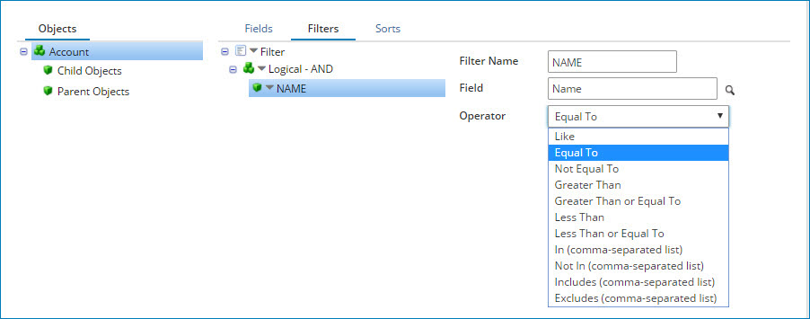
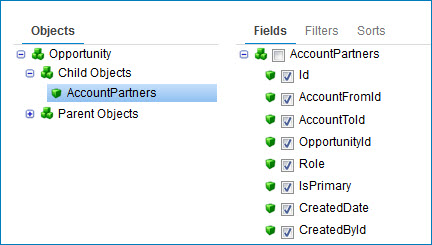

import OperationEnd from './_operationEnd.md'
import TrackingDirection from './_TrackingDirection.md'
import ReturnErrRes from './_ReturnResponse.md'
import ReqRes from './_ReqRes.md'
import TrackingDir from './_TrackObject.md'

# Salesforce operation 

<head>
  <meta name="guidename" content="Integration"/>
  <meta name="context" content="GUID-a1d4c943-d971-4b92-97aa-de3e811289ac"/>
</head>

The Salesforce operation defines how to interact with your Salesforce account.

The operation represents a specific action \(Query, Create, Update, Delete, etc.\) to perform against a specific Salesforce record type or object \(Account, Opportunity, Contact, etc.\). Create a separate operation for each action/object combination required for your integration. Not all actions are available for every object.

The Salesforce operation supports the following actions:

-   Get: Query
-   Send: Create, Delete, Merge, Update, Upsert, convertLead

:::note 

Contact your Salesforce representative to learn about the API field-level requirements for Salesforce and how to access additional help documentation.

:::

## Query 

This action is the only GET action available for the Salesforce connector and returns zero-to-many object record documents from a single Query request based on zero or more filters. As shown in the following image, the bottom half of the operation page contains configuration options to select the fields to return, add filters to limit the results, and select sorting options.

**Query Limit** - 
 This document property allows a positive integer to be set as the maximum number of documents returned by a GET operation. This property is only considered by GET operations with the **Use Custom Soql** property unchecked. The document property **Query Limit** takes precedence over any query limits provided by dynamic process property **sfquerylimit**, or the operation property **Query Limit**. When an invalid input is provided, all the available records are returned by default.

:::note 

If multiple input documents are provided for the same operation and the operation does not have parameters, the connector will combine the inputs and run them as a single query. In this case, the "Query Limit" document property is extracted from the first input document. If multiple input documents are provided and the operation does have parameters, i.e. to set a filter argument, the connector will run a query for each input document. In this case, the "Query Limit" document property is extracted from each input document.

:::

The **Import Wizard** builds an object list. After you select an object, the wizard logs into Salesforce and creates an object tree from which you can select parent and child objects to import. For each object, you can access a parent of the child object and then apply the configuration to the parent for the query execution.

:::note 

 A browse property is available for all operations in the second step of the **Import Wizard** to disable loading and displaying the parent/child object hierachy to reduce the time it takes to import. This option is available as a checkbox labelled **Skip import of parent/child hierarchy** and is not available using Bulk API v2.

:::

-   Use Salesforce to define multiple expressions and group them into logical sub-groups to create sophisticated query logic. The operator at the logical group level defines how the multiple expressions and/or logical sub-groups within that logical group are evaluated.
-   Use the In and Not In filter operators in a Query request to generate IN and NOT IN SOQL comparisons as part of the WHERE clause. Specify the input parameter as a comma-separated list of values. For example, to find all objects having a ‘state’ field value of ‘pa’ or ‘nj’, set up a filter for the ‘state’ field using the In operator. Specify the input parameter as `pa,nj`. The WHERE clause generated in SOQL is `WHERE state IN ('pa','nj')`.

    :::note
    
     Salesforce has certain character limits for SOQL that are of interest, as they may help you plan how to construct the SOQL. For example, you can determine how many values to allow in the comma-separated list of values. To learn more, see the [SOQL and SOSL Limits](https://developer.salesforce.com/docs/atlas.en-us.salesforce_app_limits_cheatsheet.meta/salesforce_app_limits_cheatsheet/salesforce_app_limits_platform_soslsoql.htm) article from Salesforce.

     :::

-   Use the Includes and Excludes filter operators in a Query request to filter selected fields from a multi-select list \(i.e., where multiple fields can be selected\). For example, on a job application form an applicant can select multiple interests such as “music, programming, sports.” The Includes filter retrieves data that contains any of the specified values \(music or programming or sports\) in the SOQL statement. The Excludes filter retrieves data that does not contain any of the specified values.

:::note 
 
  Use the Include or Exclude filters only on multi-select lists. Do not use In or Not In to filter multi-select lists. That combination creates bad results without an execution error. Do not use the Include or Exclude filters to filter non-multi-select lists. That combination results in an execution error.

:::

Click the **Show SOQL** button to display the query syntax that is sent to Salesforce. The syntax is automatically modified as you configure the fields, filters, and sorts. You cannot edit the syntax directly, but you can use it to verify complex nested logic.

## Create 

This action creates new records in the Salesforce object defined in the Create operation. The internal "ID" field is generated automatically for each document sent to the operation.

**Use Default Assignment Rule** - 
 This document property is only considered when using the SEND operation to create Cases/Leads using the SOAP API. When set to true, an AssignmentRuleHeader is used in the SOAP request to Salesforce, settting their inner element useDefaultRule parameter to true.

**Assignment Rule ID** - 
 This document property is only considered when using the SEND operation to create Cases/Leads using any API supported by the connector. When a non-blank value is provided, it is sent to Salesforce in one of two ways: as an AssignmentRuleHeader when using the SOAP API, or as a parameter in a job creation request when using Bulk and Bulk v2. If this property and the **Use Default Assignment Rule** property are defined, the input to **Assignment Rule Id** will be included as part of the request header, but the input to **Use Default Assignment Rule** will be ignored by the connector.

 :::note 
 
 If multiple input documents are provided for the same operation, the connector will only read the document properties from the first document because a single header value can be sent per batch request.

 :::

## Update 

This action updates existing records in the Salesforce object defined in the Update operation. Supply the internal "ID" field in the request to update the existing object record. If the internal ID is not readily available in your source data, consider using a Connector Call function to Query data based on a standard value such as Name.

**Update Options tab** - 
 Click the object name in the tree to the left.

**Reference Fields tab**   Fields in the primary update object that can link the record to other associated objects \(for example, Acct to Parent Acct, Oppty to Acct\).

**Use External ID For Reference** - 
  Determines if a specific value should be used to perform the reference. Reference Fields use internalID by default.

**Object Type** - 
  Indicates the object type to which the reference field is linked.

**Ref External ID** - 
 Identifies the data that is used to perform the reference.

**Use Default Assignment Rule** - 
 This document property is only considered when using the SEND operation to update Cases, Leads, and Accounts using the SOAP API. When set to true, an AssignmentRuleHeader is used in the SOAP request to Salesforce, settting their inner element useDefaultRule parameter to true.

**Assignment Rule ID** - 
This document property is only considered when using the SEND operation to update Cases/Leads using any API supported by the connector. When a non-blank value is provided, it is sent to Salesforce in one of two ways: as an AssignmentRuleHeader when using the SOAP API, or as a parameter in a job creation request when using Bulk and Bulk v2. If this property and the **Use Default Assignment Rule** property are defined, the input to **Assignment Rule Id** will be included as part of the request header, but the input to **Use Default Assignment Rule** will be ignored by the connector.

:::note 

If multiple input documents are provided for the same operation, the connector will only read the document properties from the first document because a single header value can be sent per batch request.

:::

## Upsert 

This action is a convenient way to do common "insert-new-or-update-existing" integrations. Instead of performing a lookup against Salesforce \(the destination system\) to determine if a given record exists and then perform separate insert or update mappings and calls accordingly, simply perform one map to the Upsert request and let Salesforce determine whether to do an insert or update. To use this feature, customize the particular Salesforce object to designate at least one field as the External ID. Because objects can have multiple External IDs defined, select the appropriate object for the operation.

**Upsert Options tab** - 
  Select the object name in the tree to the left and click the Browse icon to choose an External ID from the list.

**Reference Fields tab** - 
  Fields in the primary upsert object that can link the record to other associated objects \(for example, Acct to Parent Acct, Oppty to Acct\).

**External ID** - 
  The External ID to use for the upsert. Salesforce looks for a record with a matching value and either updates it \(found\) or creates it \(not found\).

**Use External ID For Reference** - 
  Determines if a specific value should be used to perform the reference. Reference Fields use internalID by default.

**Object Type**    
 Indicates the object type to which the reference field is linked.

**Ref External ID**    
 Identifies the data that is used to perform the reference.

## Delete 

This action deletes an existing record in the Salesforce object defined in the Delete operation. You must supply the internal "ID" field in the request to delete the existing object record. If the internal ID is not readily available in your source data, consider using a Connector Call function to Query data based on a standard value such as Name.

## Merge 

This action merges Salesforce records of the same object type into one record. It merges the records into one of the records, called the master record, deletes the other records, and re-parents the related records. Use the `masterRecord/ID` field to indicate which record is the master record. If there are any field values from the other records that should supersede the values in the master record, set the field names and their new values in the master record’s fields in the merge request.

:::note 

 Merge is not applicable for bulk operations where either Bulk API v1 or v2 is selected in the **Import Wizard**.

:::

Limitations

The following limitations apply to the Merge action:

-   Use Merge only with these object types: Account, Contact, and Lead.
-   Merge up to three records in a single request, including the master record. To merge more than three records, use the same master record in each request.
-   Merge up to 200 requests in a single SOAP call.
-   Do not use External ID fields.

## convertLead 

This action converts Leads to an Account, Contact, or Opportunity and is available only in version 15 and more recent versions of Salesforce.

:::note 

convertLead is not applicable for bulk operations where either Bulk API v1 or v2 is selected in the **Import Wizard**.

:::
## Options tab 

Click **Import Operation**, then use the Import wizard to select the object to integrate. When you configure an action, the following fields appear for each action type:

<TrackingDir />

**Action**   
Displays the action you specified in the **Import** Wizard.

<ReqRes />

**Query Limit** - 
\(Query only\) Numeric field that allows you to specify the maximum number of rows/documents to return. The default is -1, which returns all results.

<ReturnErrRes />

**Batch Count** - 
\(Create, Update, Upsert, Delete, Merge, and convertLead\) Batch count is only applicable when you are not using the Bulk API \(you select None in the **Bulk API version** drop-down list in the **Import Wizard**\). Use this field to specify the number of documents to send in one Salesforce request. The default is 200.

 When operating in low-latency mode on an Atom worker, consider reducing the Batch Count to 100 or lower. This can help improve the efficiency and performance of the Atom worker when multiple processes are competing for memory space.

  If you select to use the Bulk API when browsing, Batch Count is set as follows:

 -   Bulk API v1 — Batch Count is set to 5000 behind the scenes and cannot be changed. The connector automatically sets the count when the execution starts, and adjusts the count based on the processing time \(up to 10,000 records in each batch\).
 -   Bulk API v2 — Salesforce automatically determines the most efficient way to batch and process the data based on the amount of bytes, instead of the number of records.

**Use Bulk API** - 
\(Query only\) Select to use the Bulk API to reduce the number of API calls you need to make.

**Batch Size** - 
 \(Create, Update, Upsert, and Delete\) **Batch Size** is only applicable when Bulk API v2 is selected in the **Import Wizard**. Use this field to adjust the amount of data \(documents\) to send to Salesforce in one batch. The range of valid values, in MB, is 1–150. The default is 10 MB.

 **Important:** How you set **Batch Size** directly impacts the performance of your processes. Set this number as high as possible \(Salesforce recommends 100 MB\) to reduce the number of batch jobs needed to upload data and increase performance. However, due to a known Salesforce issue, the connector defaults **Batch Size** to 10 MB to ensure all records can safely be processed by Salesforce. If you notice a negative impact on performance while using the default of 10 MB, adjust the size as appropriate.

## Advanced tab 

\(Get only\) The Salesforce connector options shown on the Advanced tab are a subset of the options on the Options tab.

**Include Deleted**   
 \(Get only\) If selected, returns deleted records in results \(QueryAll\).

**Batch Results**   
 \(Get only\) Works only with standard queries. If selected, combines results into a single list document. If you use this feature, there is an additional step you need to take. The connector combines the results by adding an element above the top level of the incoming document elements. As a result, your profile no longer matches downstream components. To amend this mismatch, either manually edit your profile adding the element or use the inbound document to create a new profile.

**Log SOQL**    
This setting determines whether the full SOQL is written to process logs for all types of Salesforce operations, including bulk operations.

 -   If selected, the full SOQL appears in process logs after a process is executed. The SOQL includes both the SOQL and the input parameters. Having the full SOQL is useful when troubleshooting process issues, such as when a request in your SOQL fails.
 -   If cleared, the SOQL does not appear in process logs after a process is executed.

## Bulk API v1 

The Salesforce Bulk API v1 reduces the number of API calls you need to make. It uses the Salesforce Bulk API, which is an asynchronous API for loading larger data sets into Salesforce. Bulk API v1 can have up to 10,000 objects in a single call compared to the regular API, which can only have up to 200 objects.

When using the Bulk API v1, the connector processes the batches it sends to the Bulk API and adjusts batch sizes based on processing times. There is a 10-minute limit for processing a batch and a five-minute limit for processing 100 records. If there is a timeout, the connector splits the batch into smaller batches and retries them. There is a limit of three retries. Although the Bulk API v1 is asynchronous, the Salesforce connector waits for a response.

In terms of error management, if any of the documents sent in a batch fails, the connector will output the successful documents and error out the failing ones.

## Bulk API v2 

Use the Salesforce Bulk API v2 to quickly and efficiently upload large amounts of data. With the Bulk API v1, you must manually break up your data into batches and are limited to 10,000 records in a single Send operation. With Bulk API v2, you do not have to break up your data into batches. Salesforce automatically determines the most efficient way to batch the data and processes the batches in the background. You can create, update, or delete millions of records asynchronously, and you can send a maximum number of 100 million records in a 24 hour period.

Salesforce Bulk API v2 does not support parent/child object relationships. For example, an Account parent object may have one or more associated Contacts, Assets, Attachments, etc. as child objects. When using the Bulk API v2, you must first create a Send operation for the parent object \(for example, Account\). When the connector creates the request profile, it only includes the parent object's elements. You can use an External ID to identify the object you want to send by providing a value \(for example, the email address\). When using an External ID, the child objects can reference the parent using the External ID \(the email address\) instead of an internally generated ID from the connector. By using this method, you have a workaround to support parent/child object relationships.

:::note

 To address a Salesforce issue preventing batches larger than 10 MB from being processed, the connector reduces the batch size to 10 MB to ensure all records can safely be processed by Salesforce. This does not affect or change the way you build processes and no action is required on your part.

:::

In terms of error management, if any of the documents sent in a batch fails, the connector will error out the complete batch, generating an error output document for each document in the batch \(even for those that were successful\).

## Bulk API recommendations 

Boomi suggests the following when using any version of the Bulk API:

-   For Bulk Send, use a Flow Control step with parallel processing enabled in your process. See the topic [Flow Control step example: Parallel Processing option](https://help.boomi.com/docs/Atomsphere/Integration/Process%20building/c-atm-Flow_Control_shape_ex_Parallel_Processing_option_22e12870-d2f4-485d-b5ee-7a385377f94b) for details. Bulk API v1 is asynchronous, however the Salesforce connector waits for a response.
-   To prevent exhausting disk space, enable Purge Data in Atom Management. Bulk Query may store gigabytes of data.
-   To improve bulk query performance, purge data regularly if you do not have Purge Data Immediately enabled.
-   To avoid read timeout errors, increase your Atom’s default read timeout when querying large records.

<OperationEnd />