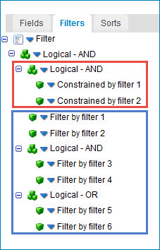

# SuccessFactors – Partner operation’s inbound action 

<head>
  <meta name="guidename" content="Integration"/>
  <meta name="context" content="GUID-bda511de-3214-417e-831f-c044e30ddb3a"/>
</head>

The SuccessFactors – Partner operation's inbound actions describe how to retrieve records from a SuccessFactors Company ID.

The Query action is the only available inbound action.

## Query 

The Query action queries records in the SuccessFactors object defined in the Create action. All records are returned as individual Integration documents. Paging is performed automatically according to the Page Size parameter.

Query actions have only a response profile.

:::note

The fields that appear on the response profile are indicated as *Selectable* or *Constrainable* per the object type specification in the SFAPI Data Dictionary.

:::

## Pick list fields 

Pick lists fields are associated with SuccessFactors pick list tables. These are name/value pairs that appear in drop-down lists within the SuccessFactors user interface pages. For more information on pick lists, refer to the SuccessFactors Configuration Guide.

A pick list entry consists of:

-   The ID of the pick list. This ID is the same for each entry that appears in each individual drop-down list.

-   The pick list label which is displayed in the user interface and on reports. This label is displayed in the language of the SFAPI user.

-   The pick list option ID. This integer value is automatically generated when importing a pick list to a SuccessFactors Company ID.

-   An optional externalCode which provides an alternate value that can be associated with a pick list entry.

-   A status field indicating whether the pick list is active or inactive \(soft deleted\).

The values contained in pick list fields are limited to the values contained in the associated pick list.

Enumerations are similar to pick lists but are not configurable. Instead, the possible set values are hard-coded by the object type. The pick list status field mentioned above is an example of an Enumeration field type.

:::note

Always use an SFAPI user that is associated with the en\_US locale. This ensures all labels use the en\_US pick list labels.

:::

When a field is associated with a pick list, the pick list ID are included in the comment for the field. Similarly if the field is associated with an Enumeration, the set of possible values are included in the comment for the field.

:::note

It may be useful to translate field values from one pick list field value to another. For example, asynchronous query results always contain the pick list label value, as do other object types. You may need to translate this value to the externalCode for writing to an external system \(for example, translate United States to "USA"\). You may be tempted to use a hard-coded cross reference table to perform this. However, a better approach is to pick list values as this ensures label spelling matches. If the label spelling fails to match a cross reference table entry, the field is translated to a blank and may result in data integrity issues.

:::

Many object types require the pick list Option ID when writing values to fields. Similarly a translation can be performed to convert an externalCode value to the associated pick list Option ID. The best way to perform these translations is to use the SuccessFactors Common Component to load pick lists into memory. Then use another Common Component map function to perform the translations. Alternatively, pick lists can be queried and written to Document Cache steps. This is cumbersome approach that requires a document cache for each pick list ID.

## Query fields 

The Query action returns zero to many documents from a single Query request based on zero or more "filters". After selecting the Query connector action and using the Import Wizard, you can select fields, add query filters, and sort the results by field. The bottom half of the Operation component page contains tabs on which you can configure these options. See the topic linked below about the Operation component’s query definition tabs.

The only fields that appear on the Query’s Fields tab are those fields indicated as *Selectable* per the object type specification in the SFAPI Data Dictionary.

## Query filters 

The only fields that appear on the Query’s Filter tab are those fields indicated as *Filterable* or *Constrainable* per the object type specification in the SFAPI Data Dictionary. See the topic linked below about how to add a filter to an Operation component.

Both Filterable and Constrainable fields support at least one of the following filter operators as specified in the Operator drop-down list. The Operator drop-down list includes only filter operators that the field supports per the object type specification in the SFAPI Data Dictionary.

-   Equal To — A record's field value matches the specified filter parameter value.

-   Greater Than — A record's field value is greater than the specified filter parameter value.

-   Less Than — A record's field value is less than the specified filter parameter value.

-   Greater Than Or Equal To — A record's field value is greater than or equal to the specified filter parameter value.

-   Less Than Or Equal To — A record's field value is less than or equal to the specified filter parameter value.

-   Is Null — A record's field is blank.

-   Is Not Null — A record's field is not blank.

-   In — A record's field value matches one of a comma delimited list of values specified in the filter parameter.

Except for the “Is Null” and “Is Not Null” operators, you must also specify a value for each filter argument on the connector’s Parameters tab, which is accessible by double-clicking the Connector step.

:::note

The “In” operator can be used to join the results of several synchronous queries of individual object types. This provides an alternative to using Ad Hoc Reports to join related object types. This technique results in fast performance, but use it with caution with extremely large data sets. An “In” operator has a maximum of 1000 values, so use of the Flow Control step may be required to batch comma-separated ID values to a query that utilizes an “In” filter operation.

1.  First query the set of parent records using filter criteria to limit the number of documents returned.

2.  Connect this record to two branches, the first of which builds a comma-delimited list of parent ID's from the result set.

3.  Feed this comma-delimited list to one or more branches connecting to synchronous query operations for each of the child object types of the join, each of which has a filter that uses an “In” operator on the foreign keys \(parent ID\) for each record.

4.  Feed the result set of each child query operation to a Document Cache step indexed by the foreign key \(parent ID\). Note the “In” filter parameter is set to receive the Current Data which contains the comma-delimited list of parent IDs.

5.  Connect the second branch from the parent query to a map function that uses the parent documents as the main profile, and uses Document Cache map lookups to join in each child object type.

:::note

At the top of the filter list there must be a top-level logical “AND” group. There are different rules for Filterable and Constrainable fields within the filter list.

-   Constrainable fields \(represented in the upper red box in the image below\):

    -   Filters using Constrainable fields must be in a single-level logical “AND” subgroup.

    -   Neither complex nested expressions nor logical “OR” operators are supported.

    -   No Filterable fields can be within this logical “AND” subgroup.

-   Filterable fields \(represented in the lower blue box in the image below\):

    -   Synchronous query operations support only Filterable fields.

    -   Filters for such operations can specify complex Boolean expressions consisting of nested logical “AND” and “OR” operators.

    -   These filters are translated to an SFQL WHERE clause.

    -   No Constrainable fields can be within this logical sub-group.

-   ADHOC\\\_ object types support both Filterable and Constrainable fields. Constrainable fields represent "required fields" for a report filter. These are fields that specify the population of users to include in the query results \(the Report Builder People tab\) and required fields for effective dated reports such as effective date ranges to limit the dates of returned records.

-   AdhocReport\\\_ object types provide only Constrainable fields for the filter set up by the report designer. No filterable fields are exposed.

## Query sorting 

You can sort the results of a query by specifying field values on the Sorts tab. You can sort fields in an ascending or descending order.

The only fields that appear on the Query’s Sorts tab are those fields indicated as *Sortable* per the object type specification in the SFAPI Data Dictionary.

:::note

Open the Boomi log file to view the raw query statement for the executed query action. Scroll down to where the “SELECT” statement appears.

:::note