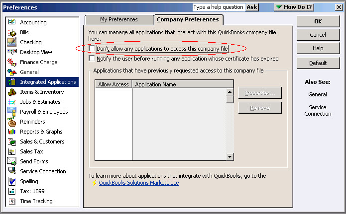
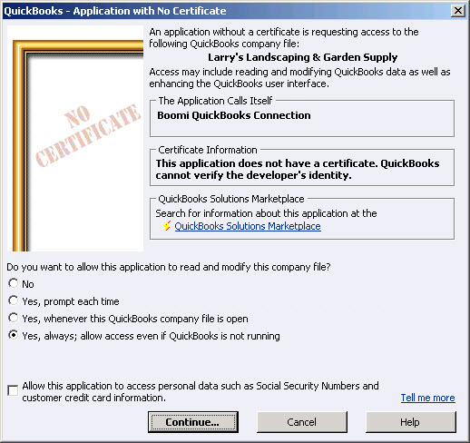

# Authorizing to connect to QuickBooks Desktop Edition 

<head>
  <meta name="guidename" content="Integration"/>
  <meta name="context" content="GUID-7e564fb9-2c13-40af-a8e9-3febb1be1b9d"/>
</head>

In the QuickBooks Desktop Edition, allow Integration to connect without using a digital certificate.

## About this task

The first time you run a process that uses a connection to a particular company file, authorize Integration to access the file from within QuickBooks.

## Procedure

1.  Launch QuickBooks on the machine where you installed the Atom.

2.  Open the company file to which connect.

    This is the company file configured in the Connection component.

3.  If you have multiple users, log in as the **Admin** user.

4.  Switch to **Single User Mode**.

    To proceed with the authorization, have other users close their instances of QuickBooks.

5.  See if your QuickBooks file allows other applications to connect. From the menu bar, go to **Edit** \> **Preferences...**, click the **Integrated Applications** tab, then click the **Company Preferences** tab, and clear **Don't allow any applications to access this company file**.

    

6.  Run a process in that uses this connection.

    This process starts the connection to QuickBooks.

7.  Go back to QuickBooks.

8.  When the authorization dialog opens in QuickBooks, choose **Yes, always; allow access even if QuickBooks is not running**.

    

9.  If there are multiple users, select **Admin** users.

10. Click **Continue**.

11. Click **Yes** to allow access without using a digital certificate.