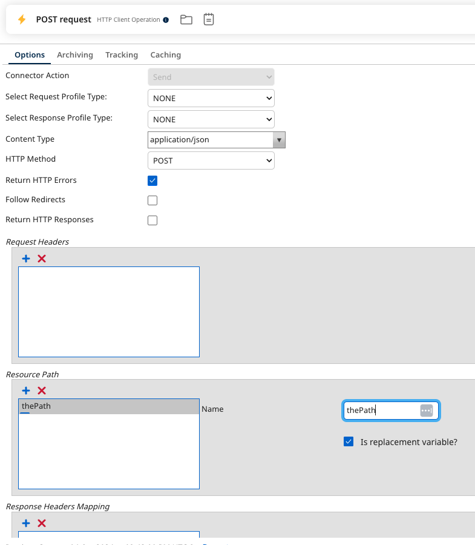
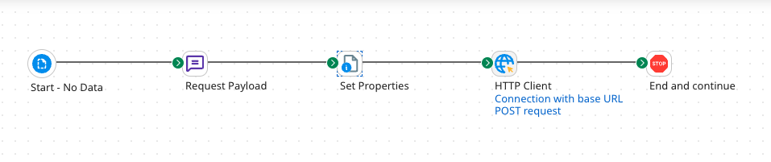
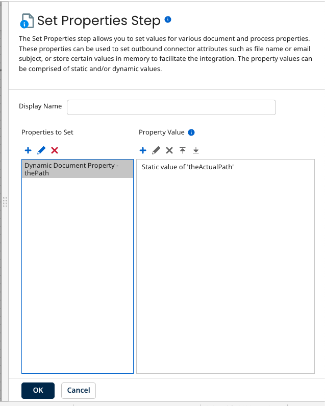

# Building a POST request using the HTTP Client connector 

<head>
  <meta name="guidename" content="Integration"/>
  <meta name="context" content="GUID-0ab92d77-4a03-4fac-97b4-80bc7650f38a"/>
</head>

By building a POST request using the HTTP Client connector, the connector can send data in the request body.

## About this task

You can create a POST request for a generic RESTful web application. Use the HTTP Client connector to send data in the request body. Build the POST request using the HTTP Client operation's Resource Path to prevent the parameters tab values from overriding the document data going into the connector.

## Procedure

1.  In the HTTP Client connection, enter the first part of the URL.

2.  In the HTTP Client operation, next to **Resource Path**, click **Add Path Element**.

    The name of the **Resource Path** and the **Is Replacement variable** fields appear.

3.  Enter the name of the Resource Path\(s\)

4.  Select **Is replacement variable** for each value you want to post.

5.  In your process, place a **Set Properties** step before the outbound connector.

6.  In **Set Properties**, click **Add Property** 

7.  In the Choose Property window, select **Dynamic Document Property** and enter a Property Name.

    The Dynamic Document Property name must match the name of the replacement variable you made in the Operation’s Resource path. The name is case-sensitive.

