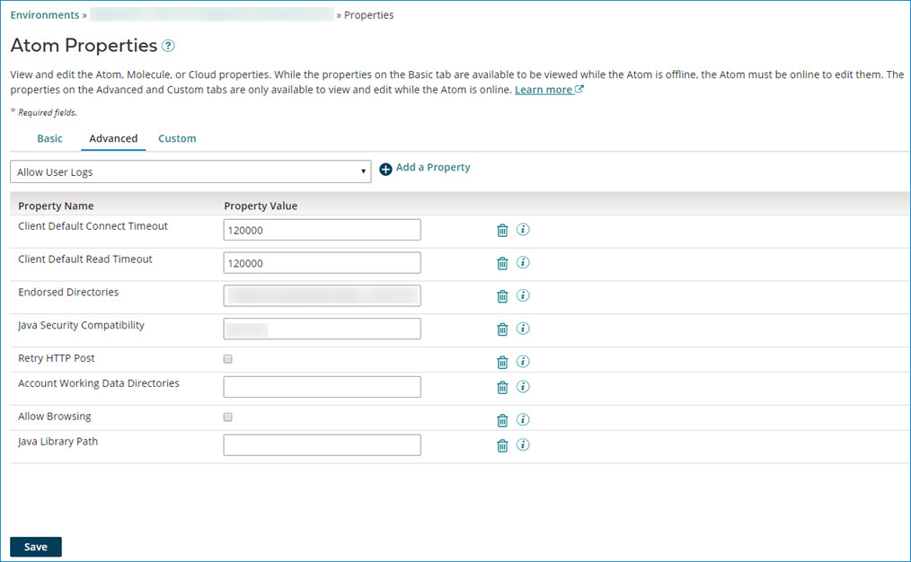

# Configuring an Atom for Microsoft SQL Server BCP browse operations 

<head>
  <meta name="guidename" content="Integration"/>
  <meta name="context" content="GUID-92fc139f-6a54-4730-8707-496bf8d2b8cf"/>
</head>

Before using the Microsoft SQL Server BCP connector, configure an Atom for Microsoft SQL Server BCP browse operations. Because this connector is available only on Windows, the Atom must be installed on Windows.

## Procedure

1.  Go to **Manage** \> **Atom Management**.

2.  On the left, click an Atom.

3.  Under **Settings & Configuration**, click **Properties**.

4.  Click the **Advanced** tab.

    

5.  Under **Property Value** select **Java Library Path** in the drop-down and click ** Add a Property**.

6.  Set the library path in the **Property Value** field to: `<atom_installation_directory>\work\connector\connector-bcp-auth`

7.  In the path, replace `<atom_installation_directory>` with your Atom installation directory.

8.  Optionally add an additional library path to the **Property Value** field. Separate multiple entries with a semicolon \(;\).

9.  Click **Save**.

    Changes to these properties do not take effect until you restart the Atom. You have the option to restart now or later.

    After restarting the Atom, you can use a trusted connection to browse the database simply by turning on the **Use Trusted Connection** check box on the Microsoft SQL Server BCP connector operation.