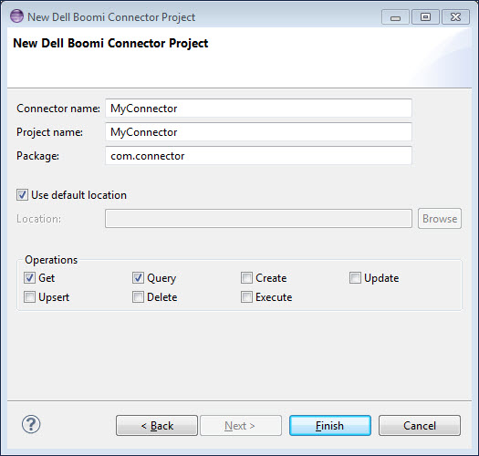
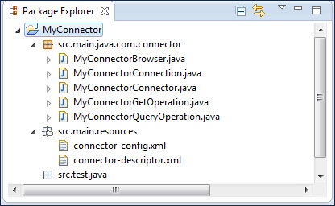

# Creating a connector project in Eclipse 

<head>
  <meta name="guidename" content="Integration"/>
  <meta name="context" content="GUID-274c48f3-bb51-454b-9fd3-54909566555f"/>
</head>

By creating a connector project, you assemble the source code, name the connector, and specify the location for the package. The Eclipse project is built with the correct file structure.

## About this task

An Eclipse connector project contains source code and related files for building a connector.

## Procedure

1.  In Eclipse, select **File** \> **New** \> **Project…**.

    The New Project wizard opens.

2.  In the **Wizards** list, expand **Boomi** and select **Connector Project**.

3.  Click **Next**.

    The wizard advances to the New Connector Project screen.

4.  In the **Connector name** field, type the connector name — this is the name you should use for the connector group in your account. The connector name must contain only letters and start with an uppercase letter.

    As you type the connector name, the **Project name** field populates with the same input.

5. **Optional:** To specify a different project name, type it in the **Project name** field.

6.  In the **Package** field, type the package name in accordance with your organization’s package naming standard — for example, `com.connector`. The package name must contain only letters and periods and start and end with a letter.

    

7.  Specify the location in which to save the project files. Do one of the following:

    -   Accept the default location, your Eclipse workspace folder, by leaving **Use default location** on.

    -   Specify a different location.

        1.  Clear **Use default location**.

        2.  Click **Browse**.

        3.  In the Browse for Folder dialog, navigate to the desired folder and select it.

        4.  Click **OK**.

8.  Turn on the check boxes for the operations for which to include template classes in the project — any or all of the following:

    -   **Get**

    -   **Query**

    -   **Create**

    -   **Update**

    -   **Upsert**

    -   **Delete**

    -   **Execute**

9.  Click **Finish**.

    The wizard exits. Eclipse creates the project and builds the file structure. If you selected operations in step 8, the newly created Java source files include stubs for the corresponding methods.

    The new project file structure appears in Package Explorer. If you selected MyConnector as the connector name and project name, com.connector as the package, and the Get and Query operations, the following project file structure would appear in Package Explorer:

    