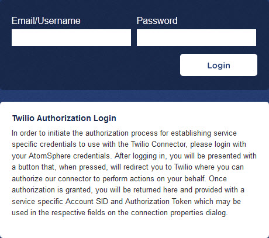
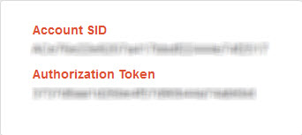

# Establishing credentials for the Twilio connector

<head>
  <meta name="guidename" content="Integration"/>
  <meta name="context" content="GUID-75180f6f-77d3-4138-a709-7044048eb3d5"/>
</head>

By establishing credentials for the Twilio connector, you have the information you need to provide on the **Connection** tab when you create a Twilio connection.

  is registered with Twilio as a Connect App. To use the Twilio connector, you must establish service-specific credentials.

1.  Browse to https://ondemand.boomi.com/application/twilio/connect.php.

    

2.  In the **Email/Username** field, type your account name.

3.  In the **Password** field, type your account password.

4.  Click **Login**.

    A page loads advising you that wants to connect to your Twilio account.

5.  Click **Connect**.

    You are redirected to Twilio.

6.  Log in to Twilio.

    You are redirected back to . Your credentials for use with the Twilio connector, Account SID and Authentication Token, appear.

    

7.  Note the credentials, which you need to enter on the **Connection** tab when you create a Twilio connection.