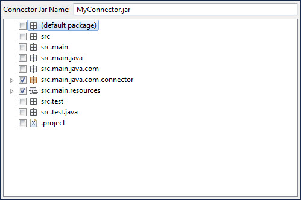

# Exporting a connector package in Eclipse 

<head>
  <meta name="guidename" content="Integration"/>
  <meta name="context" content="GUID-8b4338f6-72bb-4c5b-8dd9-ab13dd6ab205"/>
</head>

After exporting an Eclipse connector package, you are ready to upload the package to your boomi account.

1.  In Eclipse, select **File** \> **Export…**.

    The Export wizard opens.

2.  In the **Select an export destination** list, expand **Boomi** and select **Export Connector**.

3.  Click **Next**.

    The wizard advances to the next screen.

4.  In the list, select the check boxes for any files to include in the connector JAR file — for example, connector source files, resource files, etc. Do not include test files in the connector JAR file.

    

5.  Click **Next**.

    The wizard advances to the next screen.

6.  Specify the destination path and filename for the connector package. Do one of the following:

    -   Accept the defaults, `project_path\project_name.zip`, by leaving **Export Location** as is.

    -   Specify a different path and filename \(`.zip`\).

        1.  Click **Browse**.

        2.  In the Save As dialog, set the desired path and filename.

        3.  Click **Save**.

7. **Optional:** If your connector depends on any third party libraries that are not part of the Atom installation, include them by turning on their check boxes in the list.

    **Note:**

    Do not include JARs that are part of the Atom installation. For more information, see the linked topic about packaging connectors.

8.  Click **Finish**.

    The connector package Zip file is created. Once created, you are ready to upload the package to your account.