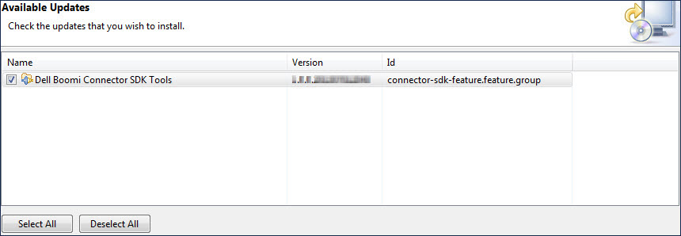

# Installing an update to the Connector SDK Tools in Eclipse 

<head>
  <meta name="guidename" content="Integration"/>
  <meta name="context" content="GUID-f0930139-f941-4dcc-a3e1-1566710b8be0"/>
</head>

By installing updates to the Boomi Connector SDK Tools, you ensure that you have the latest tools to build your Eclipse projects.

## About this task

releases updates to the Connector SDK Tools plug-in for Eclipse as needed. You should periodically use Eclipse to check for updates and install them. These steps assume that you have installed the Connector SDK Tools.

## Procedure

1.  In Eclipse, select **Help** \> **Check for Updates**.

    The Available Updates wizard opens, and Eclipse checks for updates to the base Eclipse IDE and your installed plug-ins. For the Boomi Connector SDK Tools plug-in, Eclipse checks the plug-in’s repository site at http://eclipse.boomi.com.

    If an update to the Boomi Connector SDK Tools is available, the plug-in name appears in the Available Updates list and is selected. The remaining steps assume this is the case.

    

2.  Click **Next**.

    The wizard advances to the Update Details screen.

3.  Click **Next**.

    The wizard advances to the Review Licenses screen.

4.  In the **License text** box, read the Boomi Connector SDK Tools license agreement.

    **Note:**

    You cannot install a Boomi Connector SDK Tools update unless you accept the terms of the license agreement.

5.  Select **I accept the terms of the license agreement**.

    The **Finish** button activates.

6.  Click **Finish**.

    An alert box warns you that you must restart Eclipse for the installation to complete.

7.  Do one of the following:

    -   To complete the installation now, click **Yes**.

    -   To wait to complete the installation until the next time you start Eclipse, click **No**.